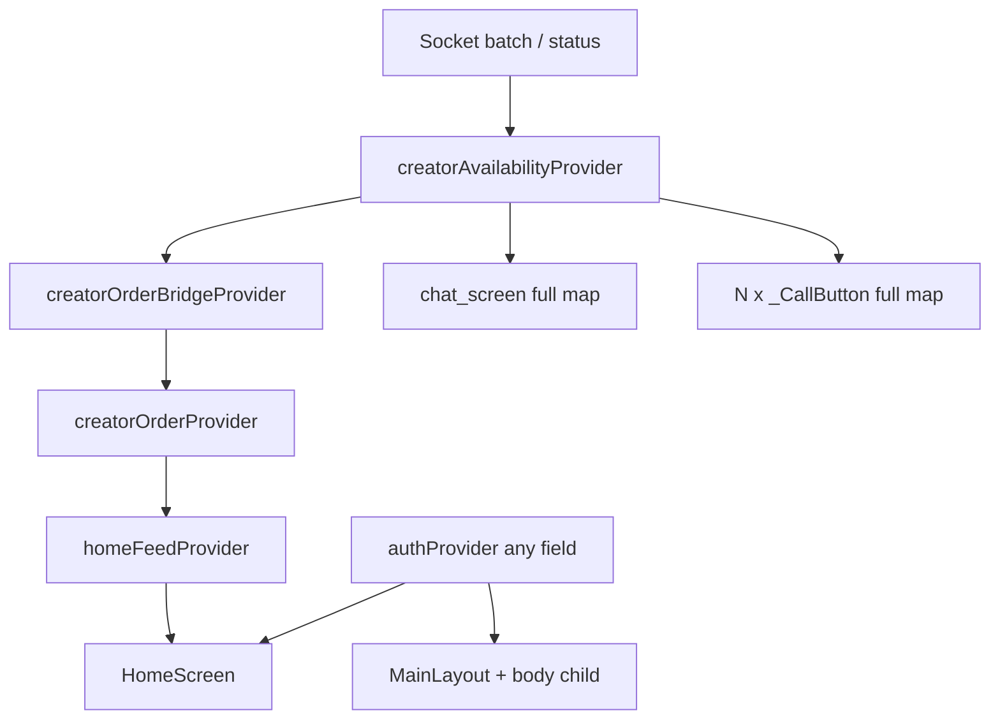
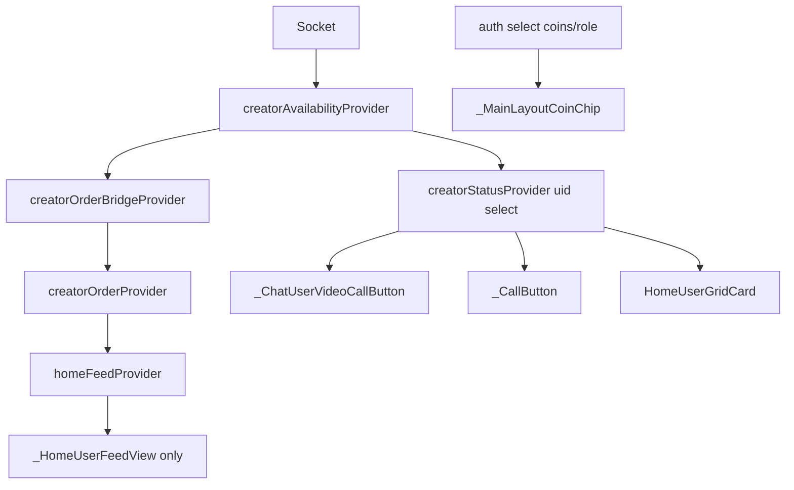

# Broad Watch Riverpod Performance Refactor — Analysis

**Project:** Match Vibe Flutter frontend  
**Date:** May 2026  
**Scope:** Provider subscription narrowing (`.select()`, per-UID families, widget boundaries)  
**Constraint:** Zero behavior / UX / realtime / billing / socket changes intended

---

## 1. Executive summary

This refactor targets **broad Riverpod watches**—subscriptions to entire `StateNotifier` / `Provider` objects when widgets only need a small slice of state. Broad watches inflate rebuild scope, increase CPU and memory churn on scroll-heavy screens, and amplify socket-driven updates across unrelated UI.

### What changed

| Category | Count (approx.) |
|----------|-----------------|
| P0 hotspot files | 7 |
| P1 secondary screens / providers | 18+ files |
| New `.select()` / family watch patterns | 40+ call sites |
| New isolated `ConsumerWidget` boundaries | 12 |

### What did **not** change

- Provider APIs and backend contracts
- Socket event wiring in `socketServiceProvider`
- Feed reorder bridge (`creatorOrderBridgeProvider`)
- UI design and navigation
- `hooks_riverpod` / codegen migration

---

## 2. Methodology

1. **Grep audit:** `ref.watch(authProvider)`, `ref.watch(creatorAvailabilityProvider)`, `homeFeedProvider`, `userProvider` across `frontend/lib`.
2. **Manual trace:** Rebuild propagation from socket → availability map → order bridge → `homeFeedProvider` → tab shell (`MainLayout`) → list/grid children.
3. **Existing good patterns:** `creatorStatusProvider(uid)` in `availability_provider.dart` (already used by `HomeUserGridCard`).
4. **Naming collision check:** Two different symbols named `creatorStatusProvider` (see §10).

---

## 3. Rebuild propagation

### Before



### After (target state)



---

## 4. Priority table

| ID | Priority | Area | Impact |
|----|----------|------|--------|
| R1 | **P0** | `recent_screen` `_CallButton` full map × N | ~90–95% fewer tile rebuilds per availability batch |
| C1 | **P0** | `chat_screen` discarded `callConnection` watch + full map | Message list no longer rebuilds on call phase / remote status |
| M1 | **P0** | `main_layout` full auth + billing | Tab `body` no longer rebuilds on coin / unread ticks |
| H1 | **P0** | `home_screen` + `home_provider` auth coupling | Home grid decoupled from coin / loading churn |
| S1 | **P0** | `availability_socket_service` family map watch | Prevents broad subscriptions via duplicate family |
| G1 | **P1** | `home_user_grid_card` auth slices | Per-card rebuild scope narrowed |
| L1 | **P1** | Secondary `authProvider` screens (wallet, account, …) | Moderate reduction on non-hot paths |
| T1 | **P2** | Derived providers (`authUserRoleProvider`, …) | Future-proofing — not added in this pass |
| U1 | **P2** | Unify duplicate availability maps | Architecture — documented only |

---

## 5. File-by-file analysis

### 5.1 `recent_screen.dart` — P0

**Broad watches found**

- `_CallHistoryTile`: `ref.watch(authProvider)` per row
- `_CallButton`: `ref.watch(creatorAvailabilityProvider)` full map per row
- `RecentScreen`: `recentCallsProvider` at root (acceptable)

**After**

- `_RecentCallListBody`: single `authProvider.select((s) => s.user?.role == 'user')` for all tiles
- `_CallHistoryTile`: `StatelessWidget`, receives `showCallButton`
- `_CallButton`: `ref.watch(creatorStatusProvider(widget.otherFirebaseUid))` from **`availability_provider.dart`**

**BEFORE**

```dart
final availabilityMap = ref.watch(creatorAvailabilityProvider);
final isOnline =
    (availabilityMap[widget.otherFirebaseUid] ?? CreatorAvailability.busy) ==
        CreatorAvailability.online;
```

**AFTER**

```dart
final creatorAvailability = ref.watch(
  creatorStatusProvider(widget.otherFirebaseUid),
);
final isOnline = creatorAvailability == CreatorAvailability.online;
```

**Why it matters:** A batch update for creator A previously rebuilt every visible recent tile (O(N)). Now only tiles watching A’s UID rebuild (O(1) per affected creator).

---

### 5.2 `chat_screen.dart` — P0

**Broad watches found**

- Line ~1195: `ref.watch(callConnectionControllerProvider)` — return value unused; still subscribed
- Line ~1198: full `creatorAvailabilityProvider` map for one `_otherUserFirebaseUid`
- `_buildCallActivityCard` received `isCreatorOnline` from parent `build` → tied availability to `StreamMessageListView` subtree

**After**

- Removed top-level `callConnection` and map watches
- `_ChatUserVideoCallButton`: per-UID `creatorStatusProvider`
- `_ChatCallActivityCardHost` + `_ChatCallActivityCard`: availability isolated per call-activity message
- `ref.listenManual(callConnectionControllerProvider)` preserved for idle-phase side effects

**BEFORE**

```dart
ref.watch(callConnectionControllerProvider);
final availabilityMap = ref.watch(creatorAvailabilityProvider);
final isCreatorOnline = ... availabilityMap[_otherUserFirebaseUid!] ...;
// ... entire StreamMessageListView in same build method
```

**AFTER**

```dart
// build() — no provider watches for call/availability
if (_showCallButton)
  _ChatUserVideoCallButton(
    otherFirebaseUid: _otherUserFirebaseUid,
    isInitiatingCall: _isInitiatingCall,
    onPressed: _initiateVideoCall,
  ),
```

**Why it matters:** Call phase transitions and global availability batches no longer rebuild the Stream message list or theme wrapper.

---

### 5.3 `main_layout.dart` — P0

**Broad watches found**

- `authProvider` (role, coins, loading, errors, dialogs, …)
- `callBillingProvider` (active call coins)
- `chatUnreadCountProvider` full `AsyncValue`

All were in the same `build` as `body: widget.child`.

**After**

- Parent watches `authProvider.select((s) => s.user?.role)` only
- `_MainLayoutCoinChip`: `(coins, isLoading)` + billing `(isActive, userCoins)`
- `_MainLayoutChatNavDestination`: unread `select` to `int`
- Billing `ref.listen` uses `ref.read(authProvider)` for creator check inside callback

**BEFORE**

```dart
final authState = ref.watch(authProvider);
final billingState = ref.watch(callBillingProvider);
// Scaffold body: widget.child — rebuilds on any auth/billing field
```

**AFTER**

```dart
final userRole = ref.watch(authProvider.select((s) => s.user?.role));
// ...
_MainLayoutCoinChip(isCreator: isCreator),
```

**Why it matters:** Coin ticks during billing and auth `isLoading` no longer invalidate Home / Recent / Chat tab bodies.

---

### 5.4 `home_screen.dart` + `home_provider.dart` — P0 / P1

**Broad watches found**

- `home_screen`: `homeFeedProvider` + full `authProvider` + `creatorsProvider` in one tree
- `homeFeedHasMoreProvider` inside `CustomScrollView` builder
- `_CreatorTasksView`: four dashboard providers in one `build`
- `CreatorFeedNotifier.build`: `ref.watch(authProvider)` → re-ran on coin changes

**After**

- `home_screen`: `authProvider.select((s) => s.user?.role)` for creator branch only
- `_HomeUserFeedView`: owns `homeFeedProvider` + `creatorsProvider.select((a) => (isLoading, hasError))`
- `_HomeFeedLoadMoreFooter`: isolated `homeFeedHasMoreProvider` watch
- `_CreatorHomeBalanceCard`, `_CreatorHomeOnlineTodayCard`, `_CreatorHomeTasksSection`: one provider each
- `CreatorFeedNotifier`: `ref.read(authProvider)` + `ref.listen` extended for **role** changes
- `homeFeedProvider` / `homeFeedHasMoreProvider`: `select` on `(user?.id, user?.role)`

**BEFORE (`CreatorFeedNotifier`)**

```dart
final auth = ref.watch(authProvider);
```

**AFTER**

```dart
final auth = ref.read(authProvider);
ref.listen<AuthState>(authProvider, (previous, next) {
  // ... userBecameReady, uid change, roleChanged
});
```

**Why it matters:** Auth coin updates no longer re-trigger creator feed `build()` / `_loadInitial()`. Feed reorder still flows through bridge → `homeFeedProvider` as before.

---

### 5.5 `availability_socket_service.dart` — P0

Duplicate `creatorStatusProvider` family watched the **full map**.

**AFTER** (aligned with `availability_provider.dart`):

```dart
return ref.watch(
  creatorAvailabilityProvider.select(
    (map) => map[creatorId] ?? CreatorAvailability.busy,
  ),
);
```

---

### 5.6 P1 secondary files (summary)

| File | Change |
|------|--------|
| `home_user_grid_card.dart` | `select` on `role`, `welcomeFreeCallEligible` |
| `app_lifecycle_wrapper.dart` | `select((s) => s.isAuthenticated)` vs bare watch |
| `call_ended_low_coins_modal.dart` | `creatorStatusProvider(uid)` |
| `chat_list_screen.dart` | `select` on `role` |
| `wallet_screen.dart` | `select` coins/role; `listen` for `socketServiceProvider` keep-alive |
| `stream_chat_wrapper.dart` | `select` auth ready + `firebaseUser` |
| `video_call_screen.dart` | `select` uid + role |
| `incoming_call_widget.dart` | `select` uid |
| `creator_dashboard_provider.dart` | `dashboardCoinsProvider` → `select` coins |
| `creator_status_provider.dart` | `listen` on `map[uid].select` |
| `account_screen`, `edit_profile`, `referral`, `help_support`, `withdrawal`, `transactions`, `creator_tasks_screen`, `login_screen` | `select` on fields used in `build` |

---

## 6. Estimated rebuild reduction

| Scenario | Before | After (order of magnitude) |
|----------|--------|----------------------------|
| Availability batch, 20 recent calls | ~20 list tile rebuilds | ~1 per changed UID |
| Availability change in open chat | Full chat scaffold + message list | App bar button + affected activity cards |
| Coin update (auth) on Home tab | MainLayout + HomeScreen + N grid cards watching auth | Coin chip + cards that watch coins (grid uses role/eligibility select only) |
| `creator:status` feed reorder | HomeScreen + full grid (via `homeFeedProvider`) | `_HomeUserFeedView` + per-card UID watches (unchanged card pattern) |
| Unread count tick | Full MainLayout + tab body | Chat nav destination only |

---

## 7. Expected UX improvements

- **Scrolling:** Less jank on Home grid and Recent list during presence storms.
- **Battery / CPU:** Fewer layout passes per socket event on low-end Android.
- **Realtime:** Unchanged latency — still same providers and notifiers; only subscription granularity changed.
- **Chat:** Reduced flicker risk when creators toggle online during active sessions.

---

## 8. Remaining hotspots (intentional)

1. **`homeFeedProvider`** still recomputes ordered list on any `creatorOrderProvider` change → `_HomeUserFeedView` rebuilds (required for feed reorder UX).
2. **`creatorOrderBridgeProvider`** still listens to full availability map (listener, not widget — correct).
3. **Duplicate `creatorAvailabilityProvider`** maps (`availability_provider` vs `availability_socket_service`) — not merged (drift risk documented).
4. **`userProvider`** — unused; no change.
5. **Login screen** — still uses full `ref.listen(authProvider)` for navigation (appropriate).

---

## 9. Risk assessment

| Risk | Likelihood | Mitigation |
|------|------------|------------|
| Stale call button (offline but enabled) | Low | Same default `busy`; preflight in `_initiateCall` unchanged |
| Wrong `creatorStatusProvider` import | Medium | Chat/recent use `availability_provider.dart`; MainLayout toggle uses `creator_status_provider.dart` (no args) |
| `select` misses role transition | Low | `CreatorFeedNotifier` listen includes `roleChanged` |
| Record/tuple `==` on select | Low | Primitives and small records; avoid selecting mutable lists |
| `creator_status` listen `null` vs missing key | Low | Falls back to `_updateFromSocketConnection()` |

---

## 10. Provider naming collision (critical for maintainers)

| Symbol | File | Use |
|--------|------|-----|
| `creatorStatusProvider(uid)` | `availability_provider.dart` | Per-creator **online/busy** for feed, chat, recent |
| `creatorStatusProvider` | `creator_status_provider.dart` | Creator’s **own** toggle in app bar |
| `creatorStatusProvider(uid)` | `availability_socket_service.dart` | Duplicate family — now uses `.select` |

**Rule:** For “is this creator callable / online?” always import from **`availability_provider.dart`**.

---

## 11. Future optimization suggestions (P2+)

1. **Derived providers:** `authUserRoleProvider`, `authUserCoinsProvider` if `.select` duplication grows.
2. **Split `homeFeedProvider`:** separate data list vs `orderedIds` for finer grid diffing.
3. **Unify availability maps** into one notifier + one socket callback path.
4. **`ListView`/`GridView` keys** keyed by creator UID to improve element reuse (Flutter layer, not Riverpod).
5. **Provider-level `select` on `AsyncValue`** helpers for repeated loading/error patterns.

---

## 12. Verification checklist

### Automated

- [x] `flutter analyze` on touched paths (no new errors; pre-existing infos/warnings only)

### Manual QA

- [ ] Creator goes online/offline → only matching Recent call buttons + Home cards + chat call icon update
- [ ] Open chat → remote status change does not flash entire message history
- [ ] Active call billing → app bar coins update; Home feed does not full-rebuild (optional: `📊 [HOME] build count` debug)
- [ ] Home feed still reorders online → busy on socket events
- [ ] Pull-to-refresh on Home / Recent unchanged
- [ ] Creator MainLayout online indicator still correct
- [ ] Initiate call from Home / Recent / Chat; low-coins modal still shows correct “still online” line
- [ ] Unread badge on Chat tab updates without stuttering other tabs
- [ ] User → creator role transition still loads correct feed (listen + refresh path)

---

## 13. Intentionally untouched

- `SocketService` class implementation
- `socketServiceProvider` callback wiring
- Backend APIs and Stream Chat integration
- `creatorOrderBridgeProvider` listener logic
- Visual design / strings / navigation routes
- Plan file at `.cursor/plans/broad_watch_refactor_*.plan.md`

---

## 14. References

- Prior audit targets: `chat_screen.dart`, `recent_screen.dart`, `home_provider.dart`, `home_screen.dart`, `main_layout.dart`, `availability_provider.dart`, `socket_service.dart`
- Riverpod docs: [select](https://riverpod.dev/docs/concepts/reading#using-select-to-filter-rebuilds)

---

*End of analysis — Match Vibe performance engineering review.*
