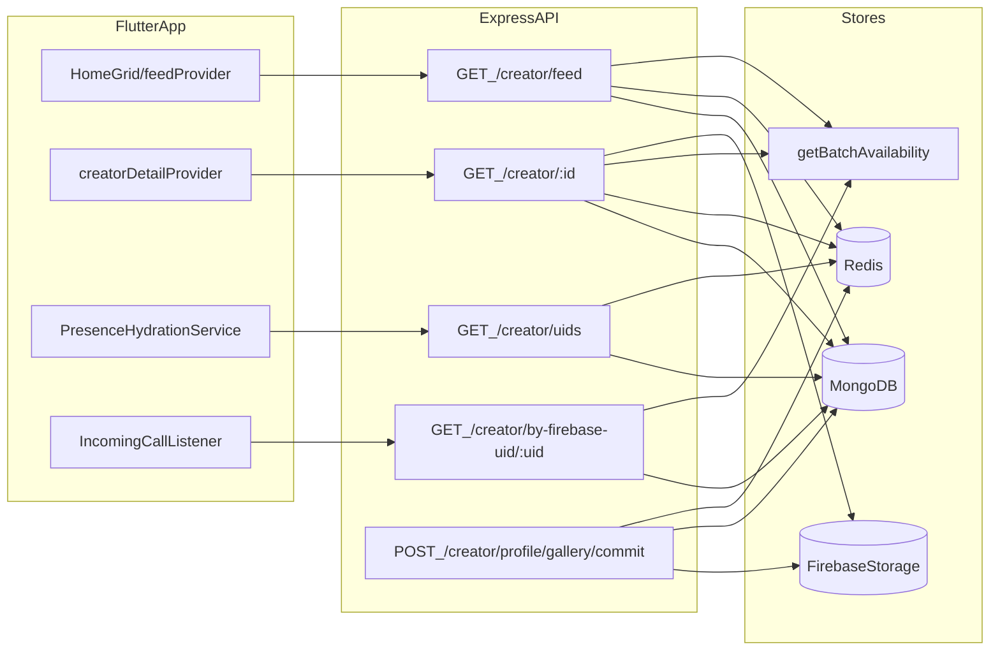

# Creator Feed Perf Refactor — How Everything Works (End-to-End)

This document is the **detailed “how it works”** companion to:

- Implementation reference: [CREATOR_FEED_PERF_REFACTOR_IMPLEMENTATION.md](CREATOR_FEED_PERF_REFACTOR_IMPLEMENTATION.md)
- Ops checklist: [CREATOR_FEED_PERF_REFACTOR_MANUAL_CHECKLIST.md](CREATOR_FEED_PERF_REFACTOR_MANUAL_CHECKLIST.md)
- Resize Images notes: [FIREBASE_RESIZE_IMAGES.md](FIREBASE_RESIZE_IMAGES.md)
- Perf analysis context: [PERF_HOME_AND_CREATOR_PROFILE_LOADING.md](PERF_HOME_AND_CREATOR_PROFILE_LOADING.md)

It also documents the **7 critical gap fixes** (denormalization, O(1) lookup, thumbnail eventual consistency, invalidation scope, deterministic sorting, presence hydration delay, and backfill robustness).

---

## High-level goals (what we’re optimizing for)

- **Home / catalog is fast**: `GET /creator/feed` must never touch Firebase Storage and must be cacheable.
- **Presence hydration is one hop**: hydrate availability using a single `/creator/uids` payload (not paging the catalog).
- **Profile is progressive**: open profile quickly using cached/feed data, then load full details with `GET /creator/:id`.
- **Images feel fast**: disk caching + optional thumbnail URLs; tolerate Resize Images extension being asynchronous.
- **Ops are safe**: one-time backfills + controlled env flags + clear rollback path.

---

## End-to-end data flow



Key design decision: **the feed never resolves gallery URLs or does Storage I/O**. Storage interaction is restricted to:

- **Write-time** gallery commit (generating tokenized URLs and optionally a thumbnail URL if the resized object exists)
- **Read-time** detail route only (and even there, repair-on-read can be disabled after a backfill)

---

## Backend: endpoints, contracts, and performance rules

### 1) `GET /creator/` — legacy root returns 410 Gone

- **Purpose**: ensure old clients don’t hit a heavy/unsupported path.
- **Behavior**: HTTP **410 Gone** and a JSON message pointing to `/creator/feed`.
- **Rule**: do not reintroduce compatibility behavior here unless you explicitly decide to support older clients.

### 2) `GET /creator/feed` — the only catalog list API

This endpoint is designed for the **home grid** and must stay lightweight.

- **Auth**: required.
- **Role rules**: creators and agents are forbidden (same product rule as before).
- **Query**: `page` and `limit` (limit bounded, max 50).
- **Mongo query**:
  - `.sort({ createdAt: -1 })` is required for deterministic pagination.
  - `select` only feed fields (no gallery).
- **Redis caching** (optional):
  - cache key per `(page, limit)`, short TTL
  - cached payload excludes viewer-specific fields (favorites), which are overlaid per request
- **Availability overlay**:
  - `getBatchAvailability` runs after the base list is loaded (and after cache read if cached) so the UI remains live.

#### Critical gap #5: deterministic sort enforced

Feed pagination only stays stable when the query includes:

- `.sort({ createdAt: -1 })`

There is a contract test that asserts this stays in place.

### 3) `GET /creator/uids` — presence hydration list

This endpoint returns a single list of all creator Firebase UIDs to seed availability/presence.

- **Auth**: required.
- **Role rules**: creators and agents forbidden.
- **Redis caching**: single key with short TTL.
- **Critical gap #1**: it must not require an extra join in the steady-state once denormalization is complete.

### 4) `GET /creator/:id` — full profile detail (progressive hydration)

This endpoint can do the heavier work, but must still avoid unnecessary Storage I/O.

- **Auth**: required.
- **Role rules**:
  - agents forbidden
  - creators can fetch only their own creator doc by id
- **Redis detail cache**:
  - cache stores most of the creator payload
  - availability is overlaid per request

#### Gallery repair-on-read

- When `DISABLE_GALLERY_REPAIR_ON_READ=true`, the detail endpoint skips Storage repair work and trusts that the DB is backfilled.
- This is only safe after the gallery URL backfill has completed successfully.

### 5) `GET /creator/by-firebase-uid/:uid` — O(1) incoming-call lookup

#### Critical gap #2: the “incoming call” path must be O(1)

The prior fallback of “scan `/creator/feed?page=1`” can silently fail when the creator isn’t in page 1.

This endpoint exists to provide:

- **O(1)** lookup by `firebaseUid`
- **minimal payload** (id, name, photo/thumb, availability) for incoming-call UI

---

## Backend: schema and denormalization strategy

### Critical gap #1: denormalize `firebaseUid` onto `Creator`

Problem (pre-fix):

- `/creator/feed` and `/creator/uids` needed an extra `User` query to map `Creator.userId → User.firebaseUid`.
- At scale, this becomes a bottleneck (extra query + hydration per page / per uids refresh).

Fix:

- Add `firebaseUid` to the `Creator` schema as a denormalized field and index it for fast lookups.

#### How it’s populated

1) **On creator creation** (all create flows):

- include `firebaseUid` when the linked `User.firebaseUid` is known

2) **Backfill for existing creators**:

- a one-time script writes `Creator.firebaseUid` for existing docs

3) **On reads (temporary rollout safety)**:

- when a creator doc lacks `firebaseUid`, the server may look up the linked user once and then persist `Creator.firebaseUid` (best-effort) so steady-state converges without requiring a hard cutover.

#### Why this matters

Once backfilled, `/creator/feed`, `/creator/uids`, and `/creator/by-firebase-uid/:uid` become:

- fewer DB round-trips
- simpler data shaping
- more cacheable/deterministic

---

## Backend: Firebase Resize Images thumbnails (eventual consistency)

### Critical gap #3: resized thumbnails are asynchronous

Reality:

- Resize Images runs **after** upload and can take time.
- Immediately after `commit`, the resized file may not exist.
- The resized object may also not have a token yet until metadata is set.

#### Server behavior on commit

When `POST /creator/profile/gallery/commit` runs:

- the original image URL is persisted (tokenized)
- the server **tries** to resolve the `400x400` resized path:
  - if it exists, `thumbnailUrl` is saved
  - if it doesn’t exist yet, `thumbnailUrl` remains null

#### Added mitigation: lazy thumbnail fill on read

To prevent “missing thumbnails forever unless the user commits again”, the detail endpoint can now lazily populate thumbnails **after the extension has produced resized objects**.

- Guarded by `ENABLE_GALLERY_THUMB_LAZY_FILL=true`
- On `GET /creator/:id`, if an image has `storagePath` but no `thumbnailUrl`, the server checks for the `400x400` resized object and persists the `thumbnailUrl` when found.

This yields:

- no broken UI (client can always fall back to full URL)
- eventual thumbnail population without requiring user action
- control over write-amplification via an explicit env flag

---

## Backend: Redis caching and invalidation rules

### What is cached

- **Feed pages**: `creator:feed:p{page}:l{limit}` (short TTL)
- **UID list**: `creator:uids:v1` (short TTL)
- **Detail**: `creator:detail:{id}` (short TTL)

### Critical gap #4: invalidate only when feed-visible fields change

Over-invalidating destroys cache hit rate and increases DB load.

#### Correct invalidation scope

- **Invalidate feed + uids** when:
  - creator created / deleted
  - feed-visible creator fields changed:
    - `name`, `photo`, `thumbnailPhoto`, `price`, `age`, `location`, `categories`
    - (and `firebaseUid` if it’s surfaced/required for list/presence paths)
- **Do not invalidate feed** when:
  - gallery commits (handled by detail invalidation)
  - availability/presence changes (handled by live overlays)

#### How it’s implemented

Creator self-update and admin update now track whether a **catalog-visible** field changed, and only then call `invalidateCreatorCatalogCaches()`.

Additionally, profile-notify paths no longer blanket-invalidate the catalog by default; invalidation is opt-in.

---

## Frontend: feed, progressive profile, and images

### Feed provider

- Uses `GET /creator/feed?page=&limit=` for initial and paginated home grid.
- Treats `about` and `galleryImages` as empty in feed shape.
- Uses availability overlay provided by backend.

### Progressive profile hydration

On profile open:

- the UI renders immediately from the feed row (fast)
- then loads full details using `GET /creator/:id`
- merges detail into the existing model

### CachedNetworkImage

- The UI uses disk-backed caching for:
  - feed tile image
  - profile avatar
  - gallery thumbnails/fullscreen

This is independent of server thumbnail availability and improves perceived performance.

---

## Frontend: presence hydration timing

### Critical gap #6: delay hydration slightly after first frame

Problem:

- immediately after auth, many subsystems initialize at once (token, sockets, layout)
- if hydration runs immediately, it can increase contention and slow perceived first paint

Fix:

- Delay the heavier UID collection + chunked availability requests by ~200ms.
- The socket connection still starts promptly; only the “fan-out” requests are deferred.

---

## Frontend: incoming call avatar lookup

### Critical gap #2 (client side): stop scanning feed page 1 as primary

Current lookup sequence:

1) try in-memory feed cache (`creatorsProvider`)
2) call `GET /creator/by-firebase-uid/:uid` (O(1))
3) as a last resort, scan `/creator/feed?page=1&limit=50`

This avoids silent failures when the creator isn’t in the first page.

---

## Ops / rollout: step-by-step (staging → prod)

This complements the checklist and adds the new denorm/thumbnail flags.

### Step 0: pre-flight

- confirm Redis configured (or accept no-cache fallback)
- confirm backups/PITR for Mongo
- confirm app version rollout strategy (legacy `/creator/` now returns 410)

### Step 1: backfill gallery URLs (staging then prod)

- run `npm run backfill:gallery-urls`
- this script now includes:
  - 3 retries (backoff)
  - `backfill-gallery-urls-failed.json` output for reruns

### Step 2: backfill creator firebase UIDs (staging then prod)

- run:

```bash
cd backend
npx tsx src/scripts/backfill-creator-firebase-uids.ts
```

### Step 3: enable safe env flags (optional)

- after gallery backfill is verified:

```bash
DISABLE_GALLERY_REPAIR_ON_READ=true
```

- if you want server-side eventual thumbnail population on reads:

```bash
ENABLE_GALLERY_THUMB_LAZY_FILL=true
```

### Step 4: smoke checks

- home loads quickly (feed endpoint)
- profile opens quickly then fills in gallery/bio (detail endpoint)
- presence dots populate (uids hydration + socket fan-out)
- incoming call avatar resolves for a creator not in page 1 (by-uid endpoint)

---

## Troubleshooting guide (quick mapping)

- **Feed slow**:
  - check Redis hit rates and `creator.feed.timing` logs
  - ensure no Storage activity on `/creator/feed`
  - ensure Creator docs are backfilled with `firebaseUid` (minimize join fallback)

- **Presence dots missing**:
  - check `/creator/uids` returns list and cache is valid
  - confirm socket connection and availability requests

- **Thumbnails missing intermittently**:
  - expected immediately after upload (Resize Images is async)
  - enable `ENABLE_GALLERY_THUMB_LAZY_FILL=true` to allow eventual persistence

- **Cache hit rate low**:
  - verify catalog invalidation only triggers when feed-visible fields change

---

## Appendix: the 7 critical gaps and what to verify

1) **Denormalize firebaseUid**
   - verify `Creator` documents have `firebaseUid` populated after backfill
   - verify `/creator/feed` no longer requires a full join in steady-state

2) **Add /creator/by-firebase-uid**
   - verify endpoint exists and is registered before `/:id`
   - verify incoming-call lookup uses it

3) **Resize thumbnails are async**
   - verify UI falls back to full image when thumb missing
   - optionally enable lazy fill

4) **Cache invalidation scope**
   - verify feed cache is busted only on feed-visible changes
   - verify gallery updates only bust detail cache

5) **Feed sorting enforced**
   - verify `sort({ createdAt: -1 })` exists in query and is asserted by contract test

6) **Presence hydration timing**
   - verify 200ms delay exists and app still hydrates presence

7) **Backfill robustness**
   - verify retries + failed-id artifact exist for gallery backfill
   - re-run failed IDs if necessary

