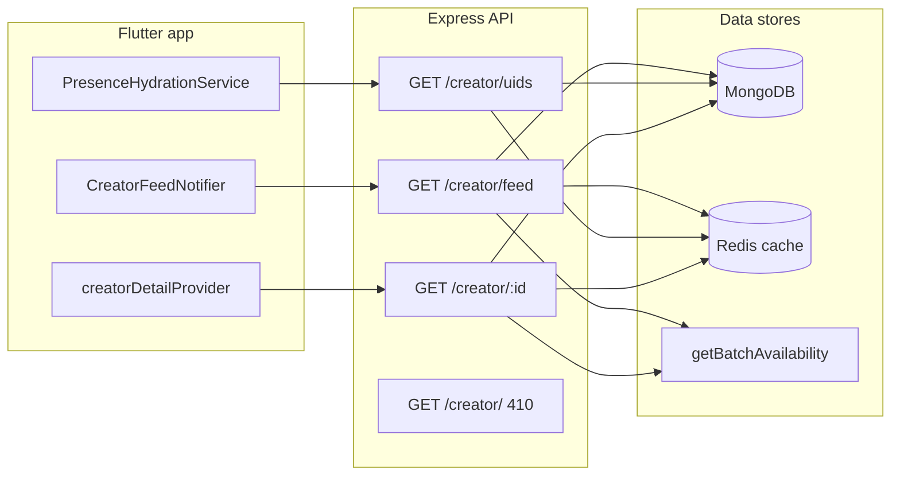

# Creator Feed Performance Refactor — Implementation Reference

This document describes **what was implemented** in the creator catalog / profile performance refactor: new API surface, caching, frontend behavior, schema changes, tests, and how the pieces fit together. It is the companion to the rollout checklist: [CREATOR_FEED_PERF_REFACTOR_MANUAL_CHECKLIST.md](CREATOR_FEED_PERF_REFACTOR_MANUAL_CHECKLIST.md).

For the original performance analysis and debugging guide, see [PERF_HOME_AND_CREATOR_PROFILE_LOADING.md](PERF_HOME_AND_CREATOR_PROFILE_LOADING.md). For Firebase Resize Images setup, see [FIREBASE_RESIZE_IMAGES.md](FIREBASE_RESIZE_IMAGES.md).

---

## Goals

- **List path is O(1) per item** with respect to Firebase Storage: no `exists()` / `getMetadata()` on the hot feed.
- **Presence hydration** does not sweep multiple heavy catalog pages; it uses a **single lightweight** UID list endpoint.
- **Progressive profile UX**: home feed stays fast; full gallery and bio load via **detail** fetch when the user opens a profile.
- **Perceived image performance**: disk-backed image caching and optional thumbnail URLs.

---

## Backend API Changes

### `GET /creator/` (legacy root)

- **Handler**: `getCreatorCatalogGone` in [backend/src/modules/creator/creator.controller.ts](../../backend/src/modules/creator/creator.controller.ts).
- **Behavior**: HTTP **410 Gone** with JSON body including `code: 'ENDPOINT_REMOVED'` and a message pointing clients to **`GET /creator/feed`**.
- **Auth**: `verifyFirebaseToken` (same router pattern as before for this path).

### `GET /creator/feed`

- **Purpose**: Paginated **public catalog** for consumers (and admins in user-style views). Minimal fields; **no** `galleryImages` resolution; empty `about` and empty `galleryImages` in JSON for feed-shaped responses.
- **Query**: `page` (default 1), `limit` (default 20, max 50).
- **Auth**: Required. **403** for `role === 'creator'` and `role === 'agent'` (same product rules as the old list).
- **Data**: Mongo query with projection on feed-only fields; batch `User` lookup for `firebaseUid`; **`getBatchAvailability`** merged **after** any Redis cache read so availability stays live.
- **Caching** (optional, when Redis is configured):
  - Key pattern: `creator:feed:p{page}:l{limit}` (see [backend/src/config/redis.ts](../../backend/src/config/redis.ts)).
  - TTL: **30 seconds**.
  - Cached payload excludes per-user fields that vary by viewer: favorites are **overlaid** after cache read from `currentUser.favoriteCreatorIds`.
  - Metrics: `INCR creator:feed:metrics:hits` / `creator:feed:metrics:misses` (best-effort).
- **Logging**: `logInfo('creator.feed.timing', { page, limit, cacheHit, mongoMs, availabilityMs, totalMs, rowCount })`.

### `GET /creator/uids`

- **Purpose**: Return **all** distinct Firebase UIDs linked to creator profiles for **presence / availability** batching over Socket.IO—without loading galleries or resolving Storage URLs.
- **Auth**: Required. **403** for creators and agents (same idea as feed).
- **Caching**: Single key `creator:uids:v1`, TTL **60 seconds** (invalidated when the public catalog invalidation runs).
- **Logging**: `logInfo('creator.uids.timing', { cacheHit, mongoMs, totalMs, count })`.

### `GET /creator/:id`

- **Purpose**: **Full** creator document for profile / detail: `about`, `galleryImages`, `firebaseUid`, `availability`, optional `thumbnailPhoto`, etc.
- **Auth**: **`verifyFirebaseToken` required** (previously this route was unauthenticated).
- **Authorization**:
  - **Agent**: **403** (must use agent-specific APIs).
  - **Creator**: may only fetch **their own** profile document (matched by `Creator.userId` ↔ current user).
  - **User** / **admin** (typical consumer paths): may fetch by Mongo creator id.
- **Gallery repair**: Still calls `resolveGalleryImageUrlsForApi` **unless** `process.env.DISABLE_GALLERY_REPAIR_ON_READ === 'true'` (after a successful gallery URL backfill in production).
- **Caching**: Per-id Redis key `creator:detail:{id}`, TTL **60 seconds**; **availability** is always merged from Redis at response time, not stored in the cache blob.
- **Logging**: `logInfo('creator.detail.timing', { id, cacheHit, totalMs })`.

### `POST /creator/profile/gallery/commit` (and related)

- After building the main download URL, the server attempts a **400×400** resized path via `buildResizedStoragePath` + `tryBuildPublicGalleryDownloadUrl` (see [backend/src/modules/creator/creator-gallery.storage.ts](../../backend/src/modules/creator/creator-gallery.storage.ts)). If the resized object does not exist yet (extension still processing), `thumbnailUrl` may be omitted.
- **Invalidation**: `invalidateCreatorDetailCache(creatorId)` on commit, delete, and reorder.

### Catalog / detail cache invalidation

Implemented in [backend/src/modules/creator/creator.controller.ts](../../backend/src/modules/creator/creator.controller.ts) and [backend/src/config/redis.ts](../../backend/src/config/redis.ts):

- **`invalidateCreatorCatalogCaches()`** — clears all registered `creator:feed:*` keys and `creator:uids:v1`. Used when creator roster or list-facing fields change (create, delete, admin/agent update, profile notify path, creator self profile update).
- **`invalidateCreatorDetailCache(creatorId)`** — clears one detail key. Used when gallery or detail-only data changes.

Helpers such as `notifyCreatorProfileChannels` also call these after Stream/admin invalidation work.

### `GET /user/list`

- Removed the debug **`User.find({}).limit(10)`** block that ran on every paginated user list request ([backend/src/modules/user/user.controller.ts](../../backend/src/modules/user/user.controller.ts)).

---

## Backend Schema and Indexes

**File**: [backend/src/modules/creator/creator.model.ts](../../backend/src/modules/creator/creator.model.ts)

| Addition | Purpose |
|----------|---------|
| `thumbnailPhoto` (optional on creator root) | Future / extension-based small avatar URL |
| `thumbnailUrl` (optional on each `galleryImages[]` item) | Thumbnail for grid; full `url` for viewer |
| Index `{ createdAt: -1 }` | Efficient default feed sort |
| Index `{ isOnline: 1, createdAt: -1 }` | Optional future “online first” queries |

**Gallery normalization**: [backend/src/modules/creator/creator-gallery-resolve.ts](../../backend/src/modules/creator/creator-gallery-resolve.ts) exports `NormalizedGalleryImage` and preserves optional `thumbnailUrl`.

---

## Backend Scripts and Tests

| Item | Location |
|------|----------|
| Gallery URL backfill | [backend/src/scripts/backfill-gallery-urls.ts](../../backend/src/scripts/backfill-gallery-urls.ts) |
| npm script | `npm run backfill:gallery-urls` in [backend/package.json](../../backend/package.json) |
| Contract tests | [backend/src/modules/creator/creator-feed.contract.test.ts](../../backend/src/modules/creator/creator-feed.contract.test.ts) (included in `npm test`) |

---

## Frontend Changes

### Feed and pagination

**File**: [frontend/lib/features/home/providers/home_provider.dart](../lib/features/home/providers/home_provider.dart)

- Initial and paginated requests use **`GET /creator/feed?page=&limit=`** (with `homeFeedPageSize` = 20).
- Removed the **“full catalog without pagination”** client fallback; the app expects **`pagination`** in the response.
- **`creatorDetailProvider`**: `FutureProvider.autoDispose.family<CreatorModel, String>` — fetches **`GET /creator/{id}`** for progressive profile hydration.

### Presence hydration

**File**: [frontend/lib/features/home/services/presence_hydration_service.dart](../lib/features/home/services/presence_hydration_service.dart)

- **`collectCreatorFirebaseUids()`** calls **`/creator/uids`** once and parses `data.firebaseUids`.
- **`collectUserFirebaseUids()`** still uses paginated **`/user/list`** (unchanged sweep for creator-side user presence).

### API client and auth token memory

**Files**:

- [frontend/lib/core/api/api_client.dart](../lib/core/api/api_client.dart) — `static` in-memory token; reads SharedPreferences only on cache miss; updates memory on refresh retry; **`setAuthTokenMemory` / `clearAuthTokenMemory`**; perf log categories **`creator_feed`**, **`creator_uids`**, **`creator_detail`**.
- [frontend/lib/features/auth/providers/auth_provider.dart](../lib/features/auth/providers/auth_provider.dart) — syncs memory on login token save, `idTokenChanges`, proactive refresh, and clears on logout / auth-null.

### Models

**File**: [frontend/lib/shared/models/creator_model.dart](../lib/shared/models/creator_model.dart)

- `thumbnailPhoto`, **`displayPhoto`** (prefers thumbnail when set).
- `CreatorGalleryImage.thumbnailUrl`.
- **`copyWith`** for merging feed row + detail fetch.
- **`fromJson`**: `about` defaults to `''` when omitted (feed payloads).

### UI: home grid and profile

**File**: [frontend/lib/features/home/widgets/home_user_grid_card.dart](../lib/features/home/widgets/home_user_grid_card.dart)

- **`CachedNetworkImage`** for feed tile, profile avatar, gallery thumbs, and fullscreen viewer (dependency: **`cached_network_image`** in [pubspec.yaml](../pubspec.yaml)).
- **`_CreatorProfilePage`** is a **`ConsumerStatefulWidget`**: watches **`creatorDetailProvider(creator.id)`** and merges detail into the feed `CreatorModel`; shows loading placeholders for bio (when empty) and gallery grid while detail loads.

### Incoming call avatar lookup

**File**: [frontend/lib/features/video/widgets/incoming_call_listener.dart](../lib/features/video/widgets/incoming_call_listener.dart)

- Prefer **`ref.read(creatorsProvider).valueOrNull`** (in-memory feed).
- Fallback: **`GET /creator/feed?page=1&limit=50`** — no longer calls unbounded **`GET /creator`**.

---

## Route Registration Order (backend)

**File**: [backend/src/modules/creator/creator.routes.ts](../../backend/src/modules/creator/creator.routes.ts)

Specific routes (`/feed`, `/uids`, `/dashboard`, …) are registered **before** **`GET /:id`** so Express does not treat `feed` or `uids` as an id parameter.

---

## Environment Variables (reference)

| Variable | Effect |
|----------|--------|
| `DISABLE_GALLERY_REPAIR_ON_READ=true` | Skips `resolveGalleryImageUrlsForApi` inside **`getCreatorById`** (use only after backfill; see checklist). |
| Redis (`REDIS_URL` / `REDISHOST`, etc.) | Enables feed, uids, and detail caches; without Redis, handlers still work, caches are skipped. |

---

## Flutter Tests Updated or Added

| Test | Purpose |
|------|---------|
| [frontend/test/home_provider_pagination_test.dart](../test/home_provider_pagination_test.dart) | Mocks `/creator/feed` paths |
| [frontend/test/home_feed_availability_stress_widget_test.dart](../test/home_feed_availability_stress_widget_test.dart) | Same |
| [frontend/test/presence_hydration_service_test.dart](../test/presence_hydration_service_test.dart) | Asserts `/creator/uids` parsing |

---

## Documentation Updated in-repo

| Doc | Notes |
|-----|-------|
| [PERF_HOME_AND_CREATOR_PROFILE_LOADING.md](PERF_HOME_AND_CREATOR_PROFILE_LOADING.md) | Checklist and observability section aligned with new endpoints |
| [FIREBASE_RESIZE_IMAGES.md](FIREBASE_RESIZE_IMAGES.md) | Extension + `thumbnailUrl` behavior |

---

## Architectural Summary

Legacy clients calling **`GET /creator/`** receive **410** and must migrate to **`/creator/feed`**. The shipped Flutter app uses the new paths exclusively.
