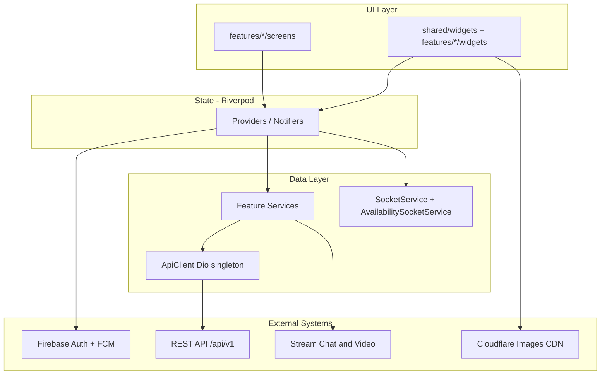
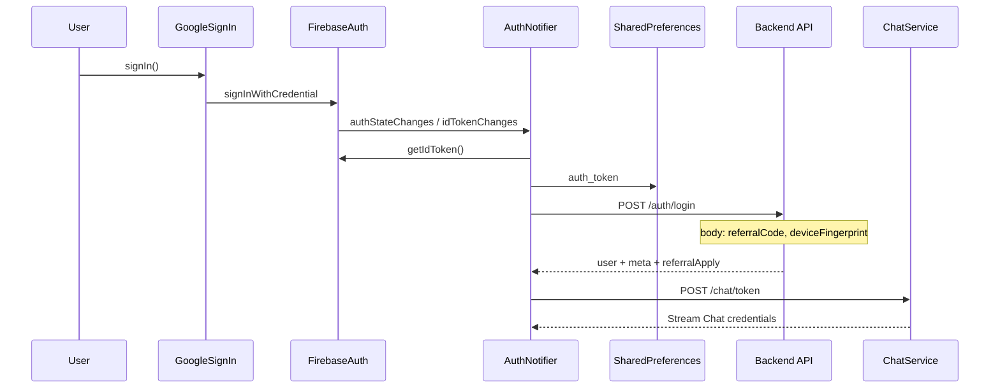
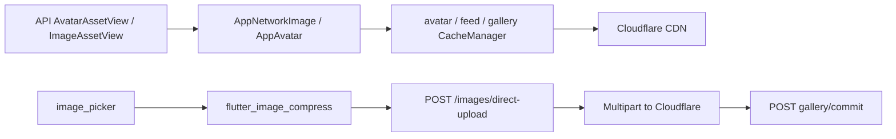
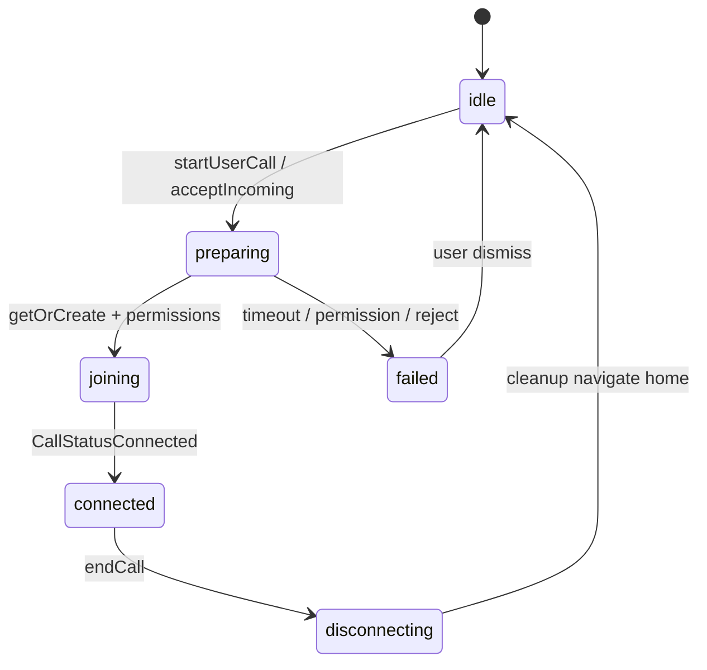

# Match Vibe — Flutter Frontend Comprehensive Reference

> **Package:** `zztherapy` · **Display name:** Match Vibe · **Version:** 1.0.0+37  
> **Path:** `D:\zztherapy\frontend`  
> **Generated from:** source code analysis (`lib/`, `pubspec.yaml`, `.env.example`) — May 2026

---

## Table of contents

1. [Executive summary](#1-executive-summary)
2. [Architecture](#2-architecture)
3. [Project structure](#3-project-structure)
4. [Dependencies and environment](#4-dependencies-and-environment)
5. [App bootstrap and widget tree](#5-app-bootstrap-and-widget-tree)
6. [Navigation and routing](#6-navigation-and-routing)
7. [UI and UX design system](#7-ui-and-ux-design-system)
8. [Authentication and session](#8-authentication-and-session)
9. [API client and REST reference](#9-api-client-and-rest-reference)
10. [Socket.IO real-time layer](#10-socketio-real-time-layer)
11. [Data models and schemas](#11-data-models-and-schemas)
12. [Image pipeline](#12-image-pipeline)
13. [State management (Riverpod)](#13-state-management-riverpod)
14. [Feature modules](#14-feature-modules)
15. [Home screen deep dive](#15-home-screen-deep-dive)
16. [Video calls, chat, wallet](#16-video-calls-chat-wallet)
17. [User journeys](#17-user-journeys)
18. [Local storage](#18-local-storage)
19. [Push notifications and permissions](#19-push-notifications-and-permissions)
20. [Testing and native projects](#20-testing-and-native-projects)
21. [Appendix: file index and glossary](#21-appendix-file-index-and-glossary)
22. [Complete Dart source manifest](#22-complete-dart-source-manifest-162-files)
23. [Core services reference](#23-core-services-reference)
24. [Modal and programmatic UI](#24-modal-and-programmatic-ui-not-in-gorouter)
25. [Related documentation](#25-related-documentation-in-frontenddocs)
26. [Sentry error monitoring (implemented)](#26-sentry-error-monitoring-implemented)

---

## 1. Executive summary

**Match Vibe** is a Flutter mobile app that connects **users** with **creators** for paid video calls, text chat, and coin-based commerce. Creators earn from calls; users spend coins purchased via web checkout.

### User roles

| Role | `UserModel.role` | Primary experience |
|------|------------------|-------------------|
| User | `user` | Browse creator grid, call/chat, buy coins |
| Creator | `creator` | Tasks dashboard, go online, receive calls, withdraw earnings |
| Admin | `admin` | Same UI with optional “view as user/creator” toggle |

### Technology stack

| Layer | Technology |
|-------|------------|
| Framework | Flutter 3.x, Dart ^3.10.7 |
| State | **flutter_riverpod** (manual providers; `riverpod_generator` in dev_deps but unused) |
| Navigation | **go_router** |
| Auth | **Firebase Auth** + Google Sign-In |
| REST | **Dio** singleton `ApiClient` |
| Real-time | **socket_io_client** (availability, billing, coins) |
| Chat | **stream_chat_flutter** |
| Video | **stream_video_flutter** |
| Images | **Cloudflare Images** (CDN variants + blurhash) |
| Local storage | **shared_preferences** (not `flutter_secure_storage` in practice) |

### Architectural pattern

**Feature-first modules** under `lib/features/`, shared code in `lib/shared/` and `lib/core/`, app shell in `lib/app/`. There is **no repository layer** — feature `*Service` classes and Riverpod providers call `ApiClient` directly.

---

## 2. Architecture



### Data flow (typical screen)

1. Screen is a `ConsumerWidget` / `ConsumerStatefulWidget`.
2. `ref.watch(someProvider)` triggers load.
3. Provider calls `*Service` or `ApiClient` directly.
4. JSON parsed into `*Model.fromJson`.
5. UI renders `AsyncValue` (loading / data / error).

### Critical design rules (from code comments)

- **Call state:** Always use `callConnectionControllerProvider` — not `streamVideo.state.activeCall` alone.
- **Navigation from overlays:** Use global `appRouter`, not `context.push` without context.
- **Creator availability:** Redis-backed socket events are authoritative; feed `isOnline` is hydrated then updated live.

---

## 3. Project structure

```
frontend/
├── lib/
│   ├── main.dart                 # Entry point
│   ├── firebase_options.dart     # Generated Firebase config
│   ├── app/
│   │   ├── router/app_router.dart
│   │   └── widgets/              # MainLayout, lifecycle, Stream Chat wrapper
│   ├── core/
│   │   ├── api/api_client.dart
│   │   ├── constants/
│   │   ├── images/               # ImageAssetView, cache managers
│   │   ├── services/             # 17 cross-cutting services
│   │   ├── theme/app_theme.dart
│   │   └── utils/
│   ├── features/                 # Feature modules (auth, home, video, …)
│   └── shared/
│       ├── models/
│       ├── providers/
│       ├── styles/
│       └── widgets/
├── android/                      # com.matchvibe.app
├── ios/
├── test/                         # 10 test files
├── pubspec.yaml
├── .env.development / .env.production / .env.example
└── docs/                         # This file
```

**Scale:** ~163 Dart files under `lib/`.

### Feature folders (`lib/features/`)

| Folder | Purpose |
|--------|---------|
| `auth` | Splash, login, `authProvider` |
| `home` | Creator/user feeds, favorites, availability |
| `recent` | Call history |
| `chat` | Stream Chat list + thread |
| `video` | Stream Video calls, billing overlay |
| `wallet` | Coins, checkout, transactions |
| `account` | Profile, settings, block, delete |
| `creator` | Dashboard, tasks, gallery API |
| `withdrawal` | Creator payouts |
| `referral` | Host/agency referral onboarding |
| `support` | Tickets, call feedback, payment complaints |
| `onboarding` | Gender, server-driven onboarding |
| `admin` | View-as mode for admins |
| `user` | `userProvider`, online users, availability |

---

## 4. Dependencies and environment

### Key `pubspec.yaml` dependencies

| Category | Packages |
|----------|----------|
| State | `flutter_riverpod`, `riverpod_annotation` (dev only) |
| Navigation | `go_router` |
| Firebase | `firebase_core`, `firebase_auth`, `firebase_messaging`, `google_sign_in` |
| HTTP | `dio`, `http` (images only) |
| Storage | `shared_preferences`, `flutter_secure_storage` (**unused in lib/**) |
| Stream | `stream_chat_flutter`, `stream_video_flutter`, `stream_video_push_notification` |
| Real-time | `socket_io_client` |
| Media | `cached_network_image`, `flutter_cache_manager`, `flutter_blurhash`, `flutter_image_compress`, `image_picker`, `video_player` |
| UI | `google_fonts`, `flutter_animate`, `skeletonizer` |
| Other | `flutter_dotenv`, `app_links`, `url_launcher`, `permission_handler`, `connectivity_plus` |

### Environment variables (`.env.example`)

| Key | Purpose |
|-----|---------|
| `API_BASE_URL` | REST base, e.g. `https://api.example.com/api/v1` |
| `SOCKET_URL` | Socket.IO origin (no path) |
| `WEBSITE_BASE_URL` | Legal pages, marketing |
| `STREAM_API_KEY` | Stream Chat/Video (optional; has default in code) |
| `GOOGLE_WEB_CLIENT_ID` | Google Sign-In → Firebase idToken on mobile |
| `USE_CLOUDFLARE_IMAGES` | Must match backend; when false, legacy URL adapters |
| `ENABLE_SERVER_ONBOARDING_FLOW` | Server-driven onboarding |
| `ENABLE_DETERMINISTIC_ONBOARDING_RUNNER` | Serialized onboarding popups |
| `ALLOW_PUSH_PERMISSION_PROMPT_OUTSIDE_ONBOARDING` | Optional push prompt outside onboarding |

Loaded in `main.dart`: **release** → `.env.production`, **debug/profile** → `.env.development`.

### Bundled assets (`lib/assets/`)

| Asset | Use |
|-------|-----|
| `app_logo.png` | Brand + launcher icon |
| `loader_bg.png` | Splash background |
| `loginpage_video.mp4` | Login loop (muted) |
| `male/`, `female/` | Default avatar placeholders |
| `ringtone/` | Call ringtones |
| `wallet_icons/` | Wallet tier art |
| `call_ended_images/` | Post-call modals |
| `promo_first_call_on_us.png` | Promo popup |

---

## 5. App bootstrap and widget tree

**File:** `lib/main.dart`

### Startup sequence

1. `WidgetsFlutterBinding.ensureInitialized()`
2. Image cache: 150 MB / 1500 images; `MemoryPressureObserver.register()`
3. `dotenv.load(.env.development | .env.production)`
4. Production env sanity check (required keys, no localhost)
5. Parallel: `SecurityService`, Firebase init, local notifications
6. FCM background handler
7. `runApp(ProviderScope(child: MyApp()))`

### Widget tree

```
ProviderScope
└── MyApp (ConsumerStatefulWidget)
    └── StreamChatWrapper
        └── MaterialApp.router
            theme: AppTheme.lightTheme
            router: appRouter
            builder:
              _StreamChatBuilder (connect Stream Chat on auth)
              └── AppLifecycleWrapper
                    ├── child: router screen
                    ├── IncomingCallListener
                    └── OutgoingCallOverlay (Stack)
```

`ApiClient.setImageServiceDegradedCallback` is wired from `MyApp` to flip `imageServiceDegradedProvider` when Dio sees `X-Image-Service-Degraded`.

---

## 6. Navigation and routing

**File:** `lib/app/router/app_router.dart`  
**Global instance:** `appRouter` — use from overlays, FCM handlers, call lifecycle without `BuildContext`.

### Route table

| Path | Screen | Notes |
|------|--------|-------|
| `/splash` | `SplashScreen` | Initial route |
| `/login` | `LoginScreen` | Query: `?ref=` referral code |
| `/gender` | `GenderSelectionScreen` | Post-signup if no gender |
| `/host-application-pending` | `HostApplicationPendingScreen` | Agency host waiting |
| `/host-profile-setup` | redirect → `/edit-profile` | |
| `/agent-verification` | redirect → `/home` | Legacy |
| `/home` | `HomeScreen` | Tab 0 |
| `/home/favorites` | `FavoriteCreatorsScreen` | Pushed; no bottom nav |
| `/recent` | `RecentScreen` | Tab 1 |
| `/chat-list` | `ChatListScreen` | Tab 2 |
| `/chat/:channelId` | `ChatScreen` | Full-screen thread |
| `/account` | `AccountScreen` | Tab 3 |
| `/edit-profile` | `EditProfileScreen` | |
| `/wallet` | `WalletScreen` | |
| `/wallet/payment-status` | `PaymentStatusScreen` | Query: `payment`, `coinsAdded`, `message` |
| `/transactions` | `TransactionsScreen` | |
| `/help-support` | `HelpSupportScreen` | |
| `/account/settings` | `AccountSettingsScreen` | |
| `/account/settings/blocked-buddies` | `BlockedBuddiesScreen` | |
| `/account/settings/delete-account` | `DeleteAccountScreen` | |
| `/creator/tasks` | `CreatorTasksScreen` | Role guard in screen |
| `/creator/withdraw` | `WithdrawalScreen` | |
| `/support` | `SupportScreen` | |
| `/support/payment-complaint` | `PaymentComplaintScreen` | `extra`: `TransactionModel` |
| `/call` | `VideoCallScreen` | Full-screen; driven by `CallConnectionController` |

### Splash navigation logic

**File:** `lib/features/auth/screens/splash_screen.dart`

1. Wait for Firebase auth restore + `authProvider` backend sync.
2. If not authenticated → `/login`.
3. If `creatorApplicationPending` → `/host-application-pending` (`host_onboarding_routes.dart`).
4. If `hostProfileSetupRequired` → `/edit-profile`.
5. If no `gender` → `/gender`.
6. Else → `/home`.

### Main tab shell

**File:** `lib/app/widgets/main_layout.dart`

| Tab index | Route | Label |
|-----------|-------|-------|
| 0 | `/home` | Home |
| 1 | `/recent` | Recent |
| 2 | `/chat-list` | Chat (badge = unread) |
| 3 | `/account` | Account |

**App bar (role-dependent):**

- **Users:** gem icon + coin balance → `/wallet`; favorites → `/home/favorites`.
- **Creators on home:** Online/Offline toggle (`creatorStatusProvider`).
- **During active call:** live billing chip from `callBillingProvider`.

Screens **outside** `MainLayout`: wallet, chat thread, call, favorites, edit-profile, settings sub-routes.

```mermaid
flowchart LR
  subgraph tabs [MainLayout]
    Home[/home]
    Recent[/recent]
    ChatList[/chat-list]
    Account[/account]
  end
  Home --> Favorites[/home/favorites]
  Home --> ProfileModal[Creator profile modal]
  ProfileModal --> CallRoute[/call]
  ProfileModal --> ChatRoute[/chat/:id]
  Account --> Wallet[/wallet]
  Wallet --> Checkout[External browser]
  Checkout --> PayStatus[/wallet/payment-status]
```

---

## 7. UI and UX design system

### Theme

**File:** `lib/core/theme/app_theme.dart`

- **Material 3** light theme only (`darkTheme` is deprecated alias).
- **Font:** Montserrat via `google_fonts`.
- **Primary:** `#D32F2F` (red).
- **Surfaces:** white + beige `#F7EFE5`.
- Themed: AppBar, Card, Dialog, inputs, FilledButton, SnackBar, NavigationBar.

### Brand gradients

**File:** `lib/shared/styles/app_brand_styles.dart` — `AppBrandGradients`

Centralized gradients for app background, call dial card, wallet, avatar rings, account menu (purple accents), user card overlays.

### Spacing

**File:** `lib/core/constants/app_spacing.dart` — 4px scale: `xs=4` … `xxl=32`.

### UI primitives

**File:** `lib/shared/widgets/ui_primitives.dart`

- `AppScaffold`, `AppCard`, `EmptyState`, consistent padding.

### Shared widgets

| Widget | File | Purpose |
|--------|------|---------|
| `AppNetworkImage` | `app_network_image.dart` | All remote images; blurhash, cache managers |
| `AppAvatar` | `app_avatar.dart` | Size-aware Cloudflare variant |
| `GemIcon` | `gem_icon.dart` | Coin currency |
| `SkeletonCard` / `SkeletonList` | `skeleton_*.dart` | Loading (`skeletonizer`) |
| `AppToast` | `app_toast.dart` | Toasts |
| `AppModalDialog` / `AppModalBottomSheet` | | Modal patterns |
| `WelcomeDialog` | | First-time welcome |
| `PermissionsIntroBottomSheet` | | Camera/mic/notifications education |
| `ImageServiceDegradedBanner` | | Backend image degradation warning |
| `AppUpdatePopup` | | Force/soft update |
| `BrandAppChrome` | | Gradient app bar / sheet headers |
| `ProfileCard` | | List-style user/creator card (legacy list UI) |
| `CreatorPricePerMinuteLabel` | | Price on cards |

### UX patterns

- **Pull-to-refresh** on feeds and lists.
- **Infinite scroll** on home creator grid (`ScrollController` → `loadMore()`).
- **Skeleton loading** via `skeletonizer` before data arrives.
- **Modal coordinator** (`modal_coordinator_service.dart`) — serializes welcome, permissions, app update, coin purchase popups (one at a time).
- **Animations:** `flutter_animate` on promos and transitions.
- **Login:** looping `video_player` background + Google CTA.

---

## 8. Authentication and session

### Overview

| Step | System |
|------|--------|
| Identity | Firebase Auth |
| Sign-in UI | Google Sign-In only |
| Backend user | `POST /auth/login` with Firebase Bearer token |
| API auth | `Authorization: Bearer <firebase_id_token>` on every Dio request |

There is **no email/password** screen in the app.

### Auth flow diagram



### Key classes

| Symbol | File |
|--------|------|
| `authProvider`, `AuthNotifier`, `AuthState` | `lib/features/auth/providers/auth_provider.dart` |
| `signInWithGoogle`, `signOut`, `refreshUser` | same |
| `LoginScreen` | `lib/features/auth/screens/login_screen.dart` |
| `SplashScreen` | `lib/features/auth/screens/splash_screen.dart` |
| `AppGoogleSignIn` | `lib/core/services/google_sign_in_service.dart` |

### `POST /auth/login` request body

```json
{
  "referralCode": "JOE48392",
  "deviceFingerprint": "<android_id or ios_vendor_id>"
}
```

Both fields optional. Referral staged via `setPendingReferralCode`, Play Install Referrer, or `/login?ref=`.

### Login response shapes

Backend returns `{ success: true, data: { ... } }`. **Two user shapes:**

1. **Regular user:** nested `data.user` → `UserModel.fromJson`.
2. **Creator:** flat creator fields at top level of `data` (no nested `user`).

Also in `data`:

- `meta.showWelcomeBackDialog`
- `referralApply` — `{ ok, code, message }`
- `createdNow` — first signup flag

### Token lifecycle

1. Firebase ID token saved to `SharedPreferences` key `auth_token`.
2. In-memory: `ApiClient.setAuthTokenMemory(token)`.
3. `idTokenChanges()` listener refreshes token (~hourly).
4. **401 on API:** Dio interceptor calls `getIdToken(true)`, saves, retries (shared `_tokenRefreshFuture` for concurrent 401s).
5. **App resume:** `refreshAuthToken()` in auth provider.

### Logout

`signOut()`: disconnect availability socket, Google sign-out, Firebase sign-out, `prefs.clear()`, reset `AuthState`, clear API token memory.

### Referral at signup

- `ReferralService` — preview and apply codes.
- Agency host fallback: if user referral fails with certain codes, retries `applyAgencyHostReferral`.
- Host pending route when `creatorApplicationPending == true`.

---

## 9. API client and REST reference

### ApiClient

**File:** `lib/core/api/api_client.dart` — factory singleton.

| Setting | Value |
|---------|-------|
| Base URL | `AppConstants.baseUrl` → `API_BASE_URL` |
| Connect timeout | 15s |
| Receive timeout | 30s |
| Send timeout | 15s |
| Headers | `Content-Type: application/json`, `Accept: application/json` |
| Auth | `Authorization: Bearer` from memory or prefs |
| Health | Separate Dio → `{SOCKET_URL}/health` |

### Standard response

```json
{
  "success": true,
  "data": { }
}
```

Errors mapped via `UserMessageMapper` (`lib/core/utils/user_message_mapper.dart`).

### GET endpoints

| Endpoint | Caller | Purpose |
|----------|--------|---------|
| `GET /user/me` | `auth_provider.dart`, `user_provider.dart` | Current user profile |
| `GET /user/list?page&limit` | `home_provider.dart`, `presence_hydration_service.dart`, `remote_avatar_lookup.dart` | Paginated users (creator home feed) |
| `GET /user/favorites/creators?page&limit` | `favorite_creators_provider.dart` | Favorited creators |
| `GET /user/call-history?page&limit` | `call_history_service.dart` | Recent calls |
| `GET /user/transactions?page&limit` | `transaction_service.dart` | User transaction history |
| `GET /creator/transactions?page&limit` | `transaction_service.dart` | Creator earnings transaction history |
| `GET /user/blocked-creators/count` | `account_settings_screen.dart`, `blocked_buddies_screen.dart` | Block count only |
| `GET /creator/feed?page&limit` | `home_provider.dart`, `incoming_call_listener.dart` | Paginated creators (user home) |
| `GET /creator/:creatorId` | `home_provider.dart` (`creatorDetailProvider`) | Single creator |
| `GET /creator/uids` | `presence_hydration_service.dart` | All creator Firebase UIDs for hydration |
| `GET /creator/by-firebase-uid/:uid` | `chat_screen.dart`, `incoming_call_listener.dart` | Creator by Stream UID |
| `GET /creator/profile` | `creator_gallery_service.dart` | Creator profile + gallery |
| `GET /creator/dashboard` | `creator_dashboard_service.dart` | Earnings, tasks summary |
| `GET /creator/tasks` | `creator_task_service.dart` | Task list |
| `GET /creator/earnings` | `earnings_service.dart` | Creator earnings |
| `GET /creator/withdrawals` | `withdrawal_service.dart` | Withdrawal history |
| `GET /payment/packages` | `payment_service.dart` | Coin package pricing |
| `GET /chat/quota/:channelId` | `chat_service.dart` | Message quota for channel |
| `GET /chat/channel/:channelId/other-member` | `chat_service.dart` | Other member metadata |
| `GET /chat/channel/:channelId/creator-call-info` | `chat_service.dart` | Creator call pricing for chat CTA |
| `GET /images/presets` | `image_presets_service.dart` | Avatar preset URLs |
| `GET /support/my-tickets` | `support_service.dart` | User support tickets |
| `GET /app-updates/pending` | `app_update_service.dart` | Pending app update popup |
| `GET /availability/online-users` | `online_users_provider.dart` | Online users for creator chat tab |
| `GET /user/referrals` | `referral_service.dart` | Referral list |
| `GET /referral/preview?code&mode` | `referral_service.dart` | Validate referral (signup / agency_host) |

### POST / PUT / PATCH / DELETE endpoints

| Method | Endpoint | Caller | Purpose |
|--------|----------|--------|---------|
| POST | `/auth/login` | `auth_provider.dart` | Sync Firebase user to backend |
| POST | `/chat/token` | `chat_service.dart` | Stream Chat JWT |
| POST | `/chat/channel` | `chat_service.dart` | Create or get DM channel |
| POST | `/chat/pre-send` | `chat_service.dart` | Pre-send quota check |
| POST | `/video/token` | `video_service.dart` | Stream Video JWT |
| POST | `/payment/web/initiate` | `payment_service.dart` | Start web checkout |
| POST | `/user/coins` | `wallet_service.dart` | Adjust coins (admin/dev) |
| POST | `/billing/:event` | `socket_service.dart` | REST fallback when socket down |
| POST | `/user/onboarding/stage` | `onboarding_flow_service.dart` | Advance onboarding stage |
| POST | `/user/onboarding/permissions-decision` | `onboarding_flow_service.dart` | Accept/skip permissions |
| POST | `/user/onboarding/permissions-reconcile` | `permission_reconciliation_service.dart` | Reconcile permission state |
| POST | `/user/referral/apply` | `referral_service.dart` | Apply user referral |
| POST | `/user/referral/apply-agency` | `referral_service.dart` | Apply agency host referral |
| POST | `/user/block-creator` | `chat_screen.dart` | Block creator from chat |
| POST | `/user/delete-account` | `delete_account_screen.dart` | Delete account |
| POST | `/creator/tasks/:taskKey/claim` | `creator_task_service.dart` | Claim task reward |
| POST | `/creator/withdraw` | `withdrawal_service.dart` | Request withdrawal |
| POST | `/creator/profile/gallery/commit` | `creator_gallery_service.dart` | Commit uploaded gallery image |
| POST | `/images/direct-upload` | `image_upload_service.dart` | Get Cloudflare upload URL |
| POST | `/metrics/image-render` | `image_render_metrics_reporter.dart` | Image perf telemetry |
| POST | `/support/ticket` | `support_service.dart` | Create support ticket |
| POST | `/support/call-feedback` | `support_service.dart` | Post-call rating/report |
| POST | `/app-updates/:id/ack-update-now` | `app_update_service.dart` | Acknowledge app update |
| POST | `/availability/resolve-users` | `online_users_provider.dart` | Resolve user availability batch |
| PUT | `/user/profile` | `edit_profile_screen.dart`, `gender_selection_screen.dart` | Update user profile |
| PATCH | `/creator/profile` | `edit_profile_screen.dart` | Update creator profile |
| DELETE | `/creator/profile/gallery/:imageId` | `creator_gallery_service.dart` | Remove gallery image |

### Stream SDK (not REST call creation)

- **Calls** are created via Stream Video SDK (`CallService.getOrCreateCall`) after `POST /video/token`.
- **Chat channels** use Stream SDK after `POST /chat/token` + `POST /chat/channel`.

---

## 10. Socket.IO real-time layer

### Services

| Service | File | Role |
|---------|------|------|
| `SocketService` | `lib/core/services/socket_service.dart` | Availability batches, billing, coins, app updates |
| `AvailabilitySocketService` | `lib/core/services/availability_socket_service.dart` | Creator online/offline lifecycle |

Auth: `{ token: firebaseIdToken }` on connect to `SOCKET_URL`.

### Client emits

| Event | Payload | When |
|-------|---------|------|
| `availability:get` | `{ creatorIds: [...] }` | Request creator status |
| `user:availability:get` | `[firebaseUids]` | Request user status (creators) |
| `creator:online` / `creator:offline` | — | Creator toggles availability |
| `user:online` / `user:offline` | — | User presence |
| `call:started` | billing payload | Call connected |
| `call:ended` | billing payload | Call ended |
| `billing:recover-state` | — | Recover billing after reconnect |

### Server events (listened)

| Event | Purpose |
|-------|---------|
| `availability:batch` | Map creatorId → `online` \| `busy` |
| `creator:status` | Single creator status change |
| `user:status` | Fan online/offline (creators room) |
| `user:availability:batch` | Batch user availability |
| `billing:started` | Billing session started |
| `billing:update` | Per-tick coin deduction |
| `billing:settled` | Final settlement |
| `call:force-end` | Server forced call end |
| `billing:error` | Billing failure |
| `billing:recover-state:response` | Recovery payload |
| `creator:data_updated` | Dashboard refresh after call/task |
| `coins_updated` | Balance changed (purchase, bonus) |
| `wallet_pricing_updated` | Admin changed packages |
| `app_update:published` | Global update popup |

**REST fallback:** If socket disconnected, `emitCallStarted` / `emitCallEnded` call `POST /billing/:event`.

---

## 11. Data models and schemas

### JSON helpers

**File:** `lib/core/utils/api_json.dart`

- `readId`, `readDateTime`, `readJsonMap` — handle Mongo-style `$oid`, `$date` in API responses.

### Image asset types

**File:** `lib/core/images/image_asset_view.dart`

| Type | Fields | Use |
|------|--------|-----|
| `AvatarUrls` | `xs`, `sm`, `md`, `feedTile`, `callPhoto`, `callBg` | Pre-built CDN URLs |
| `GalleryUrls` | `thumb`, `md`, `xl` | Gallery variants |
| `ImageAssetView` | `imageId`, `avatarUrls`, `galleryUrls`, `blurhash`, `width`, `height` | Full image payload |
| `AvatarAssetView` | `imageId`, `avatarUrls`, `blurhash`, dims | User avatar only |

Backend serializes URLs; the app does **not** construct Cloudflare URLs manually.

### UserModel

**File:** `lib/shared/models/user_model.dart`

| Field | Type | Notes |
|-------|------|-------|
| `id` | String | MongoDB user id |
| `email`, `phone` | String? | |
| `gender` | String? | `male`, `female`, `other` |
| `username` | String? | |
| `avatarAsset` | AvatarAssetView? | Cloudflare avatar |
| `categories` | List<String>? | Creator categories |
| `coins` | int | Wallet balance |
| `introFreeCallCredits` | int | Promo call credits |
| `welcomeFreeCallEligible` | bool | Show free-call UI |
| `spendableCallCoins` | computed | `coins + introFreeCallCredits` |
| `role` | String? | `user`, `creator`, `admin` |
| `creatorApplicationPending` | bool | Host approval waiting |
| `hostProfileSetupRequired` | bool | Complete host profile |
| `name`, `about`, `age` | | Creator profile fields |
| `referralCode` | String? | Creator referral code |
| `profileRevision` | int | Admin edit toast dedupe |
| `onboarding*` | various | Server-driven onboarding state |

### CreatorModel

**File:** `lib/shared/models/creator_model.dart`

| Field | Type | Notes |
|-------|------|-------|
| `id`, `userId` | String | Creator doc + linked user |
| `firebaseUid` | String? | Stream Video identity |
| `name`, `about` | String | |
| `avatar` | ImageAssetView? | |
| `galleryImages` | List<CreatorGalleryImage> | |
| `price` | double | Coins per minute |
| `age` | int? | |
| `isFavorite` | bool | Current user favorited |
| `availability` | String | `online` \| `busy` (Redis) |
| `feedTileUrl` | getter | `avatar.avatarUrls.feedTile` |

### UserProfileModel

**File:** `lib/shared/models/profile_model.dart` — creator-facing user cards on creator home feed.

| Field | Type |
|-------|------|
| `id`, `username`, `gender` | |
| `avatarAsset` | AvatarAssetView? |
| `firebaseUid` | String? |
| `availability` | `online` \| `offline` |

### Wallet models

| Model | File |
|-------|------|
| `TransactionModel`, `TransactionSummary` | `wallet/models/transaction_model.dart` |
| `WalletPricingData` | `wallet/models/wallet_pricing_model.dart` |
| `CreatorEarnings`, etc. | `wallet/models/earnings_model.dart` |

### Other models

| Model | File |
|-------|------|
| `CallHistoryModel` | `recent/models/call_history_model.dart` |
| `CreatorDashboard`, tasks | `creator/models/` |
| `WithdrawalRequest` | `withdrawal/models/withdrawal_model.dart` |
| `SupportTicket` | `support/models/support_ticket_model.dart` |
| `ReferralData` | `referral/models/referral_model.dart` |
| `AppUpdateModel` | `shared/models/app_update_model.dart` |

---

## 12. Image pipeline



### Rendering

| Component | File | Behavior |
|-----------|------|----------|
| `AppNetworkImage` | `shared/widgets/app_network_image.dart` | `CachedNetworkImage`, DPR-sized decode, blurhash → shimmer, Hero, metrics |
| `AppAvatar` | `shared/widgets/app_avatar.dart` | Picks variant by display dp |

### Cache managers

**File:** `lib/core/images/image_cache_managers.dart`

| Manager | stalePeriod | maxObjects | Use |
|---------|-------------|------------|-----|
| `avatarCacheManager` | 365 days | 2000 | Avatars, chat, calls |
| `feedCacheManager` | 90 days | 500 | Home grid tiles |
| `galleryCacheManager` | 365 days | 300 | Profile gallery |

Custom `HttpFileService`: WebP/AVIF `Accept` (Android prefers WebP), retry on 5xx.

### Memory

- **Global:** 150 MB / 1500 images (`main.dart`).
- **During call:** temporarily 80 MB (`video_call_screen.dart`).
- **`MemoryPressureObserver`:** evicts cache on low memory.

### Upload flow

**File:** `lib/core/services/image_upload_service.dart`

1. Pick image (`image_picker`).
2. Compress / strip EXIF (`flutter_image_compress`).
3. `POST /images/direct-upload` → signed upload URL.
4. Multipart upload to Cloudflare (separate Dio instance).
5. Gallery: `POST /creator/profile/gallery/commit`.

`UploadDraftRegistry` supports retry of failed uploads.

### Degraded mode

- Response header `X-Image-Service-Degraded` → `imageServiceDegradedProvider` → banner.
- Cleared when upload/commit health endpoints succeed.

### Precache

**File:** `lib/core/services/image_precache_service.dart`

- Home feed: first 12 tiles after load.
- Chat avatars, recent calls, gallery thumbs on profile open.

---

## 13. State management (Riverpod)

### Patterns used

| Pattern | Examples |
|---------|----------|
| `StateNotifierProvider` | `authProvider`, `callConnectionControllerProvider`, `callBillingProvider`, `streamChatNotifierProvider`, `creatorStatusProvider` (creator online toggle) |
| `AsyncNotifierProvider` | `creatorsProvider`, `usersProvider`, `favoriteCreatorsProvider`, `onlineUsersProvider` |
| `FutureProvider` | `recentCallsProvider`, `walletPricingProvider`, `creatorDashboardProvider`, `userProvider` |
| `Provider` | `homeFeedProvider`, `dashboardCoinsProvider`, service providers |
| `StateProvider` | Feed pagination meta, `coinPurchasePopupProvider` |
| `StreamProvider` | `chatUnreadCountProvider` |

### Provider inventory (critical)

| Provider | File | Exposes |
|----------|------|---------|
| `authProvider` | `auth/providers/auth_provider.dart` | `AuthState` (firebase + UserModel) |
| `creatorsProvider` | `home/providers/home_provider.dart` | `AsyncValue<List<CreatorModel>>` |
| `usersProvider` | same | `AsyncValue<List<UserProfileModel>>` |
| `homeFeedProvider` | same | Role-aware feed list |
| `creatorAvailabilityProvider` | `home/providers/availability_provider.dart` | Live creator status map |
| `callConnectionControllerProvider` | `video/controllers/call_connection_controller.dart` | Call phases |
| `callBillingProvider` | `video/providers/call_billing_provider.dart` | Live coin burn UI |
| `streamChatNotifierProvider` | `chat/providers/stream_chat_provider.dart` | `StreamChatClient?` |
| `streamVideoProvider` | `video/providers/stream_video_provider.dart` | Stream Video client |
| `modalCoordinatorProvider` | `core/services/modal_coordinator_service.dart` | Popup queue |
| `adminViewModeProvider` | `admin/providers/admin_view_provider.dart` | Admin view-as toggle |
| `imageServiceDegradedProvider` | `shared/providers/image_service_degraded_provider.dart` | Degraded banner state |

**Note:** `creatorAvailabilityProvider` and `creatorStatusProvider` exist in both `availability_provider.dart` and `availability_socket_service.dart` — the socket service file is the creator lifecycle implementation; home feed uses availability batch updates.

---

## 14. Feature modules

### auth

| Item | Detail |
|------|--------|
| Screens | `SplashScreen`, `LoginScreen` |
| Provider | `authProvider` |
| APIs | `POST /auth/login`, `GET /user/me` |
| UX | Video background login; Google button; referral `?ref=` |

### home

| Item | Detail |
|------|--------|
| Screens | `HomeScreen`, `FavoriteCreatorsScreen` |
| Providers | `creatorsProvider`, `usersProvider`, `homeFeedProvider`, `favoriteCreatorsProvider`, `creatorAvailabilityProvider` |
| Services | `presence_hydration_service.dart` |
| Widgets | `HomeUserGridCard`, `CallButtonVariant` |
| APIs | `GET /creator/feed`, `GET /user/list`, `GET /creator/uids` |

### recent

| Item | Detail |
|------|--------|
| Screen | `RecentScreen` |
| Provider | `recentCallsProvider` |
| API | `GET /user/call-history` |
| UX | Re-call, open chat from history |

### chat

| Item | Detail |
|------|--------|
| Screens | `ChatListScreen`, `ChatScreen` |
| Provider | `streamChatNotifierProvider`, `chatUnreadCountProvider` |
| Service | `ChatService` |
| UX | Creators: 2 tabs (channels + online users). Quota display. Block creator. |

### video

| Item | Detail |
|------|--------|
| Screen | `VideoCallScreen` |
| Controller | `CallConnectionController` — phases: idle → preparing → joining → connected → disconnecting / failed |
| Widgets | `IncomingCallListener`, `OutgoingCallOverlay`, `CallDialCard`, `LiveBillingOverlay` |
| Services | `CallService`, `VideoService`, ringtone, permissions, navigation |
| API | `POST /video/token` only (calls via Stream SDK) |

### wallet

| Item | Detail |
|------|--------|
| Screens | `WalletScreen`, `PaymentStatusScreen`, `TransactionsScreen` |
| Services | `PaymentService`, `WalletService`, `TransactionService`, `wallet_checkout_launcher` |
| UX | Web checkout via `url_launcher`; return via `app_links` → `/wallet/payment-status` |
| Widgets | `CallEndedLowCoinsModal` post-call upsell |

### account

| Item | Detail |
|------|--------|
| Screens | Account, edit profile, settings, blocked buddies, delete, help |
| APIs | `PUT /user/profile`, `PATCH /creator/profile`, gallery, block count, delete |
| Widgets | `BecomeCreatorBottomSheet` |

### creator

| Item | Detail |
|------|--------|
| Screen | `CreatorTasksScreen` |
| Providers | `creatorDashboardProvider`, `creatorTasksProvider`, `creatorStatusProvider` |
| Services | dashboard, tasks, gallery |
| UX | Online toggle on home; withdrawal CTA |

### withdrawal

| Item | Detail |
|------|--------|
| Screen | `WithdrawalScreen` |
| APIs | `POST /creator/withdraw`, `GET /creator/withdrawals` |

### referral

| Item | Detail |
|------|--------|
| Screens | `HostApplicationPendingScreen`, `ReferralBottomSheet` (modal) |
| Service | `ReferralService` |
| Utils | `host_onboarding_routes.dart` |

### support

| Item | Detail |
|------|--------|
| Screens | `SupportScreen`, `PaymentComplaintScreen` |
| APIs | tickets, call feedback |

### onboarding

| Item | Detail |
|------|--------|
| Screen | `GenderSelectionScreen` |
| Service | `OnboardingFlowService` — server stages + permissions |
| APIs | `/user/onboarding/*` |

### admin

| Item | Detail |
|------|--------|
| Provider | `adminViewModeProvider` — toggles user feed vs creator feed on home |

---

## 15. Home screen deep dive

**Files:** `home_screen.dart`, `home_provider.dart`, `home_user_grid_card.dart`, `creator_shuffle_utils.dart`

### Role-based content

| Role | Home tab shows |
|------|----------------|
| `user` | Paginated **creator grid** |
| `creator` | **Tasks dashboard** (balance, tasks, earnings) — not the grid |
| `admin` | Toggle via `adminViewModeProvider`: user grid OR creator user list |

### User feed (`GET /creator/feed`)

- Page size: **20** (`homeFeedPageSize`).
- Pagination: `CreatorFeedNotifier.loadMore()` on scroll end.
- Ordering (`creatorOrderProvider`):
  - Stable per-user hash shuffle (`creator_shuffle_utils.dart`).
  - **Online first**, then busy.
  - Live updates merge from `creatorAvailabilityProvider` (socket).
- Meta: `creatorsFeedMetaProvider` — page, total, `hasMore`, `isLoadingMore`.

### Grid UI

- `CustomScrollView` + responsive **2–5 columns** (`LayoutBuilder`).
- Tile: `HomeUserGridCard`
  - Image: `feedTileUrl` via `AppNetworkImage` + `feedCacheManager` + blurhash.
  - Overlay: name, age, country, online/busy pill, price/min.
  - FAB: video call (only if `availability == online`).
  - Tap: full-screen `_CreatorProfilePage` modal (gallery precache, Call + Chat).

### Call preflight

```dart
if (user.spendableCallCoins < 10) {
  // Show coin purchase popup via coinPurchasePopupProvider
}
```

Otherwise `CallConnectionController.startUserCall(creator)`.

### Loading / empty / error

- Loading: 6× `SkeletonCard`.
- Empty / error: `EmptyState` + `RefreshIndicator`.
- Precache: `ImagePrecacheService.precacheFeedTiles` (first 12).

### On-home modals (orchestrated)

- Welcome / welcome-back dialog.
- Permissions intro bottom sheet.
- Free-call promo (`welcome_free_call_promo_popup.dart`).
- Post-call star rating + report (`in_app_feedback_service.dart`).

### Creator feed (`GET /user/list`)

When creator (or admin in creator view) sees users:

- Same pagination pattern via `UserFeedNotifier`.
- `UserProfileModel` cards with availability from `userAvailabilityProvider`.

### Favorites

**Route:** `/home/favorites`  
**API:** `GET /user/favorites/creators?page&limit`  
Separate `FavoriteCreatorsNotifier` — same card UI as home.

---

## 16. Video calls, chat, wallet

### Call lifecycle



| Phase | UI |
|-------|-----|
| preparing / joining (outgoing) | `OutgoingCallOverlay` on current route |
| connected | Navigate `/call` → `StreamCallContainer` + `LiveBillingOverlay` |
| disconnecting | `VideoCallScreen` → then `context.go('/home')` |

**Failure reasons:** `permissionDenied`, `joinTimeout`, `creatorNotPickedUp`, `sfuFailure`, `rejected`, `unknown`.

### Billing

- Socket: `billing:started`, `billing:update`, `billing:settled`.
- `callBillingProvider` drives gem count in `MainLayout` during call.
- Post-call: refresh user, recent, dashboard; optional low-coins modal.

### Chat

1. On auth: `POST /chat/token` → connect `StreamChatClient`.
2. Open DM: `POST /chat/channel` → `context.push('/chat/$channelId')`.
3. Pre-send: `POST /chat/pre-send` for quota.
4. Unread: `chatUnreadCountProvider` → bottom nav badge.

### Wallet / payments

1. `GET /payment/packages` → tier cards with local PNG art.
2. `POST /payment/web/initiate` → checkout URL.
3. `wallet_checkout_launcher` opens browser (`url_launcher`).
4. `app_lifecycle_wrapper` + `app_links` catches return URL.
5. Navigate `/wallet/payment-status?payment=success&coinsAdded=N`.
6. Socket `coins_updated` also refreshes balance.

---

## 17. User journeys

### New user

```mermaid
flowchart TD
  A[Splash] --> B{Authenticated?}
  B -->|No| C[Login Google]
  C --> D[POST /auth/login]
  D --> E{Gender set?}
  E -->|No| F[/gender]
  E -->|Yes| G{Host pending?}
  F --> G
  G -->|Yes| H[/host-application-pending]
  G -->|No| I[/home]
  I --> J[Welcome + permissions]
  J --> K[Browse creators]
  K --> L[Call or Chat]
```

### Returning user

1. Splash → restore Firebase → `GET /user/me` → `/home`.
2. Browse grid (socket updates availability).
3. **Recent** tab → history → call again or chat.
4. **Chat** tab → Stream threads.
5. **Account** → profile, wallet, referral, logout.

### Creator

1. Home → tasks dashboard (not creator grid).
2. Toggle **Online** in app bar (emits `creator:online` / offline).
3. **Incoming call** overlay → accept → `/call`.
4. Chat: channels + **online users** tab.
5. Withdraw via `/creator/withdraw`.

### Payment return

1. User buys coins in external browser.
2. Deep link opens app → `AppLifecycleWrapper` parses URL.
3. `appRouter.go('/wallet/payment-status?...')`.
4. Success screen → wallet or home.

---

## 18. Local storage

### SharedPreferences keys (`AppConstants`)

| Key | Purpose |
|-----|---------|
| `auth_token` | Firebase ID token for API |
| `user_id`, `user_email`, `user_phone`, `user_coins` | Cached snapshot after login |
| `pending_referral_code` | Referral before sign-in |
| `install_referrer_consumed` | Play Install Referrer one-shot |
| `ack_profile_revision_$userId` | Admin profile update toast dedupe |

### Per-feature prefs (non-exhaustive)

- `onboarding_flow_service.dart` — stage idempotency, client mutation IDs.
- `welcome_service.dart`, `free_call_popup_service.dart`, `promo_popup_service.dart` — promo dedupe.
- `onboarding_popup_state_service.dart` — popup state.
- `app_lifecycle_wrapper.dart` — deferred payment acks.

### Not used

- **`flutter_secure_storage`** — in pubspec but no imports under `lib/`.
- **Hive / SQLite** — no local DB for app data.
- **`firebase_storage`** — listed in pubspec; uploads use Cloudflare pipeline.

---

## 19. Push notifications and permissions

### FCM

**File:** `lib/core/services/push_notification_service.dart`

- Registered in `main.dart` (foreground + background handler).
- Tap actions: navigate to `/chat/:channelId` via `appRouter`.
- Stream Video push via `stream_video_push_notification`.

### Permissions

| Permission | When requested |
|------------|----------------|
| Camera / microphone | Before video call (`permission_service.dart`) |
| Notifications | Onboarding sheet; optional outside onboarding per env flag |
| `permission_reconciliation_service` | Syncs OS state with server onboarding |

---

## 20. Testing and native projects

### Tests (`test/`)

| File | Covers |
|------|--------|
| `widget_test.dart` | Basic smoke |
| `home_provider_pagination_test.dart` | Feed pagination |
| `home_feed_availability_stress_widget_test.dart` | Availability stress |
| `presence_hydration_service_test.dart` | Presence hydration |
| `onboarding_flow_service_test.dart` | Onboarding |
| `modal_coordinator_service_test.dart` | Modal queue |
| `call_overlay_rules_test.dart` | Call overlay rules |
| `incoming_call_header_layout_test.dart` | Incoming call layout |
| `in_app_feedback_service_test.dart` | Feedback |
| `video_call_screen_disconnecting_test.dart` | Disconnect UI |

### Native

| Platform | Package / notes |
|----------|-----------------|
| Android | `com.matchvibe.app`, `google-services.json`, release signing via `key.properties` |
| iOS | Runner workspace, Firebase config |

### Setup (from code)

```bash
cd frontend
flutter pub get
# Copy .env.example → .env.development and .env.production
flutterfire configure   # generates firebase_options.dart
flutter run
```

---

## 21. Appendix: file index and glossary

### Complete `lib/` file index by area

#### `lib/app/` (5 files)

| File | Description |
|------|-------------|
| `router/app_router.dart` | GoRouter route table + `appRouter` |
| `widgets/main_layout.dart` | Bottom nav shell + app bar |
| `widgets/app_lifecycle_wrapper.dart` | Resume, deep links, modal runner, payment return |
| `widgets/stream_chat_wrapper.dart` | Stream Chat connect on auth |

#### `lib/core/` (34 files)

| Area | Files |
|------|-------|
| `api/` | `api_client.dart` |
| `constants/` | `app_constants.dart`, `app_spacing.dart` |
| `images/` | `image_asset_view.dart`, `image_cache_managers.dart`, `image_pipeline_providers.dart` |
| `services/` | socket, availability socket, push, google sign-in, image upload/presets/precache/metrics, modal coordinator, welcome/promo/free-call popups, install referrer, device fingerprint, memory pressure, permission prompts/reconciliation, in-app feedback |
| `theme/` | `app_theme.dart` |
| `utils/` | `api_json.dart`, `error_handler.dart`, `user_message_mapper.dart`, referral utils, `route_log_observer.dart` |

#### `lib/shared/` (28 files)

Models, providers (`image_service_degraded`, `coin_purchase_popup`, `app_update_popup`), styles (`app_brand_styles.dart`), widgets (avatars, network image, modals, skeletons, welcome, permissions, etc.), `app_update_service.dart`.

#### `lib/features/auth/` (3 files)

`splash_screen.dart`, `login_screen.dart`, `auth_provider.dart`.

#### `lib/features/home/` (11 files)

`home_screen.dart`, `favorite_creators_screen.dart`, providers (home, favorites, availability), `presence_hydration_service.dart`, `home_user_grid_card.dart`, `call_button_variant.dart`, `creator_shuffle_utils.dart`.

#### `lib/features/video/` (22 files)

`video_call_screen.dart`, `call_connection_controller.dart`, services (call, video, ringtone, security, permissions, navigation), providers (stream video, billing, feedback, busy toast), widgets (incoming/outgoing overlays, dial card, billing), utils.

#### `lib/features/chat/` (6 files)

`chat_list_screen.dart`, `chat_screen.dart`, `chat_service.dart`, `stream_chat_provider.dart`, `chat_utils.dart`.

#### `lib/features/wallet/` (14 files)

Screens, services, providers, models, `call_ended_low_coins_modal.dart`, asset paths.

#### Other features

`recent/` (4), `account/` (7), `creator/` (9), `withdrawal/` (4), `referral/` (6), `support/` (5), `onboarding/` (5), `admin/` (1), `user/` (3).

#### Root

`main.dart`, `firebase_options.dart`.

### Glossary

| Term | Meaning |
|------|---------|
| **Coins** | User wallet currency for calls and chat |
| **Spendable call coins** | `coins + introFreeCallCredits` |
| **Creator** | Host who receives calls and earns |
| **Host / agency referral** | Signup path for creators under an agency |
| **Availability** | `online` (callable) vs `busy` (not) for creators |
| **feedTile** | Cloudflare image variant for home grid |
| **Stream** | GetStream Chat + Video SDK |
| **Phase E** | Migration removing legacy Firebase image URL fields |

### Known code notes

1. Root `README.md` still references legacy name “Eazy Talks” — app branding is **Match Vibe**.
2. `riverpod_generator` is in dev_dependencies but providers are hand-written.
3. `flutter_secure_storage` is unused; tokens live in SharedPreferences.
4. Dual `creatorAvailabilityProvider` definitions — home imports from `availability_provider.dart`; creator socket lifecycle in `availability_socket_service.dart`.
5. `imageServiceDegradedProvider` is defined in both `shared/providers/` and `core/images/image_pipeline_providers.dart`; **`main.dart` wires the shared provider**.

---

## 22. Complete Dart source manifest (162 files)

Every `.dart` file under `lib/` as of this document. Use this as a lookup when navigating the codebase.

### Root (`lib/`)

| File | Role |
|------|------|
| `main.dart` | App entry: env, Firebase, notifications, `ProviderScope`, `MaterialApp.router` |
| `firebase_options.dart` | Generated Firebase platform config (`flutterfire configure`) |

### `lib/app/` (4 files)

| File | Role |
|------|------|
| `router/app_router.dart` | Global `GoRouter` (`appRouter`), 22 routes + error page |
| `widgets/main_layout.dart` | Bottom nav shell (Home / Recent / Chat / Account), role-aware app bar |
| `widgets/app_lifecycle_wrapper.dart` | Resume/pause, deep links, modal queue, payment return, creator offline |
| `widgets/stream_chat_wrapper.dart` | Connect/disconnect Stream Chat + Video on auth changes |

### `lib/core/api/` (1 file)

| File | Role |
|------|------|
| `api_client.dart` | Singleton Dio: auth header, 401 refresh, health check, image-degraded header |

### `lib/core/constants/` (2 files)

| File | Role |
|------|------|
| `app_constants.dart` | App name, URLs from dotenv, SharedPreferences keys, feature flags |
| `app_spacing.dart` | 4px spacing scale (`xs` … `xxl`) |

### `lib/core/images/` (3 files)

| File | Role |
|------|------|
| `image_asset_view.dart` | `AvatarUrls`, `GalleryUrls`, `ImageAssetView`, `AvatarAssetView` types |
| `image_cache_managers.dart` | Avatar / feed / gallery `CacheManager` instances + HTTP Accept tuning |
| `image_pipeline_providers.dart` | `useCloudflareImagesProvider`, duplicate degraded provider |

### `lib/core/services/` (17 files)

| File | Role |
|------|------|
| `availability_socket_service.dart` | Creator online/offline socket lifecycle + availability Riverpod |
| `device_fingerprint_service.dart` | Android ID / iOS vendor ID for login anti-abuse |
| `free_call_popup_service.dart` | First free-call promo dedupe |
| `google_sign_in_service.dart` | Google Sign-In → Firebase credential |
| `image_precache_service.dart` | Precache feed tiles, chat avatars, gallery thumbs |
| `image_presets_service.dart` | `GET /images/presets` default avatar URLs |
| `image_render_metrics_reporter.dart` | `POST /metrics/image-render` telemetry |
| `image_upload_service.dart` | Cloudflare direct upload + compress pipeline |
| `in_app_feedback_service.dart` | Post-call star rating + report sheet |
| `install_referrer_service.dart` | Play Install Referrer → pending referral code |
| `memory_pressure_observer.dart` | Low-memory cache eviction + telemetry |
| `modal_coordinator_service.dart` | Serial modal queue (`modalCoordinatorProvider`) |
| `permission_prompt_service.dart` | When to show permission education |
| `permission_reconciliation_service.dart` | OS permissions ↔ server onboarding sync |
| `promo_popup_service.dart` | Promo popup show-once logic |
| `push_notification_service.dart` | FCM + local notifications + tap routing |
| `socket_service.dart` | Availability batches, billing, coins, app-update socket events |
| `welcome_service.dart` | Welcome / welcome-back dialog dedupe |

### `lib/core/theme/` (1 file)

| File | Role |
|------|------|
| `app_theme.dart` | Material 3 light theme, Montserrat, brand colors |

### `lib/core/utils/` (6 files)

| File | Role |
|------|------|
| `api_json.dart` | Mongo `$oid` / `$date` JSON helpers |
| `error_handler.dart` | Legacy error parsing |
| `referral_apply_messages.dart` | User-facing referral apply copy |
| `referral_code_format.dart` | Referral code validation/format |
| `route_log_observer.dart` | GoRouter navigation logging |
| `user_message_mapper.dart` | Dio/API errors → friendly UI strings |

### `lib/shared/models/` (4 files)

| File | Role |
|------|------|
| `user_model.dart` | Authenticated user: coins, role, onboarding, avatar |
| `creator_model.dart` | Creator card: price, gallery, availability, favorites |
| `profile_model.dart` | `UserProfileModel` for creator-facing user feed |
| `app_update_model.dart` | Force/soft app update popup payload |

### `lib/shared/providers/` (3 files)

| File | Role |
|------|------|
| `image_service_degraded_provider.dart` | Cloudflare degradation banner state (used by `main.dart`) |
| `coin_purchase_popup_provider.dart` | Low-coins upsell intent after call |
| `app_update_popup_provider.dart` | App update popup queue state |

### `lib/shared/services/` (1 file)

| File | Role |
|------|------|
| `app_update_service.dart` | `GET /app-updates/pending`, ack endpoints |

### `lib/shared/styles/` (1 file)

| File | Role |
|------|------|
| `app_brand_styles.dart` | `AppBrandGradients` — wallet, call, account backgrounds |

### `lib/shared/widgets/` (19 files)

| File | Role |
|------|------|
| `app_avatar.dart` | Sized Cloudflare avatar variant |
| `app_modal_dialog.dart` | Standard dialog chrome |
| `app_modal_bottom_sheet.dart` | Standard bottom sheet chrome |
| `app_network_image.dart` | All remote images: blurhash, cache, metrics |
| `app_toast.dart` | Toast helper |
| `app_update_popup.dart` | Force-update UI |
| `brand_app_chrome.dart` | Gradient headers for account/wallet |
| `creator_price_per_minute_label.dart` | Price label on cards |
| `gem_icon.dart` | Coin/gem icon |
| `image_service_degraded_banner.dart` | Top banner when images degraded |
| `loader_bg_wordmark_cover.dart` | Splash loader background |
| `loading_indicator.dart` | Branded spinner |
| `permissions_intro_bottom_sheet.dart` | Camera/mic/notifications education |
| `profile_card.dart` | Legacy list-style profile row |
| `skeleton_card.dart` | Grid skeleton tile |
| `skeleton_list.dart` | List skeleton |
| `ui_primitives.dart` | `AppScaffold`, `AppCard`, `EmptyState` |
| `welcome_dialog.dart` | First-time welcome |
| `welcome_free_call_promo_popup.dart` | Free first-call promo |

### `lib/features/account/` (7 files)

| File | Role |
|------|------|
| `screens/account_screen.dart` | Account tab: profile, menu, logout |
| `screens/account_settings_screen.dart` | Settings hub, block count |
| `screens/blocked_buddies_screen.dart` | Blocked creators list |
| `screens/delete_account_screen.dart` | Account deletion flow |
| `screens/edit_profile_screen.dart` | User/creator profile + gallery edit |
| `screens/help_support_screen.dart` | Help links, support entry |
| `widgets/become_creator_bottom_sheet.dart` | Apply to become creator |

### `lib/features/admin/` (1 file)

| File | Role |
|------|------|
| `providers/admin_view_provider.dart` | Admin toggle: view as user vs creator on home |

### `lib/features/auth/` (3 files)

| File | Role |
|------|------|
| `screens/splash_screen.dart` | Auth restore + route to home/login/onboarding |
| `screens/login_screen.dart` | Google sign-in, video background, `?ref=` |
| `providers/auth_provider.dart` | `AuthNotifier`: login, token, `UserModel`, logout |

### `lib/features/chat/` (5 files)

| File | Role |
|------|------|
| `screens/chat_list_screen.dart` | Channel list; creators get online-users tab |
| `screens/chat_screen.dart` | Thread UI, quota, block, call CTA |
| `services/chat_service.dart` | Stream token, channel create, pre-send, quota APIs |
| `providers/stream_chat_provider.dart` | Stream Chat client + unread count |
| `utils/chat_utils.dart` | Channel ID / display helpers |

### `lib/features/creator/` (9 files)

| File | Role |
|------|------|
| `screens/creator_tasks_screen.dart` | Tasks dashboard (also embedded on creator home) |
| `services/creator_dashboard_service.dart` | `GET /creator/dashboard` |
| `services/creator_gallery_service.dart` | Gallery list, commit, delete |
| `services/creator_task_service.dart` | Tasks list + claim |
| `providers/creator_dashboard_provider.dart` | Dashboard + earnings slices |
| `providers/creator_status_provider.dart` | Creator's own online/offline toggle |
| `providers/creator_task_provider.dart` | Task list provider |
| `models/creator_dashboard_model.dart` | Dashboard JSON model |
| `models/creator_task_model.dart` | Task JSON model |

### `lib/features/home/` (9 files)

| File | Role |
|------|------|
| `screens/home_screen.dart` | Main feed grid or creator dashboard |
| `screens/favorite_creators_screen.dart` | Favorited creators grid |
| `providers/home_provider.dart` | Creator/user feeds, ordering, pagination |
| `providers/availability_provider.dart` | Live creator availability map (home UI) |
| `providers/favorite_creators_provider.dart` | Favorites feed |
| `services/presence_hydration_service.dart` | Hydrate creator UIDs + initial availability |
| `widgets/home_user_grid_card.dart` | Feed grid tile + profile modal |
| `widgets/call_button_variant.dart` | Call FAB styling variants |
| `utils/creator_shuffle_utils.dart` | Stable per-user shuffle for feed order |

### `lib/features/onboarding/` (5 files)

| File | Role |
|------|------|
| `screens/gender_selection_screen.dart` | Post-signup gender + `PUT /user/profile` |
| `services/onboarding_flow_service.dart` | Server onboarding stages API |
| `services/onboarding_popup_state_service.dart` | Popup state persistence |
| `services/onboarding_runner_lock_service.dart` | Serialize onboarding runner |
| `models/onboarding_step.dart` | Onboarding step enum/model |

### `lib/features/recent/` (4 files)

| File | Role |
|------|------|
| `screens/recent_screen.dart` | Call history list |
| `services/call_history_service.dart` | `GET /user/call-history` |
| `providers/recent_provider.dart` | `recentCallsProvider` |
| `models/call_history_model.dart` | Call history row model |

### `lib/features/referral/` (6 files)

| File | Role |
|------|------|
| `screens/referral_screen.dart` | Referral bottom sheet (from account) |
| `screens/host_application_pending_screen.dart` | Agency host waiting state |
| `services/referral_service.dart` | Preview, apply, agency apply, list |
| `models/referral_model.dart` | Referral data model |
| `widgets/agency_referral_apply_dialog.dart` | Agency referral apply UI |
| `utils/host_onboarding_routes.dart` | Pending host route helpers |

### `lib/features/support/` (5 files)

| File | Role |
|------|------|
| `screens/support_screen.dart` | Support tickets list + create |
| `screens/payment_complaint_screen.dart` | Payment dispute for a transaction |
| `services/support_service.dart` | Tickets + call feedback APIs |
| `providers/support_provider.dart` | Support UI state |
| `models/support_ticket_model.dart` | Ticket model |

### `lib/features/user/` (3 files)

| File | Role |
|------|------|
| `providers/user_provider.dart` | `GET /user/me` snapshot |
| `providers/user_availability_provider.dart` | Fan online map (creator view) |
| `providers/online_users_provider.dart` | Online users for chat tab |

### `lib/features/video/` (22 files)

| File | Role |
|------|------|
| `screens/video_call_screen.dart` | Full-screen Stream Video call UI |
| `controllers/call_connection_controller.dart` | Call phase state machine (single source of truth) |
| `services/call_service.dart` | getOrCreate call, join, leave orchestration |
| `services/video_service.dart` | `POST /video/token` |
| `services/call_ringtone_service.dart` | Incoming/outgoing ringtone audio |
| `services/call_navigation_service.dart` | Navigate to `/call` / home on phases |
| `services/permission_service.dart` | Camera/mic permission before call |
| `services/security_service.dart` | Android FLAG_SECURE, method channel |
| `providers/stream_video_provider.dart` | Stream Video client lifecycle |
| `providers/call_billing_provider.dart` | Live billing overlay state |
| `providers/call_feedback_prompt_provider.dart` | Post-call feedback prompt |
| `providers/creator_busy_toast_provider.dart` | "Creator busy" toast message |
| `widgets/incoming_call_listener.dart` | Global incoming call handler |
| `widgets/incoming_call_widget.dart` | Incoming call UI card |
| `widgets/outgoing_call_overlay.dart` | Outgoing dial overlay on current route |
| `widgets/call_dial_card.dart` | Dial card design for overlays |
| `widgets/live_billing_overlay.dart` | Per-minute coin burn during call |
| `utils/remote_avatar_lookup.dart` | Resolve avatar URL by Firebase UID |
| `utils/call_remote_image_resolver.dart` | Call background image resolution |
| `utils/call_remote_participant_display.dart` | Remote participant display names |
| `utils/call_overlay_rules.dart` | When overlays may show (tested) |

### `lib/features/wallet/` (15 files)

| File | Role |
|------|------|
| `screens/wallet_screen.dart` | Coin packages + balance |
| `screens/payment_status_screen.dart` | Checkout return success/failure |
| `screens/transactions_screen.dart` | Transaction history |
| `services/payment_service.dart` | Packages + web checkout initiate |
| `services/wallet_service.dart` | Coin adjustments |
| `services/wallet_checkout_launcher.dart` | Open checkout URL in browser |
| `services/transaction_service.dart` | User/creator transaction lists |
| `services/earnings_service.dart` | Creator earnings API |
| `providers/wallet_pricing_provider.dart` | Package pricing |
| `providers/earnings_provider.dart` | Creator earnings provider |
| `models/wallet_pricing_model.dart` | Pricing tiers model |
| `models/earnings_model.dart` | Earnings model |
| `models/transaction_model.dart` | Transaction + summary |
| `widgets/call_ended_low_coins_modal.dart` | Post-call buy-coins upsell |
| `widgets/call_ended_asset_paths.dart` | Local PNG paths for call-ended modals |

### `lib/features/withdrawal/` (4 files)

| File | Role |
|------|------|
| `screens/withdrawal_screen.dart` | Request payout UI |
| `services/withdrawal_service.dart` | Withdraw + history APIs |
| `providers/withdrawal_provider.dart` | Form state |
| `models/withdrawal_model.dart` | Withdrawal request model |

---

## 23. Core services reference

Cross-cutting services in `lib/core/services/` — how they connect to the rest of the app.

| Service | Singleton? | Triggered by | Key behavior |
|---------|------------|--------------|--------------|
| `SocketService` | Yes | `availability_provider`, billing, wallet | Reconnect re-requests last availability; REST fallback for billing |
| `AvailabilitySocketService` | Via provider | Creator online toggle, lifecycle | Emits `creator:online` / `offline`; pairs with `creatorStatusProvider` |
| `PushNotificationService` | Yes | `main.dart`, FCM | Foreground local notifications; tap → `appRouter` chat route |
| `GoogleSignInService` | — | `auth_provider` | Returns Firebase credential |
| `ImageUploadService` | — | Edit profile, gallery | Compress → direct-upload → Cloudflare multipart |
| `ImagePrecacheService` | — | Home load, profile open | Warms `ImageCache` for feed/chat |
| `ImagePresetsService` | — | Avatar fallbacks | Fetches preset URLs when user has no avatar |
| `ImageRenderMetricsReporter` | — | `AppNetworkImage` | Batches render timing to backend |
| `MemoryPressureObserver` | Yes | `main.dart` register | Trims cache on Android low memory |
| `ModalCoordinatorService` | Riverpod | `AppLifecycleWrapper` | One modal at a time: welcome, permissions, update, coins |
| `WelcomeService` | — | Home first open | Welcome vs welcome-back |
| `FreeCallPopupService` | — | Home | First-call promo dedupe |
| `PromoPopupService` | — | Home | Generic promo dedupe |
| `InstallReferrerService` | — | Splash / login | Android Play referrer → `pending_referral_code` |
| `DeviceFingerprintService` | — | `POST /auth/login` | Stable device id |
| `PermissionPromptService` | — | Onboarding | Decides when to show permissions sheet |
| `PermissionReconciliationService` | — | Resume | `POST /user/onboarding/permissions-reconcile` |
| `InAppFeedbackService` | — | After call settle | Star rating + optional report |

---

## 24. Modal and programmatic UI (not in GoRouter)

These surfaces are **not** separate `GoRoute` entries; they are opened via `showModalBottomSheet`, `showDialog`, overlays, or `Navigator` pushes.

| UI | Entry | File |
|----|-------|------|
| Creator profile (full screen) | Tap grid card | `home_user_grid_card.dart` → modal page |
| Referral sheet | Account menu | `referral_screen.dart` |
| Become creator | Account | `become_creator_bottom_sheet.dart` |
| Agency referral apply | Lifecycle / login | `agency_referral_apply_dialog.dart` |
| Welcome / welcome-back | Modal coordinator | `welcome_dialog.dart` |
| Permissions intro | Modal coordinator | `permissions_intro_bottom_sheet.dart` |
| Free-call promo | Modal coordinator | `welcome_free_call_promo_popup.dart` |
| App update | Modal coordinator / socket | `app_update_popup.dart` |
| Coin purchase (low balance) | `coinPurchasePopupProvider` | wallet modals + home preflight |
| Call-ended low coins | After billing settle | `call_ended_low_coins_modal.dart` |
| Incoming call | Always mounted | `incoming_call_widget.dart` via `IncomingCallListener` |
| Outgoing dial | Stack in `main.dart` builder | `outgoing_call_overlay.dart` |
| Post-call feedback | `in_app_feedback_service.dart` | Star sheet after settle |
| Blocked buddies (sheet variant) | Settings | may use bottom sheet from settings |
| Admin profile-revision toast | Auth refresh | `account_screen.dart` listener |

**Deep links** (not routes — parsed in `AppLifecycleWrapper`):

| Scheme / host | Purpose |
|---------------|---------|
| `zztherapy://wallet` | Return from web checkout |
| `app://signup`, `zztherapy://signup` | Signup / referral flows |

---

## 25. Related documentation in `frontend/docs/`

| Document | Topic |
|----------|-------|
| `FLUTTER_FRONTEND_COMPREHENSIVE.md` | **This file** — full app reference |
| `SENTRY_INTEGRATION_PLAN.md` | Sentry integration reference (implemented) |
| `CREATOR_FEED_PERF_REFACTOR_*.md` | Creator feed performance refactor |
| `PERF_HOME_AND_CREATOR_PROFILE_LOADING.md` | Home/profile loading performance |
| `FIREBASE_RESIZE_IMAGES.md` | Legacy Firebase image migration notes |
| `IOS_BUILD_READINESS.md` | iOS release checklist |
| `FRONTEND_*_CAPACITY_*.md` | Capacity audits and benchmarks (Apr 2026) |
| `FRONTEND_UI_AUDIT_REPORT.md` | UI audit findings |
| `CREATOR_FIREBASEUID_CUTOVER_MANUAL_STEPS.md` | Creator Firebase UID migration |

### Native projects (summary)

| Platform | Package | Notable config |
|----------|---------|----------------|
| **Android** | `com.matchvibe.app` | `FLAG_SECURE` on `MainActivity`; deep links `zztherapy://`; cleartext only in debug; FCM via `google-services.json` |
| **iOS** | Match Vibe | URL schemes `zztherapy`, `app`; camera/mic/photo privacy strings |

### Bundled assets (`pubspec.yaml`)

| Path | Use |
|------|-----|
| `lib/assets/male/`, `female/` | Default avatar placeholders |
| `lib/assets/ringtone/` | Call ringtones (`just_audio`) |
| `lib/assets/wallet_icons/` | Coin package tier art |
| `lib/assets/call_ended_images/` | Post-call modal illustrations |
| `lib/assets/app_logo.png` | Brand + launcher icon |
| `lib/assets/loader_bg.png` | Splash |
| `lib/assets/loginpage_video.mp4` | Login background loop |
| `lib/assets/promo_first_call_on_us.png` | Promo popup |
| `lib/assets/addpopup-bg.jpeg` | Add-coins popup background |
| `.env.development`, `.env.production` | Runtime config (not committed with secrets) |

---

## 26. Sentry error monitoring (implemented)

**Packages:** `sentry_flutter`, `sentry_dio`  
**Hub:** [lib/core/services/sentry_service.dart](../lib/core/services/sentry_service.dart)

### Bootstrap order

1. `SentryWidgetsFlutterBinding.ensureInitialized()`
2. `dotenv.load` (DSN from `.env` or `--dart-define=SENTRY_DSN`)
3. `SentryService.init` → Firebase, notifications, `runApp(SentryWidget(...))`

### Production-only reporting

- `SentryService.isEnabled` = release build + DSN (or debug verify with `--dart-define=SENTRY_ALLOW_DEBUG_REPORTING=true`)
- Normal debug builds do not report (empty DSN in `.env.development`)

**Dashboard setup (org `yagati`, project `flutter`):** [SENTRY_DASHBOARD_SETUP.md](SENTRY_DASHBOARD_SETUP.md) — DSN, verify button, symbol upload.

### Instrumentation touchpoints

| Layer | File |
|-------|------|
| Dio breadcrumbs + selective 5xx | `core/api/api_client.dart` |
| Navigation breadcrumbs | `core/utils/route_log_observer.dart` |
| User scope login/logout | `features/auth/providers/auth_provider.dart` |
| Stream Chat log handler | `features/chat/providers/stream_chat_provider.dart` |
| Call breadcrumbs/failures | `features/video/controllers/call_connection_controller.dart` |
| Socket breadcrumbs | `core/services/socket_service.dart`, `availability_socket_service.dart` |
| Performance transactions | `home_provider.dart`, call controller, `app_lifecycle_wrapper.dart` |

### Production hardening

| Feature | Setting |
|---------|---------|
| Rate limiting | 30s fingerprint dedup in `beforeSend` |
| Breadcrumb cap | `maxBreadcrumbs = 100` |
| Session health | `enableAutoSessionTracking` in release |
| Android ANR | `anrEnabled = true` in release |
| PII scrubbing | `beforeSend` + `beforeBreadcrumb`; mongo user id only |

### Offline behavior

Sentry SDK queues events offline automatically. Low-storage devices may drop oldest queued events. App does not implement a custom offline queue.

### Release symbols

- Android: Sentry Gradle plugin in `android/app/build.gradle.kts` (requires `SENTRY_AUTH_TOKEN`)
- Dart + iOS: [scripts/sentry_release_upload.sh](../scripts/sentry_release_upload.sh)
- Release name: `matchvibe@{version}+{buildNumber}`

See [SENTRY_INTEGRATION_PLAN.md](SENTRY_INTEGRATION_PLAN.md) for full rollout checklist.

---

*End of document. Last expanded: May 2026 — 162 Dart files under `lib/`.*
