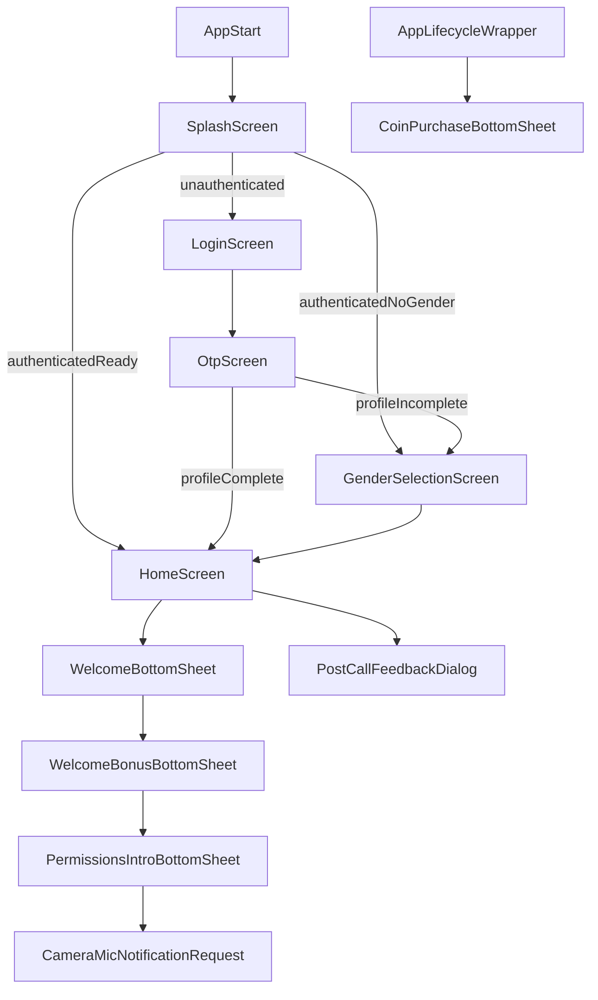

# Frontend UI/UX Scalability Audit Report (Flutter)

## Executive Summary

This audit reviewed the Flutter frontend in `D:\zztherapy\frontend` for UI scalability, jitter/jank risk, onboarding quality, popup/modal quality, and readiness for:

- ~1000 users/day
- ~200 creators
- ~50 users+creators online simultaneously

Overall verdict:

- **Onboarding flow is not perfect yet** (functionally complete but overly blocking and timing-driven).
- **Popup system is not perfect yet** (multiple modal entry points can collide; no centralized arbitration).
- **Frontend can serve current scale with targeted fixes**, but high-risk UI performance hotspots should be addressed before growth in live concurrency.

---

## Scope and Method

Primary files reviewed:

- `lib/main.dart`
- `lib/app/router/app_router.dart`
- `lib/app/widgets/app_lifecycle_wrapper.dart`
- `lib/app/widgets/stream_chat_wrapper.dart`
- `lib/features/auth/screens/splash_screen.dart`
- `lib/features/auth/screens/login_screen.dart`
- `lib/features/auth/screens/otp_screen.dart`
- `lib/features/onboarding/screens/gender_selection_screen.dart`
- `lib/features/home/screens/home_screen.dart`
- `lib/features/home/providers/home_provider.dart`
- `lib/features/home/widgets/home_user_grid_card.dart`
- `lib/features/home/utils/creator_shuffle_utils.dart`
- `lib/shared/widgets/welcome_dialog.dart`
- `lib/shared/widgets/welcome_bonus_dialog.dart`
- `lib/shared/widgets/permissions_intro_bottom_sheet.dart`
- `lib/shared/widgets/coin_purchase_popup.dart`
- `lib/features/video/screens/video_call_screen.dart`
- `lib/features/video/widgets/live_billing_overlay.dart`

Assessment approach:

1. Route + flow mapping for onboarding and modal orchestration.
2. Static code inspection for rebuild fan-out, timer/animation pressure, layout rigidity, and list/image patterns.
3. UX resilience review for dismissibility, recoverability, and conflict handling.
4. Readiness mapping for expected DAU/concurrency profile.

---

## Flow Map (Observed)

Key observation: onboarding sheets are triggered in `HomeScreen`, while session-level purchase popup is triggered in `AppLifecycleWrapper`; these paths are independent and can overlap.

---

## Findings by Severity

## Critical / High

### 1) Broad home-feed recomputation and rebuild fan-out
- **Where**: `lib/features/home/providers/home_provider.dart`, `lib/features/home/utils/creator_shuffle_utils.dart`, `lib/features/home/widgets/home_user_grid_card.dart`
- **Evidence**:
  - `homeFeedProvider` watches full `creatorAvailabilityProvider` map and re-sorts/re-shuffles creators.
  - Each card also watches `creatorAvailabilityProvider` directly.
- **Impact**: frequent online/offline updates can trigger full feed recomputation plus many tile rebuilds; risk increases with 50 concurrent online participants.
- **Priority**: High.

### 2) Blocking onboarding stack (no escape path)
- **Where**: `lib/features/home/screens/home_screen.dart`, `lib/shared/widgets/welcome_bonus_dialog.dart`, `lib/shared/widgets/permissions_intro_bottom_sheet.dart`
- **Evidence**:
  - onboarding sheets use `isDismissible: false`, `enableDrag: false`.
  - sheets use `PopScope(canPop: false)`.
- **Impact**: users can get trapped in forced flow when any call/path fails; higher churn risk on first session.
- **Priority**: High.

### 3) Modal collision risk (onboarding vs lifecycle popup)
- **Where**: `lib/features/home/screens/home_screen.dart`, `lib/app/widgets/app_lifecycle_wrapper.dart`
- **Evidence**:
  - onboarding dialogs are staged in `HomeScreen.initState`.
  - coin purchase popup can be shown from wrapper post-frame/auth transitions.
- **Impact**: stacked/competing dialogs, interrupted onboarding, inconsistent UX sequencing.
- **Priority**: High.

### 4) Repeated timer-driven updates in critical surfaces
- **Where**: `lib/features/auth/screens/splash_screen.dart`, `lib/features/video/widgets/live_billing_overlay.dart`, `lib/features/video/screens/video_call_screen.dart`
- **Evidence**:
  - splash progress timer at 120ms.
  - billing overlay timer at 400ms.
  - call duration watchdog timer at 500ms.
- **Impact**: avoidable rebuild pressure in startup and in-call views; can manifest as jitter on lower/mid-tier devices.
- **Priority**: High.

### 5) Per-card heartbeat animation controller pattern
- **Where**: `lib/features/home/widgets/home_user_grid_card.dart`
- **Evidence**: `_VideoCallButton` owns a repeating `AnimationController` per card.
- **Impact**: many simultaneously visible cards mean multiple active animations and extra frame work.
- **Priority**: High.

### 6) No visible feed-level pagination/virtualization strategy for growth
- **Where**: `lib/features/home/providers/home_provider.dart`
- **Evidence**: full list fetch of creators/users (`/creator`, `/user/list`) and direct rendering.
- **Impact**: list growth increases memory, layout, sort, and rebuild cost linearly.
- **Priority**: High.

## Medium

### 7) Responsive rigidity from fixed grids and hardcoded sizing
- **Where**: `lib/features/home/screens/home_screen.dart`, `lib/features/home/screens/favorite_creators_screen.dart`, `lib/features/account/screens/account_screen.dart`
- **Evidence**: repeated `crossAxisCount: 2`, fixed ratios/sizes.
- **Impact**: suboptimal scaling on tablets/foldables/large phones; visual crowding or wasted space.
- **Priority**: Medium.

### 8) Nested scroll patterns in sheets/lists
- **Where**: `lib/shared/widgets/coin_purchase_popup.dart`, `lib/features/home/widgets/home_user_grid_card.dart`
- **Evidence**: `SingleChildScrollView` wrapping inner `ListView.builder(shrinkWrap: true, NeverScrollableScrollPhysics())`.
- **Impact**: extra layout cost and less stable scroll performance.
- **Priority**: Medium.

### 9) Image rendering cost not tightly constrained
- **Where**: `lib/features/home/widgets/home_user_grid_card.dart`, `lib/features/video/screens/video_call_screen.dart`, `lib/features/chat/screens/chat_screen.dart`
- **Evidence**: multiple `Image.network` usages without explicit decode sizing hints.
- **Impact**: higher decode/upload overhead and memory pressure during scroll/transitions.
- **Priority**: Medium.

### 10) Startup pipeline has multiple serialized async initializations
- **Where**: `lib/main.dart`, `lib/features/auth/screens/splash_screen.dart`, `lib/app/widgets/stream_chat_wrapper.dart`
- **Impact**: cold start responsiveness and first meaningful interaction can degrade on weaker devices/network.
- **Priority**: Medium.

## Low

### 11) Welcome persistence key is global, not user-scoped
- **Where**: `lib/core/services/welcome_service.dart`
- **Evidence**: `has_seen_welcome` key is not keyed by user ID, while bonus/permission flags are user-scoped.
- **Impact**: shared-device account switching can produce inconsistent first-time UX.
- **Priority**: Low.

---

## Onboarding Verdict

Status: **Partially good, not perfect**

What is working:
- Route gating for missing profile (`/gender`) is implemented consistently from splash/login/OTP.
- Validation checks in gender/profile screen are present.
- Bonus and permissions onboarding sequence exists and has mounted checks/retries in key points.

What prevents a “perfect” verdict:
- Mandatory blocking sheets with no alternate path (`Skip`, `Not now`, `Back`).
- Orchestration heavily depends on delayed timers (`Future.delayed`) rather than event/state completion.
- No central onboarding state machine to guarantee exactly-once, deterministic progression in all race cases.

Recommended target state:
- Introduce explicit onboarding finite-state flow with resumable steps.
- Add non-destructive exits for non-critical prompts.
- Make each step idempotent and independently retryable without trapping the user.

---

## Popup / Dialog Verdict

Status: **Functional, not perfect**

Strengths:
- Shared helper `showAppModalBottomSheet` gives consistent style defaults.
- Some flows already guard against repeated shows via flags/session checks.

Weaknesses:
- No global modal coordinator/queue; multiple domains can request overlays independently.
- Mixed policy: some dialogs are hard-blocking, others freely dismissible, without central UX policy.
- Lifecycle popup behavior can overlap first-home onboarding and feedback dialogs.

Recommended target state:
- Add a central modal orchestrator (single-active-modal policy, priority queue).
- Define UX rules: which dialogs may block, max display frequency, suppression during onboarding/call transitions.

---

## Capacity Readiness (1000 DAU / 50 Concurrent Online)

Current readiness: **Moderate (requires focused hardening)**

Likely stable:
- Core routing/auth gating architecture.
- Real-time plumbing existence (socket + stream wrappers).

Main risk areas under target load:
- Availability update storms causing wide UI invalidation.
- Animation/timer density in call and home surfaces.
- Increasing list size without pagination and selective watching.

If top 6 high issues are addressed, frontend readiness for your stated load becomes **strong**.

---

## Prioritized Remediation Roadmap

### Quick wins (1-2 weeks)
1. Replace global availability watches with selector-based per-item watches.
2. Add modal guard/coordinator to prevent overlay collisions.
3. Convert non-critical blocking onboarding prompts to skippable prompts.
4. Reduce timer frequencies where possible; compute display values from timestamps during paint/build.
5. Add image decode constraints (`cacheWidth`/`cacheHeight`) on grid/card/media surfaces.

### Medium refactors (2-4 weeks)
1. Introduce onboarding state machine service (persisted per user).
2. Implement paginated/incremental loading for creators/users feed endpoints.
3. Adapt grid columns by breakpoints (`LayoutBuilder`) rather than fixed 2-column layout.
4. Consolidate repeated animation controllers (shared ticker or less aggressive animation policy).

### Strategic hardening (4+ weeks)
1. Add app-wide performance budgets and CI checks (startup time, frame timings, memory thresholds).
2. Introduce an event throttling/debouncing layer for high-frequency realtime updates.
3. Build regression dashboards for frame timing in critical flows (onboarding, home feed, call start, active call).

---

## Runtime Profiling Checklist (Profile Mode)

Use this checklist for validation after changes:

1. **Startup**
   - Run in profile mode.
   - Measure time from app launch -> interactive login/home.
   - Capture frame chart during splash and initial route transition.

2. **Onboarding chain**
   - Test: fresh user, returning user, shared-device account switch.
   - Track modal sequencing and verify no overlap/stall.
   - Verify each step remains responsive under slow network.

3. **Home realtime churn**
   - Simulate frequent creator availability changes.
   - Observe rebuild count on `HomeScreen` and tile widgets.
   - Verify scroll smoothness while statuses update.

4. **Popup stress**
   - Trigger coin popup + onboarding + feedback prompt close together.
   - Verify only one active modal at a time and deterministic order.

5. **Call flow**
   - Measure jank during call connect/disconnect and live billing overlay.
   - Test low-end device profile with camera/mic and bad network.

6. **Memory/Image**
   - Monitor memory during rapid grid scroll and call open/close loops.
   - Verify no spikes from unbounded image decode.

Acceptance thresholds to enforce:
- No visible stutter in first 10s of onboarding/home.
- No stacked modals or blocked dead-end UI.
- No repeated full-grid rebuilds for single availability updates.

---

## Final Conclusion

The frontend is structurally capable, but **not yet “perfect”** in onboarding and popup orchestration, and it has **high-priority performance scalability hotspots** that should be fixed before expecting smooth operation as concurrency grows.

Most issues are fixable without major architectural rewrite. Focus first on:

1. modal orchestration,
2. availability-driven rebuild scope,
3. timer/animation pressure,
4. feed pagination and responsive layout adaptation.

With these addressed, the app should be in a much safer position for your target daily and concurrent usage.
