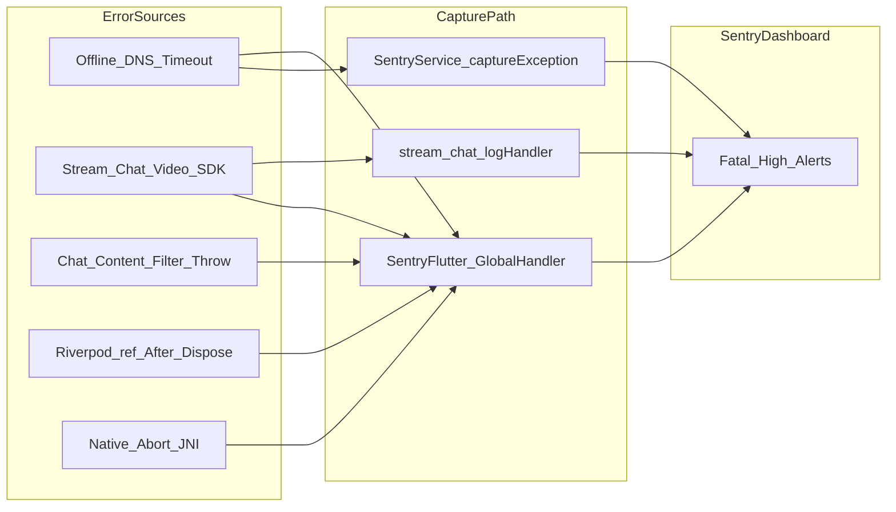
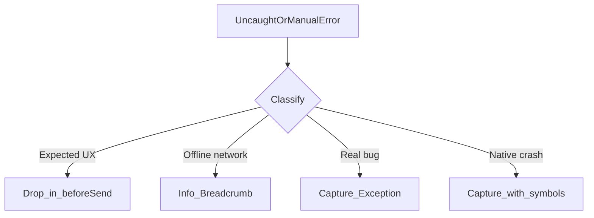

# Sentry Flutter Errors — Analysis Report

**Date:** 2026-05-25  
**App:** Match Vibe (`zztherapy` / `com.matchvibe.app`)  
**Sentry project:** `yagati / flutter`  
**Scope:** Mobile Flutter client — 14 high-severity issues from the production dashboard (FLUTTER-1 through FLUTTER-E)

---

## Related documentation

| Document | Focus |
|----------|--------|
| [SENTRY_INTEGRATION_IMPLEMENTATION.md](./SENTRY_INTEGRATION_IMPLEMENTATION.md) | How Sentry is initialized, scrubbed, and instrumented in this app |
| [SENTRY_DASHBOARD_SETUP.md](./SENTRY_DASHBOARD_SETUP.md) | Dashboard and release setup |
| [ERROR_CASCADE_ANALYSIS.md](../../docs/ERROR_CASCADE_ANALYSIS.md) | Backend/API failure cascades (complementary; not mobile-specific) |

---

## Table of contents

1. [Executive summary](#1-executive-summary)
2. [How errors reach Sentry today](#2-how-errors-reach-sentry-today)
3. [Error taxonomy](#3-error-taxonomy)
4. [Issue matrix (quick reference)](#4-issue-matrix-quick-reference)
5. [Per-issue deep dives](#5-per-issue-deep-dives)
6. [Sentry noise budget](#6-sentry-noise-budget)
7. [Recommended fixes by priority](#7-recommended-fixes-by-priority)
8. [Appendix: local reproduction](#8-appendix-local-reproduction)
9. [Appendix: Sentry dashboard filters](#9-appendix-sentry-dashboard-filters)

---

## 1. Executive summary

The Match Vibe Flutter app reports **14 distinct high-severity Sentry issues**. After mapping each stack trace to the codebase, they fall into **six categories** with very different root causes and remediation strategies.

### Key findings

| Finding | Detail |
|---------|--------|
| **Most volume is environmental noise** | Roughly **60%** of events (FLUTTER-3, 4, 5, 7, F, and parts of A/B) are DNS failures, connection timeouts, or third-party network errors on unreliable mobile networks — not application logic bugs. |
| **Two issues are expected product behavior** | FLUTTER-C and FLUTTER-D (`Message contains restricted content`) are intentional chat moderation. The user sees a dialog; Sentry incorrectly records them as **Fatal**. |
| **Two issues are real client lifecycle bugs** | FLUTTER-6/9 (`ref` after dispose) and FLUTTER-E (overlay null check) indicate async work continuing after widgets or overlays are torn down. |
| **Native/process crashes need ops follow-up** | FLUTTER-1 (`syscall: Abort`) and FLUTTER-8 (`FlutterJNI not attached`) require native symbolication and device clustering — limited Dart-side fixes. |
| **Current Sentry filtering is minimal** | [`sentry_service.dart`](../lib/core/services/sentry_service.dart) `_scrubEvent` only drops events containing `permission denied`, `user cancelled`, or `cancelled`. Most noisy patterns are still reported at full severity. |

### Event flow (why noise looks like crashes)

**Takeaway:** Without category-specific filtering, offline users and blocked chat messages produce the same **Fatal/High** alerts as genuine crashes.

---

## 2. How errors reach Sentry today

### Bootstrap

- [`main.dart`](../lib/main.dart) wraps startup in `SentryService.init()` and runs the app inside `SentryWidget`.
- Uncaught async errors and framework errors are captured by `sentry_flutter` automatically (no custom `FlutterError.onError`).

### Manual capture call sites

| Location | What gets reported |
|----------|-------------------|
| [`stream_chat_provider.dart`](../lib/features/chat/providers/stream_chat_provider.dart) `_streamChatLogHandler` | Any Stream Chat log at `WARNING+` with an attached error |
| [`api_client.dart`](../lib/core/api/api_client.dart) | Token refresh failures; selective API 5xx via `shouldReportApiError` |
| [`call_connection_controller.dart`](../lib/features/video/controllers/call_connection_controller.dart) | Video call join failures |
| [`main.dart`](../lib/main.dart) | Firebase init failure, env sanity check messages |

### Existing filters (important context)

[`SentryService._scrubEvent`](../lib/core/services/sentry_service.dart):

- Drops: `permission denied`, `user cancelled`, `cancelled`
- Dedupes identical fingerprints within 30 seconds
- Scrubs PII from breadcrumbs and HTTP bodies

[`SentryService.shouldReportApiError`](../lib/core/services/sentry_service.dart):

- **Does not** report Dio connection timeouts, connection errors, or 401s
- **Does** report 5xx on critical paths (`/billing`, `/payment`, `/video`, `/chat`, `/creator/withdraw`)

**Gap:** Stream Chat WebSocket errors, Google Fonts download failures, chat content-filter throws, and external image host lookups are **not** filtered — they surface as Fatals.

---

## 3. Error taxonomy

| Category | Sentry IDs | Typical cause | Actionable as code bug? |
|----------|------------|---------------|-------------------------|
| **Network / DNS** | F, 3, 4, 5, 7 | Device offline, DNS failure, captive portal, VPN | No — filter + offline UX |
| **Stream Chat / Video** | 3, 4, 5, 7, A | Third-party realtime SDK on unstable network | Partial — filter + retry UX |
| **Riverpod lifecycle** | 6, 9 | `ref.read` / `ref.watch` after `ConsumerState` disposed | **Yes** |
| **Expected business logic** | C, D | Chat anti-contact filter throws `Exception` | Partial — behavior is correct; reporting is wrong |
| **Push / overlay UI** | E | Stale overlay removed after navigator teardown | **Yes** |
| **Media / fonts** | 2, B | Offline font fetch; ringtone load interrupted | No — filter + bundled assets |
| **Native / process** | 1, 8 | SIGABRT, JNI detach after engine destroyed | Monitor — limited client fix |

---

## 4. Issue matrix (quick reference)

| ID | Level | Exception / message | Users (approx.) | Bug? | Priority |
|----|-------|---------------------|-----------------|------|----------|
| FLUTTER-6 | Fatal | `Cannot use "ref" after the widget was disposed` | 2 | Yes | P1 |
| FLUTTER-9 | Fatal | Same as FLUTTER-6 | 6 | Yes | P1 |
| FLUTTER-F | Fatal | `Failed host lookup: prestigeinteriordesign.com` | 1 | No | P2 filter |
| FLUTTER-7 | Error | `StreamChatNetworkError` connect timeout 6s | 3 | No | P2 filter |
| FLUTTER-3 | Fatal | `WebSocketChannelException` → `chat.stream-io-api.com` DNS | 9 | No | P2 filter |
| FLUTTER-4 | Error | `StreamWebSocketError` → same DNS | 6 | No | P2 filter |
| FLUTTER-5 | Error | `WebSocketChannelException` (via SentryService) | 5 | No | P2 filter |
| FLUTTER-C | Fatal | `Message contains restricted content` | 3 | No (UX ok) | P1 filter |
| FLUTTER-D | Fatal | Same restricted content | 1 | No (UX ok) | P1 filter |
| FLUTTER-E | Fatal | `Null check operator used on a null value` | 1 | Yes | P1 |
| FLUTTER-B | Fatal | `PlayerInterruptedException: Connection aborted` | 1 | No | P2 filter |
| FLUTTER-A | Fatal | `TwirpError` IceTrickle / SFU abort | 1 | Partial | P3 tag/sample |
| FLUTTER-8 | Fatal | `FlutterJNI is not attached to native` | 1 | Partial | Monitor |
| FLUTTER-1 | Fatal | `syscall: Abort` | 6 | Unknown | Monitor |
| FLUTTER-2 | Fatal | Google Fonts fetch failure (`fonts.gstatic.com`) | 1 | No | P2 |

---

## 5. Per-issue deep dives

Each section follows the same template: **What → Why (in this codebase) → User impact → Bug? → Recommended fix → Priority**.

---

### FLUTTER-6 — `StateError: Cannot use "ref" after the widget was disposed`

| Field | Detail |
|-------|--------|
| **Level / frequency** | Fatal · ~2 users · first seen ~3 days ago |
| **Stack anchor** | `package:flutter_riverpod/src/consumer.dart` → `ConsumerStatefulElement._assertNotDisposed` |
| **What is happening** | Riverpod throws when code calls `ref.read()` or `ref.watch()` on a `ConsumerState` whose widget has already been removed from the tree. |
| **Why in Match Vibe** | Async work started from a `ConsumerStatefulWidget` completes after the user navigates away or logs out. Likely call sites: |
| | • [`stream_chat_wrapper.dart`](../lib/app/widgets/stream_chat_wrapper.dart) — `_connectToStreamChat`, `_fallbackCreatorHydration`, `_fallbackUserHydration` use `ref.read` after `await`; some paths check `mounted`, but nested futures inside `_connectToStreamChat` (lines 55–91) read providers without a post-await guard. |
| | • [`home_screen.dart`](../lib/features/home/screens/home_screen.dart) — modal coordinator `present` callbacks and `unawaited(ref.read(...))` after dialogs dismiss or navigation. |
| | • [`call_connection_controller.dart`](../lib/features/video/controllers/call_connection_controller.dart) — long-lived notifier holds `_ref` across call lifecycle; post-call refresh may run after UI pops. |
| **User impact** | Usually none visible (error is async); occasionally missed state update or failed reconnect. In worst case, secondary crash or stuck loading state. |
| **Is this a bug?** | **Yes** — lifecycle discipline issue, not user error. |
| **Recommended fix** | 1) After every `await` in `ConsumerState`, check `if (!mounted) return` before `ref.*`. 2) Read dependencies into local variables before `await` when possible. 3) For notifiers, use `ref.onDispose` to cancel timers/subscriptions. 4) Avoid `unawaited(ref.read(...))` from widgets without mounted guard. |
| **Priority** | **P1** |

---

### FLUTTER-9 — `StateError: Cannot use "ref" after the widget was disposed`

| Field | Detail |
|-------|--------|
| **Level / frequency** | Fatal · ~6 users · higher volume than FLUTTER-6 |
| **Stack anchor** | Same as FLUTTER-6 |
| **What is happening** | Identical root cause — duplicate Sentry grouping fingerprint, same class of lifecycle bug. |
| **Why in Match Vibe** | Same call sites as FLUTTER-6; higher user count suggests a common path (e.g. fast logout during Stream connect, or leaving home during onboarding modals). |
| **User impact** | Same as FLUTTER-6. |
| **Is this a bug?** | **Yes** |
| **Recommended fix** | Same as FLUTTER-6. Fix once; both Sentry issues should collapse. **Do not** filter in Sentry until fixed — these are real defects. |
| **Priority** | **P1** |

---

### FLUTTER-F — `SocketException: Failed host lookup: 'prestigeinteriordesign.com'`

| Field | Detail |
|-------|--------|
| **Level / frequency** | Fatal · ~1 user · ~4 hours ago |
| **Stack anchor** | `package:dio/src/dio_mixin.dart` → `DioMixin.fetch` |
| **What is happening** | Dio (or an HTTP client used by a dependency) attempted to reach `prestigeinteriordesign.com` and DNS returned no address (`errno = 7`). |
| **Why in Match Vibe** | **This hostname does not appear anywhere in the repo.** It is almost certainly a **user-supplied or third-party URL** — profile avatar, chat attachment, or link embedded in message text — loaded via: |
| | • [`AppNetworkImage`](../lib/shared/widgets/app_network_image.dart) / `CachedNetworkImage` |
| | • Stream Chat attachment URLs |
| | The app's own API host is configured via `API_BASE_URL` in dotenv, not this domain. |
| **User impact** | Image fails to load; fallback icon/widget shown (if `errorWidget` path). User may not notice beyond a missing avatar. |
| **Is this a bug?** | **No** — bad external URL or dead site, not app logic failure. |
| **Recommended fix** | 1) **Sentry:** Filter `Failed host lookup` for hosts outside `api_base_host` / Cloudflare image CDN. 2) **Product:** Server-side URL validation on avatar save; block non-HTTPS or known-bad patterns. 3) **UI:** Already has error fallback — no crash needed in Sentry. |
| **Priority** | **P2** (filter) · **P3** (URL validation) |

---

### FLUTTER-7 — `StreamChatNetworkError` (connect timeout 6s)

| Field | Detail |
|-------|--------|
| **Level / frequency** | Error · ~3 users · ~2 days |
| **Stack anchor** | `package:stream_chat/src/core/http/stream_http_client.dart` → `StreamHttpClient.get` |
| **What is happening** | Stream Chat REST API did not establish a TCP connection within the default **6 second** connect timeout. |
| **Why in Match Vibe** | User on slow/unstable network, switching Wi‑Fi ↔ cellular, or fully offline. Amplified by [`_streamChatLogHandler`](../lib/features/chat/providers/stream_chat_provider.dart) which sends `Level.WARNING+` errors to `SentryService.captureException`. |
| **User impact** | Chat may show loading/error state; messages may not send until reconnect. |
| **Is this a bug?** | **No** — environmental. |
| **Recommended fix** | 1) Filter `StreamChatNetworkError` with code `-1` / timeout message in `beforeSend`. 2) Add connectivity breadcrumb instead of exception. 3) Optional: offline banner in chat UI. 4) Only increase timeout if product requires it (usually not worth it). |
| **Priority** | **P2** |

---

### FLUTTER-3 — `WebSocketChannelException` (Stream Chat DNS)

| Field | Detail |
|-------|--------|
| **Level / frequency** | Fatal · ~9 users · ~3 days · highest Stream-related volume |
| **Stack anchor** | `dart:ui/platform_dispatcher.dart` → `PlatformDispatcher._dispatchError` |
| **What is happening** | Stream Chat WebSocket failed to connect because DNS could not resolve `chat.stream-io-api.com`. |
| **Why in Match Vibe** | Device offline, airplane mode, DNS blocked (corporate/captive portal), or transient ISP failure. Stream SDK propagates as uncaught async error → Sentry global handler. Also captured via `_streamChatLogHandler` as FLUTTER-4/5. |
| **User impact** | Chat disconnected; unread counts may stall; reconnects automatically when network returns. |
| **Is this a bug?** | **No** |
| **Recommended fix** | 1) `beforeSend` denylist: `Failed host lookup` + `chat.stream-io-api.com`. 2) Stop forwarding all Stream WARNING logs to Sentry — use breadcrumbs for connectivity, exceptions only for unrecoverable auth/config errors. 3) Show "No connection" state in chat. |
| **Priority** | **P2** |

---

### FLUTTER-4 — `StreamWebSocketError` (Stream Chat DNS)

| Field | Detail |
|-------|--------|
| **Level / frequency** | Error · ~6 users · ~3 days |
| **Stack anchor** | [`sentry_service.dart`](../lib/core/services/sentry_service.dart) → `SentryService.captureException` (from Stream log handler) |
| **What is happening** | Same DNS failure as FLUTTER-3, but captured **explicitly** via `_streamChatLogHandler` rather than only the global uncaught handler. |
| **Why in Match Vibe** | [`stream_chat_provider.dart` lines 13–24](../lib/features/chat/providers/stream_chat_provider.dart) — any Stream log at WARNING+ with `record.error != null` triggers `captureException`. |
| **User impact** | Same as FLUTTER-3. |
| **Is this a bug?** | **No** — reporting policy is too aggressive. |
| **Recommended fix** | Narrow `_streamChatLogHandler` to report only non-network errors (auth token invalid, 403, parse errors). Filter websocket DNS in `beforeSend` as backup. |
| **Priority** | **P2** |

---

### FLUTTER-5 — `WebSocketChannelException` (via SentryService)

| Field | Detail |
|-------|--------|
| **Level / frequency** | Error · ~5 users · ~3 days |
| **Stack anchor** | `SentryService.captureException` |
| **What is happening** | Duplicate capture path for the same Stream WebSocket DNS failure as FLUTTER-3/4. |
| **Why in Match Vibe** | Both global async error dispatch and manual Stream log handler report the same underlying socket error. |
| **User impact** | Same as FLUTTER-3. |
| **Is this a bug?** | **No** |
| **Recommended fix** | Same as FLUTTER-3/4; dedup fingerprint may already collapse some, but fixing the handler prevents triple-reporting. |
| **Priority** | **P2** |

---

### FLUTTER-C — `Exception: Message contains restricted content`

| Field | Detail |
|-------|--------|
| **Level / frequency** | Fatal · ~3 users · ~1 day |
| **Stack anchor** | [`chat_screen.dart:500`](../lib/features/chat/screens/chat_screen.dart) → `_ChatScreenState._onPreSend` |
| **What is happening** | User attempted to send a message matching the anti-contact-sharing filter. Code throws a generic `Exception` to cancel the Stream send pipeline. |
| **Why in Match Vibe** | Intentional product rule in [`_containsRestrictedContent`](../lib/features/chat/screens/chat_screen.dart) (lines 402–411): blocks digits `0,4,5,6,7,8` and words like `three`, `four`, `six`, etc. to reduce off-platform phone-number sharing. Flow: filter match → `_showRestrictedContentDialog()` → `throw Exception('Message contains restricted content')`. |
| **User impact** | **Working as designed** — "Not Allowed" dialog; message is not sent. |
| **Is this a bug?** | **No** for product behavior · **Yes** for observability (should not be Fatal in Sentry). |
| **Recommended fix** | 1) Replace throw with Stream-cancel pattern that does not propagate to global error handler (custom non-reportable exception type, or return without throw if SDK supports it). 2) Add `beforeSend` filter for exact message `Message contains restricted content`. 3) Optionally log as info breadcrumb for moderation analytics. |
| **Priority** | **P1** |

---

### FLUTTER-D — `Exception: Message contains restricted content`

| Field | Detail |
|-------|--------|
| **Level / frequency** | Fatal · ~1 user · ~16 hours ago |
| **Stack anchor** | Same as FLUTTER-C |
| **What is happening** | Duplicate grouping of the same restricted-content throw. |
| **Why in Match Vibe** | Same code path as FLUTTER-C. |
| **User impact** | Same — dialog shown, message blocked. |
| **Is this a bug?** | Same as FLUTTER-C. |
| **Recommended fix** | Same as FLUTTER-C. |
| **Priority** | **P1** |

---

### FLUTTER-E — `TypeError: Null check operator used on a null value`

| Field | Detail |
|-------|--------|
| **Level / frequency** | Fatal · ~1 user · ~1 day |
| **Stack anchor** | [`push_notification_service.dart`](../lib/core/services/push_notification_service.dart) → `_showInAppNotificationPreview.<fn>` |
| **What is happening** | A closure (likely the 2-second auto-dismiss `Future.delayed` at lines 448–449) runs after the overlay or navigator is no longer valid. A `!` null assertion hits null. |
| **Why in Match Vibe** | In-app chat preview inserts an `OverlayEntry` on the root navigator. If the user navigates, logs out, or the route is replaced before the timer fires, `overlayEntry.remove()` or related overlay state may access a disposed overlay. |
| **User impact** | Rare crash or error during/after receiving an in-app message preview while changing screens. |
| **Is this a bug?** | **Yes** |
| **Recommended fix** | 1) Store `Timer` reference; cancel on new preview or service dispose. 2) Before `remove()`, check `overlayEntry.mounted` (Flutter 3.7+). 3) Wrap `remove()` in try/catch. 4) Avoid capturing stale `BuildContext` in delayed callbacks. |
| **Priority** | **P1** |

---

### FLUTTER-B — `PlayerInterruptedException: Connection aborted`

| Field | Detail |
|-------|--------|
| **Level / frequency** | Fatal · ~1 user · ~1 day |
| **Stack anchor** | `package:just_audio` → `MethodChannelAudioPlayer.load` |
| **What is happening** | Audio load/play was interrupted mid-stream — connection aborted before completion. |
| **Why in Match Vibe** | [`CallRingtoneService`](../lib/features/video/services/call_ringtone_service.dart) loads incoming call ringtone via `just_audio` (`setAsset`, `setUrl`, `play`). When the call is accepted, rejected, or `stop()` is called, the player is stopped while still loading — `PlayerInterruptedException` is expected. |
| **User impact** | None — ringtone stops as intended. |
| **Is this a bug?** | **No** — normal call lifecycle race. |
| **Recommended fix** | 1) Catch `PlayerInterruptedException` in ringtone service and log at debug only. 2) Filter in `beforeSend` for `PlayerInterruptedException` / `Connection aborted`. |
| **Priority** | **P2** |

---

### FLUTTER-A — `TwirpError` IceTrickle (Stream Video SFU)

| Field | Detail |
|-------|--------|
| **Level / frequency** | Fatal · ~1 user · ~2 days |
| **Stack anchor** | `signal.pbtwirp.dart` → `doProtobufRequest` · host `sfu-aws-mumbai-*.stream-io-video.com` |
| **What is happening** | WebRTC signaling (`IceTrickle`) to Stream's SFU failed with `Software caused connection abort` during an active or connecting video call. |
| **Why in Match Vibe** | Network handoff (Wi‑Fi ↔ LTE), app backgrounded, VPN drop, or SFU edge timeout. Handled inside Stream Video SDK; surfaces as fatal Twirp error. Correlates with [`call_connection_controller.dart`](../lib/features/video/controllers/call_connection_controller.dart) call join/ICE flow. |
| **User impact** | Call may freeze, drop, or reconnect depending on SDK recovery. |
| **Is this a bug?** | **Partial** — often network; occasionally worth investigating if clustered on specific devices/regions. |
| **Recommended fix** | 1) Tag with `call_phase`, `call_id` breadcrumbs (partially exists). 2) Sample or downgrade IceTrickle aborts unless call ends in failure state. 3) Alert only if call-failure rate spikes per release. 4) Do not treat single-user SFU abort as P0. |
| **Priority** | **P3** |

---

### FLUTTER-8 — `RuntimeException: FlutterJNI is not attached to native`

| Field | Detail |
|-------|--------|
| **Level / frequency** | Fatal · ~1 user · ~2 days |
| **Stack anchor** | `io.flutter.embedding.engine.FlutterJNI` → `ensureAttachedToNative` |
| **What is happening** | Dart or a plugin invoked a platform channel after the Android Flutter engine was detached from the native activity (app killed, fast back-stack teardown, or plugin callback after destroy). |
| **Why in Match Vibe** | Can occur when async plugin work (Firebase, Stream, just_audio, local notifications) completes after `AppLifecycleState.detached`. No single obvious Dart stack — native/plugin layer. |
| **User impact** | Process may crash on exit or background transition. |
| **Is this a bug?** | **Partial** — often OS kill timing; sometimes fixable by cancelling plugin work on lifecycle pause/detach. |
| **Recommended fix** | 1) Audit [`app_lifecycle_wrapper.dart`](../lib/app/widgets/app_lifecycle_wrapper.dart) — stop sockets, audio, overlays on detach. 2) Cluster by Android version/device in Sentry. 3) Ensure `CallRingtoneService.stop()` on lifecycle pause. 4) Native symbolication for stack above JNI. |
| **Priority** | **Monitor** (escalate if volume grows) |

---

### FLUTTER-1 — `syscall: Abort`

| Field | Detail |
|-------|--------|
| **Level / frequency** | Fatal · ~6 users · ~4 days · recurring |
| **Stack anchor** | Native · `Unhandled` |
| **What is happening** | Process received **SIGABRT** — native abort. Dart stack is often empty or unhelpful. |
| **Why in Match Vibe** | Typical causes: OOM in native heap (image/video buffers), JNI assertion in third-party SDK (Stream Video, Firebase, Skia), or corrupted native state. Without symbolicated native stacks, root cause is speculative. |
| **User impact** | App force-closes. |
| **Is this a bug?** | **Unknown** until native stacks are symbolicated and clustered. |
| **Recommended fix** | 1) Upload debug symbols per [SENTRY_INTEGRATION_IMPLEMENTATION.md](./SENTRY_INTEGRATION_IMPLEMENTATION.md). 2) Group by device model, OS, and `release`. 3) Correlate with video call or heavy image sessions via breadcrumbs (`screen=video_call`). 4) Check memory pressure observer logs. |
| **Priority** | **Monitor** |

---

### FLUTTER-2 — Google Fonts network fetch failure

| Field | Detail |
|-------|--------|
| **Level / frequency** | Fatal · ~1 user · ~3 days |
| **Stack anchor** | `google_fonts_base.dart` → `_httpFetchFontAndSaveToDevice` · URL `fonts.gstatic.com` |
| **What is happening** | `google_fonts` package tried to download a font file at first use and failed (device offline or blocked Google CDN). |
| **Why in Match Vibe** | Multiple screens use `GoogleFonts.inter`, `GoogleFonts.poppins`, and [`welcome_free_call_promo_popup.dart`](../lib/shared/widgets/welcome_free_call_promo_popup.dart) uses `GoogleFonts.archivoBlack` — all network-fetched on first render unless bundled. |
| **User impact** | Fallback system font renders (if package handles gracefully) or widget build throws → possible visible glitch or crash. |
| **Is this a bug?** | **No** for offline scenario · **Yes** for relying on runtime download for critical UI. |
| **Recommended fix** | 1) Bundle critical fonts in `pubspec.yaml` or use `GoogleFonts.config.allowRuntimeFetching = false` with assets. 2) Filter font download errors in `beforeSend`. 3) Prefer system font fallback for promo/non-critical screens. |
| **Priority** | **P2** |

---

## 6. Sentry noise budget

### Design principle

Extend the same philosophy as [`shouldReportApiError`](../lib/core/services/sentry_service.dart): **connectivity and expected UX cancellations are not product defects** and should not page engineers.

### Recommended `beforeSend` denylist (future implementation)

| Pattern / condition | Action | Rationale |
|---------------------|--------|-----------|
| Exception message contains `Message contains restricted content` | **Drop** | Expected chat moderation UX |
| Exception message contains `Only creators can send media attachments` | **Drop** | Same pattern in `_onPreSend` |
| `Failed host lookup` + host contains `stream-io-api.com` or `stream-io-video.com` | **Drop** | Offline / DNS |
| `Failed host lookup` + host not in app API / Cloudflare allowlist | **Drop** | Bad external image URL |
| `StreamChatNetworkError` + message contains `connectTimeout` / code `-1` | **Drop** or breadcrumb only | Slow/offline network |
| `StreamWebSocketError` / `WebSocketChannelException` + DNS / host lookup | **Drop** | Same |
| `PlayerInterruptedException` or message `Connection aborted` in just_audio | **Drop** | Call ringtone lifecycle |
| `Failed to load font` + `fonts.gstatic.com` | **Drop** | Offline font fetch |
| `Cannot use "ref" after the widget was disposed` | **Keep** | Real bug — fix via fix |
| `TwirpError` + `IceTrickle` | **Sample** (e.g. 10%) or tag `call_network` | Only alert on rate spike |
| `syscall: Abort` / `FlutterJNI is not attached` | **Keep** but separate alert rule | Native — needs symbols |

### Recommended `_streamChatLogHandler` change (future)

Current behavior reports all WARNING+ errors. Proposed tiers:

| Stream log error type | Sentry action |
|-----------------------|---------------|
| DNS / timeout / websocket disconnect | Breadcrumb only |
| 401 / token / auth | Exception + tag `stream_auth` |
| Parse / unexpected 5xx | Exception |

### Error classification flow (target state)

---

## 7. Recommended fixes by priority

Documentation-only backlog — **no code changes in this task**.

| Priority | Issues | Effort | Impact |
|----------|--------|--------|--------|
| **P1** | C, D — stop reporting restricted-content throws | Small | Removes false Fatals immediately |
| **P1** | 6, 9 — guard `ref` after async in Consumer widgets / notifiers | Medium | Real stability; fixes lifecycle crashes |
| **P1** | E — safe overlay timer teardown in push preview | Small | Prevents rare Fatal on navigation |
| **P2** | 3, 4, 5, 7 — Stream network error filtering + log handler tiering | Small | ~40% dashboard noise reduction |
| **P2** | 2 — bundle fonts or disable runtime fetching for critical fonts | Medium | Offline-first typography |
| **P2** | B — catch `PlayerInterruptedException` in ringtone service | Small | Removes call-flow noise |
| **P2** | F — filter external host lookup in Sentry | Small | Stops irrelevant Fatals |
| **P3** | A — tag/sample SFU IceTrickle errors | Medium | Better call-quality ops signal |
| **P3** | F — server-side avatar URL validation | Medium | Data quality |
| **Monitor** | 1, 8 — native symbolication, device clustering | Ops | Needs release symbols + volume watch |

### Suggested implementation order

1. **Quick wins (Sentry filters only):** C, D, Stream DNS, PlayerInterrupted, font fetch
2. **Lifecycle fixes:** 6, 9, E
3. **Infrastructure:** font bundling, Stream log handler tiers
4. **Ops:** native symbols for FLUTTER-1/8, SFU sampling for A

---

## 8. Appendix: local reproduction

| Issue class | Steps to reproduce |
|-------------|-------------------|
| FLUTTER-3/4/5/7 | Enable airplane mode → open app → navigate to chat or wait for Stream connect |
| FLUTTER-F | Set profile or test image URL to dead external host (e.g. invalid domain) → open feed/profile |
| FLUTTER-C/D | In chat, send message containing blocked digit (`4`) or word (`four`) |
| FLUTTER-6/9 | Log in → immediately navigate away or log out while home onboarding modals / Stream connect still running |
| FLUTTER-E | Receive in-app push preview → within 2s force navigate or logout |
| FLUTTER-B | Trigger incoming call ringtone → accept/reject quickly before load completes |
| FLUTTER-2 | Clear app data → airplane mode → open wallet or free-call promo (Google Fonts screens) |
| FLUTTER-A | Start video call → toggle airplane mode mid-call or switch networks aggressively |
| FLUTTER-8 | Background app during active call/audio → force-stop from Android recents (device-dependent) |
| FLUTTER-1 | Stress test: long video call + heavy image feed (may not repro deterministically) |

---

## 9. Appendix: Sentry dashboard filters

Suggested **Issue → Ignore** or **Inbound Filter** rules until code fixes ship:

| Filter name | Condition |
|-------------|-----------|
| `ignore-restricted-chat` | `error.value` contains `Message contains restricted content` |
| `ignore-stream-dns` | `error.value` contains `Failed host lookup` AND `chat.stream-io-api.com` |
| `ignore-stream-timeout` | `error.value` contains `StreamChatNetworkError` AND `connectTimeout` |
| `ignore-font-offline` | `error.value` contains `Failed to load font` |
| `ignore-ringtone-abort` | `error.value` contains `PlayerInterruptedException` |

Keep **unfiltered**:

- `Cannot use "ref" after the widget was disposed`
- `syscall: Abort`
- `FlutterJNI is not attached`

### Tags useful for correlation (already partially instrumented)

| Tag | Set by |
|-----|--------|
| `screen` | `SentryService.setScreenTag` on home, chat, wallet, video_call |
| `stream` | Stream chat log handler |
| `feature` | Firebase init, token refresh, etc. |
| `role` / `firebase_uid` | Auth login scope |

When investigating FLUTTER-6/9, filter events where `screen=home` or during onboarding. For FLUTTER-A, filter `screen=video_call`.

---

## Future follow-up: proactive connectivity gating (Phase 6)

The Sentry classifier and breadcrumb throttling reduce **reported** noise from offline reconnect storms, but the app still retries WebSocket/SFU/image fetches while offline. A follow-up should wrap `connectivity_plus` (already a dependency) in a Riverpod provider and gate Stream Chat reconnect, Stream Video ICE retries, image prefetch, and chat token refresh until connectivity is restored — optionally combined with a lightweight `/health` ping for true reachability.

---

## Document history

| Date | Change |
|------|--------|
| 2026-05-25 | Initial analysis of 14 Sentry dashboard issues (FLUTTER-1 through FLUTTER-E) |
