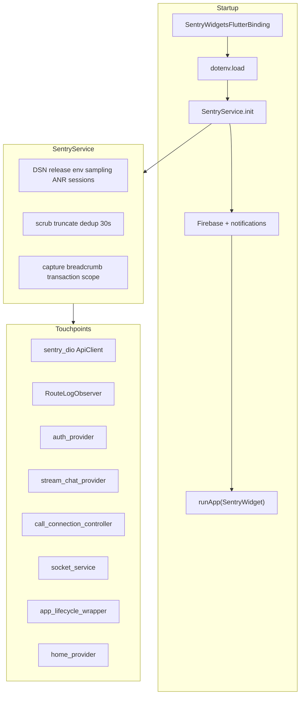

# Sentry Integration — Implementation Changelog

> **Plan reference:** [Sentry Flutter Integration Plan](file:///c:/Users/user/.cursor/plans/sentry_flutter_integration_7f24e17d.plan.md) (Cursor plan; do not edit)  
> **Related docs:** [SENTRY_INTEGRATION_PLAN.md](SENTRY_INTEGRATION_PLAN.md), [FLUTTER_FRONTEND_COMPREHENSIVE.md](FLUTTER_FRONTEND_COMPREHENSIVE.md) §26  
> **App:** Match Vibe (`zztherapy`) · **Package:** `com.matchvibe.app`  
> **Implemented:** May 2026  
> **Status:** Code complete — requires manual Sentry project + DSN + CI secrets

---

## Table of contents

1. [Executive summary](#1-executive-summary)
2. [What changed (file inventory)](#2-what-changed-file-inventory)
3. [Dependencies](#3-dependencies)
4. [App bootstrap and startup order](#4-app-bootstrap-and-startup-order)
5. [SentryService — central hub](#5-sentryservice--central-hub)
6. [Instrumentation by area](#6-instrumentation-by-area)
7. [Native builds and symbol upload](#7-native-builds-and-symbol-upload)
8. [Environment and configuration](#8-environment-and-configuration)
9. [Testing and documentation](#9-testing-and-documentation)
10. [Plan coverage matrix](#10-plan-coverage-matrix)
11. [Manual setup (still required)](#11-manual-setup-still-required)
12. [Verification checklist](#12-verification-checklist)

---

## 1. Executive summary

Production-grade Sentry error monitoring was added to the Match Vibe Flutter app without changing the existing architecture (Riverpod, Dio singleton, go_router, feature modules). All Sentry behavior is centralized in **`lib/core/services/sentry_service.dart`**.

### Design principles enforced

| Rule | How it is enforced |
|------|-------------------|
| No debug traffic to production Sentry | `SentryService.isEnabled` = `kReleaseMode && DSN present`; empty DSN in debug |
| No Dio 4xx/timeout flooding | `sentry_dio` with `captureFailedRequests: false`; selective 5xx only |
| No PII in events | `sendDefaultPii = false`; user scope = Mongo `id` only; scrubbing in `beforeSend` / `beforeBreadcrumb` |
| No duplicate error handlers | Single `SentryFlutter.init`; no custom `FlutterError.onError` |
| No duplicate nav observers | Extended existing `RouteLogObserver` only |
| No architecture rewrite | One new service file; touchpoints call `SentryService` helpers |

### Packages added

- `sentry_flutter: ^8.14.0`
- `sentry_dio: ^8.14.0`

Resolved versions at install: **8.14.2**.

---

## 2. What changed (file inventory)

### New files

| File | Purpose |
|------|---------|
| `lib/core/services/sentry_service.dart` | Central Sentry init, scrubbing, dedup, helpers |
| `test/sentry_service_test.dart` | Asserts Sentry disabled in debug/profile |
| `scripts/sentry_release_upload.sh` | CI helper: release create, Dart symbols, iOS dSYM, finalize |
| `docs/SENTRY_INTEGRATION_IMPLEMENTATION.md` | This document |

### Modified files

| File | Change type |
|------|-------------|
| `pubspec.yaml` | Added `sentry_flutter`, `sentry_dio` |
| `lib/main.dart` | Sentry binding, init wrapper, `SentryWidget`, env/Firebase capture |
| `lib/core/api/api_client.dart` | `addSentry`, selective capture, token-refresh capture |
| `lib/core/utils/route_log_observer.dart` | Navigation breadcrumbs |
| `lib/core/services/socket_service.dart` | Socket/billing breadcrumbs |
| `lib/core/services/availability_socket_service.dart` | Availability socket breadcrumbs |
| `lib/features/auth/providers/auth_provider.dart` | User scope on login/refresh; clear on logout |
| `lib/features/chat/providers/stream_chat_provider.dart` | Stream Chat log handler + breadcrumbs |
| `lib/features/video/controllers/call_connection_controller.dart` | Call breadcrumbs, failures, `video.call_join` transaction |
| `lib/features/video/screens/video_call_screen.dart` | Screen tag `video_call` |
| `lib/features/home/providers/home_provider.dart` | `home.feed_load` transaction |
| `lib/features/home/screens/home_screen.dart` | Screen tag `home` |
| `lib/features/wallet/screens/wallet_screen.dart` | Screen tag `wallet` |
| `lib/features/chat/screens/chat_screen.dart` | Screen tag `chat` |
| `lib/app/widgets/app_lifecycle_wrapper.dart` | Wallet deep-link transaction + error capture |
| `.env.example` | `SENTRY_DSN`, traces rate, CI env vars |
| `android/settings.gradle.kts` | Sentry Gradle plugin declaration |
| `android/app/build.gradle.kts` | Apply plugin + `sentry { }` block |
| `android/app/proguard-rules.pro` | Sentry keep rules + line numbers |
| `docs/FLUTTER_FRONTEND_COMPREHENSIVE.md` | §26 Sentry + TOC entry |
| `docs/SENTRY_INTEGRATION_PLAN.md` | Status → implemented |
| `frontend/README.md` | Link to comprehensive doc (prior session) |

### Files not modified (plan mentioned, not required for MVP)

| File | Plan item | Status |
|------|-----------|--------|
| `lib/features/video/widgets/incoming_call_listener.dart` | Breadcrumb on incoming ring | **Not implemented** |
| `lib/features/video/providers/stream_video_provider.dart` | Breadcrumb on `connect()` failure | **Not implemented** (Stream Video uses `logPriority: Priority.error` only) |
| `lib/app/router/app_router.dart` | Per-route scope tags in builders | **Partial** — screen tags set in screen `initState` instead |
| Backend `monitoring.ts` | Cross-stack correlation | **Deferred** (future) |

---

## 3. Dependencies

### `pubspec.yaml`

```yaml
dependencies:
  sentry_flutter: ^8.14.0
  sentry_dio: ^8.14.0
```

No changes to `dependency_overrides` or asset lists for Sentry (DSN comes from `.env` or `--dart-define`, not bundled assets).

---

## 4. App bootstrap and startup order

### Before

```text
WidgetsFlutterBinding.ensureInitialized()
  → image cache, MemoryPressureObserver
  → dotenv.load
  → Firebase + notifications + SecurityService (parallel)
  → runApp(ProviderScope → MyApp)
```

### After

```text
SentryWidgetsFlutterBinding.ensureInitialized()
  → dotenv.load(.env.development | .env.production)
  → SentryFlutter.init (via SentryService.init)
       → appRunner:
            → image cache, MemoryPressureObserver (unchanged order)
            → production env sanity check (+ captureMessage on failure)
            → Firebase + notifications + SecurityService (unchanged)
            → runApp(SentryWidget → ProviderScope → MyApp)
```

### `lib/main.dart` — specific edits

| Change | Detail |
|--------|--------|
| Binding | `WidgetsFlutterBinding` → `SentryWidgetsFlutterBinding.ensureInitialized()` (no `await`; returns `WidgetsBinding`) |
| Init wrapper | Entire previous `main()` body moved into `SentryService.init(() async { ... })` |
| Root widget | `runApp` child wrapped with `SentryWidget` |
| Production env failure | `SentryService.captureMessage` when required env keys missing or localhost API in release |
| Firebase failure | `SentryService.captureException` in `_initializeFirebaseSafely` catch |
| Import | `dart:async` for `unawaited`; `sentry_flutter`, `sentry_service` |

**Not added:** custom `runZonedGuarded`, duplicate `FlutterError.onError`, or second navigation observer.

---

## 5. SentryService — central hub

**File:** `lib/core/services/sentry_service.dart` (~454 lines)

### Public API

| Method / getter | Behavior |
|---------------|----------|
| `isEnabled` | `true` only when `_initialized && kReleaseMode` |
| `resolveDsn()` | `--dart-define=SENTRY_DSN` → `dotenv['SENTRY_DSN']` → `null` |
| `init(appRunner)` | Wraps `SentryFlutter.init` with all options |
| `setGlobalTags()` | `platform`, `api_base_host` (host only) |
| `setUserContext(user, firebaseUid)` | `SentryUser(id: mongoId)`; tags `role`, `firebase_uid` |
| `clearUserContext()` | Clears user + role tags |
| `setScreenTag` / `clearScreenTag` | Ephemeral `screen` tag |
| `addBreadcrumb(...)` | No-op when disabled; scrubs data |
| `captureException` / `captureMessage` | Guarded; tags only (no raw extras on scope) |
| `startTransaction(name, op)` | `bindToScope: true` |
| `shouldReportApiError(DioException)` | Policy for selective HTTP issues |

### Init options (release + DSN)

| Option | Value |
|--------|-------|
| `dsn` | Resolved DSN, or `''` when disabled |
| `environment` | `production` / `development` |
| `release` | `matchvibe@{version}+{buildNumber}` from `package_info_plus` |
| `dist` | `buildNumber` |
| `tracesSampleRate` | `0.15` release (overridable via env/define); `0` when disabled |
| `profilesSampleRate` | `0.0` |
| `sendDefaultPii` | `false` |
| `attachStacktrace` | `true` |
| `maxBreadcrumbs` | `100` |
| `enableAutoSessionTracking` | `true` in release only |
| `anrEnabled` | `true` on Android in release only |

### Privacy and anti-flood pipeline (`beforeSend`)

Order applied on every event:

1. **`_scrubEvent`** — drop user-cancelled / permission-denied-only events; scrub breadcrumbs; redact HTTP response headers/bodies; strip user to `id` only  
2. **`_truncateEventPayloads`** — cap breadcrumb message (512 chars), data values (256), max 100 breadcrumbs, max 50 stack frames  
3. **`_shouldDropDuplicateEvent`** — 30s in-memory fingerprint cache

### Fingerprint dedup keys

Built from exception type + first line of message + tags: `screen`, `call_phase`, `failure_reason`, `stream`, `call_id`, `http.path`, `http.status`.

Targets: RTC failures, socket reconnect storms, billing loops, repeated Dio 5xx on same path.

### Sensitive data handling

- Keys matching regex: `token`, `password`, `secret`, `dsn`, `email`, `phone`, etc. → `[Filtered]`
- Headers: `authorization`, `cookie`, `x-auth-token`, `set-cookie` → `[Filtered]`
- **`beforeBreadcrumb`** applies same scrubbing to HTTP breadcrumbs from `sentry_dio`

### Offline queue (SDK behavior)

Documented behavior (no custom queue in app):

- Sentry Flutter SDK caches events offline and retries on connectivity restore  
- `maxBreadcrumbs = 100` limits pre-crash context size  
- Dedup reduces duplicate issues after reconnect  
- Low-storage devices may drop oldest queued events (SDK-managed)

---

## 6. Instrumentation by area

### 6.1 Authentication — `auth_provider.dart`

| Event | Action |
|-------|--------|
| After successful `_syncUserToBackend` | `SentryService.setUserContext(user:, firebaseUid:)` |
| After `refreshUser()` success | `setUserContext` again (keeps role/tags current) |
| `signOut()` (before `prefs.clear`) | `SentryService.clearUserContext()` |

**Never set:** `user.email`, `user.username`, `user.phone`.

### 6.2 HTTP (Dio) — `api_client.dart`

| Change | Detail |
|--------|--------|
| Import | `sentry_dio`, `sentry_service`, `dart:async` |
| After `Dio(...)` | `_dio.addSentry(captureFailedRequests: false)` — breadcrumbs only, no auto-failed-request events |
| Token refresh failure | `captureException` with tags `feature: token_refresh`, `http.path` |
| End of `onError` | If `shouldReportApiError(error)` → `captureException` with `http.path`, `http.status`, optional `backend_request_id` from JSON body |
| Helper | `_extractBackendRequestId` for `requestId` / `request_id` in error JSON |

**`shouldReportApiError` reports when:**

- `statusCode >= 500` on paths containing: `/billing`, `/payment`, `/video`, `/chat`, `/creator/withdraw`

**Never reports:**

- 401 (including failed refresh path handled separately), 4xx, cancel, connection/receive/send timeouts, connection errors

### 6.3 Navigation — `route_log_observer.dart`

Extended existing `RouteLogObserver` (still used as sole `GoRouter` observer in `app_router.dart`):

- `didPush` / `didPop` / `didRemove` → `SentryService.addBreadcrumb(category: 'navigation', ...)`
- `didReplace` → breadcrumb with new/old route labels
- Existing `debugPrint` logging preserved

### 6.4 Screen tags

| Screen | File | Tag value | Cleared on `dispose` |
|--------|------|-----------|------------------------|
| Home | `home_screen.dart` | `home` | Yes |
| Wallet | `wallet_screen.dart` | `wallet` | No `dispose` hook (tag overwritten by next screen) |
| Chat | `chat_screen.dart` | `chat` | Yes |
| Video call | `video_call_screen.dart` | `video_call` | Yes |

### 6.5 Stream Chat — `stream_chat_provider.dart`

| Change | Detail |
|--------|--------|
| Log handler | `_streamChatLogHandler` on `StreamChatClient` — WARNING+ with `record.error` → `captureException` tags `stream: chat` |
| Debug | Still uses `StreamChatClient.defaultLogHandler` in debug |
| Log level | `Level.INFO` in debug, `Level.WARNING` in release |
| Connect | Breadcrumb `stream.chat.connect` with `firebase_uid` only (no token) |
| Disconnect | Breadcrumb `stream.chat.disconnect` |

### 6.6 Stream Video / calls — `call_connection_controller.dart`

| Event | Instrumentation |
|-------|-----------------|
| `startUserCall` start | Breadcrumb `call.outgoing.start` |
| Join flow | `SentryService.startTransaction('video.call_join', 'call')` with `finally { joinTxn.finish() }` |
| Connected | Breadcrumb `call.connected` + `call_id` |
| Failure | `_sentryReportCallFailure` → `captureException` with tags `stream: video`, `screen: video_call`, `failure_reason`, `call_id`, `call_phase` |
| Join timeouts | `captureException` for `joinTimeout` |

**Failures NOT reported (breadcrumb only):**

- `permissionDenied`, `rejected`, `creatorNotPickedUp`

Helpers: `_sentryCallBreadcrumb`, `_sentryReportCallFailure` (private methods at end of controller).

### 6.7 Socket.IO — `socket_service.dart`

| Event | Breadcrumb |
|-------|------------|
| `onConnect` | `socket.connect` |
| `onDisconnect` | `socket.disconnect` |
| `onReconnect` | `socket.reconnect` |
| `billing:started` | `billing:started` + optional `callId` |
| `billing:settled` | `billing:settled` + optional `callId` |
| `billing:error` | `billing:error` + optional `callId` |

Helper `_socketEventBreadcrumb` — max 2–3 keys in data, no auth token.

### 6.8 Availability socket — `availability_socket_service.dart`

| Event | Breadcrumb |
|-------|------------|
| `onConnect` | `availability.connect` |
| `onDisconnect` | `availability.disconnect` |

### 6.9 Performance transactions

| Transaction | Location | Operation |
|-------------|----------|-----------|
| `home.feed_load` | `home_provider.dart` — `CreatorFeedNotifier._fetchPage` | `ui.load` |
| `video.call_join` | `call_connection_controller.dart` — `startUserCall` | `call` |
| `wallet.checkout_return` | `app_lifecycle_wrapper.dart` — wallet deep link handler | `navigation` |

### 6.10 Lifecycle / deep links — `app_lifecycle_wrapper.dart`

Wallet payment return (`zztherapy://wallet`) refactored into:

- `_handleIncomingDeepLink` → starts `wallet.checkout_return` transaction, calls `_handleWalletPaymentDeepLink`, catches errors → `captureException` tag `feature: wallet_checkout_return`

Payment routing logic unchanged (success/failed → `/wallet/payment-status`).

---

## 7. Native builds and symbol upload

### Android — `android/settings.gradle.kts`

```kotlin
id("io.sentry.android.gradle") version "4.14.1" apply false
```

### Android — `android/app/build.gradle.kts`

- Plugin: `id("io.sentry.android.gradle")`
- Block:

```kotlin
sentry {
    autoUploadProguardMapping.set(System.getenv("SENTRY_AUTH_TOKEN")?.isNotBlank() == true)
    org.set(System.getenv("SENTRY_ORG") ?: "")
    projectName.set(System.getenv("SENTRY_PROJECT") ?: "flutter")
    authToken.set(System.getenv("SENTRY_AUTH_TOKEN") ?: "")
}
```

ProGuard mapping upload runs only when `SENTRY_AUTH_TOKEN` is set in the build environment.

### Android — `android/app/proguard-rules.pro`

```proguard
-keepattributes SourceFile,LineNumberTable
-keep class io.sentry.** { *; }
```

### iOS

- Native SDK pulled via CocoaPods when running `pod install` after `sentry_flutter` add  
- dSYM upload via `scripts/sentry_release_upload.sh` (not an Xcode build phase in repo)

### Release script — `scripts/sentry_release_upload.sh`

| Step | Command |
|------|---------|
| Create release | `sentry-cli releases new matchvibe@{VERSION}+{BUILD}` |
| Commits | `releases set-commits --auto` (best effort) |
| Dart symbols | `dart-symbol-files upload build/app/outputs/symbols` |
| iOS dSYM | `debug-files upload build/ios/iphoneos/Runner.app.dSYM` |
| Finalize | `releases finalize` |

**Required env:** `SENTRY_AUTH_TOKEN`, `SENTRY_ORG` (`yagati`); optional `SENTRY_PROJECT` (default `flutter`).

**Dashboard setup:** [SENTRY_DASHBOARD_SETUP.md](SENTRY_DASHBOARD_SETUP.md) (DSN, verify button, wizard command).

**Recommended release build:**

```bash
flutter build appbundle --release \
  --split-debug-info=build/app/outputs/symbols \
  --obfuscate \
  --dart-define=SENTRY_DSN=https://...
```

---

## 8. Environment and configuration

### `.env.example` additions

```env
SENTRY_DSN=
# SENTRY_TRACES_SAMPLE_RATE=0.15
# SENTRY_AUTH_TOKEN=...  # CI only
# SENTRY_ORG=your-org-slug
```

### DSN precedence

1. `--dart-define=SENTRY_DSN=...` (CI / release pipelines)  
2. `dotenv['SENTRY_DSN']` from `.env.production` or `.env.development`  
3. Disabled (empty DSN → no reporting)

### Traces sample rate precedence

1. `--dart-define=SENTRY_TRACES_SAMPLE_RATE`  
2. `SENTRY_TRACES_SAMPLE_RATE` in dotenv  
3. Default `0.15` release / `0.0` debug

### What you must configure locally (not in git)

| File | `SENTRY_DSN` |
|------|----------------|
| `.env.development` | **Empty** (no production noise) |
| `.env.production` | Production project DSN |

---

## 9. Testing and documentation

### Test — `test/sentry_service_test.dart`

```dart
test('SentryService is disabled in debug/profile builds', () {
  expect(SentryService.isEnabled, isFalse);
});
```

Run: `flutter test test/sentry_service_test.dart`

### Docs updated

| Document | Update |
|----------|--------|
| `docs/FLUTTER_FRONTEND_COMPREHENSIVE.md` | New §26 — Sentry error monitoring |
| `docs/SENTRY_INTEGRATION_PLAN.md` | Status: implemented |
| `docs/SENTRY_INTEGRATION_IMPLEMENTATION.md` | This changelog |

---

## 10. Plan coverage matrix

Maps plan phases to implementation status.

| Plan phase | Status | Notes |
|------------|--------|-------|
| Phase 0 — Sentry project setup | **Manual** | Documented; not automatable in code |
| Phase 1 — Core SDK + SentryService | **Done** | Includes 1.4–1.8 hardening |
| Phase 2 — main.dart refactor | **Done** | Correct dotenv-before-init order |
| Phase 3 — Environment | **Done** | `.env.example` + dart-define |
| Phase 4 — Auth scope | **Done** | login, refresh, logout |
| Phase 5 — Dio | **Done** | sentry_dio + selective 5xx |
| Phase 6 — Navigation | **Done** | RouteLogObserver only |
| Phase 7 — Stream Chat | **Done** | Log handler + breadcrumbs |
| Phase 8 — Stream Video | **Mostly done** | Controller covered; incoming_call_listener omitted |
| Phase 9 — Socket | **Done** | Main + availability sockets |
| Phase 10 — Performance | **Done** | 3 transactions |
| Phase 11 — Android symbols | **Done** | Gradle plugin + ProGuard |
| Phase 12 — iOS/Dart symbols | **Done** | Shell script |
| Phase 13 — Manual capture paths | **Partial** | main Firebase/env; call failures; not every plan path |
| Phase 14 — Testing | **Partial** | Unit test for disabled state; full matrix manual |
| Phase 15 — Docs / rollout | **Done** | Docs + alerts still manual in Sentry UI |

---

## 11. Manual setup (still required)

These steps are from the plan and are **not** completed by the code changes alone.

1. **Sentry project** — org `yagati`, project `flutter` (see [SENTRY_DASHBOARD_SETUP.md](SENTRY_DASHBOARD_SETUP.md))  
2. **Copy DSN** into `.env.production` (keep `.env.development` `SENTRY_DSN` empty)  
3. **Create auth token** — scopes: `project:releases`, `org:read`, `project:write`  
4. **Set CI secrets:** `SENTRY_AUTH_TOKEN`, `SENTRY_ORG`, optional `SENTRY_PROJECT`  
5. **Configure Sentry alerts** — new issues in `production`, regressions, ANR spike, crash-free session drop  
6. **First release build** with symbols + verify one test event in staging before wide rollout  

---

## 12. Verification checklist

Use after configuring DSN in a **release** build (or staging DSN).

| # | Test | Expected |
|---|------|----------|
| 1 | `flutter run` debug with empty `SENTRY_DSN` | No events in Sentry production project |
| 2 | `SentryService.isEnabled` in debug test | `false` |
| 3 | Release APK with staging DSN + forced exception | Event appears with `release`, `environment`, `dist` |
| 4 | Login | User scope: Mongo `id`, tags `role`, `firebase_uid` |
| 5 | Logout | User scope cleared |
| 6 | Dio 404 on `/user/me` | Breadcrumb only, no new issue |
| 7 | Dio 500 on `/payment/...` | Issue created (if path matches policy) |
| 8 | Navigate home → call | Navigation breadcrumbs in event trail |
| 9 | Repeat same call failure 5× in 10s | ≤1–2 issues (30s dedup) |
| 10 | Android release + ANR test (if possible) | ANR event in Sentry |
| 11 | Inspect sample events | No `Authorization`, email, phone, or tokens in payload |
| 12 | Release Health dashboard | Crash-free sessions visible after real usage |

---

## Architecture diagram (post-implementation)



---

*End of implementation changelog. For operational rollout steps, see [SENTRY_INTEGRATION_PLAN.md](SENTRY_INTEGRATION_PLAN.md) Phase 14–15.*
