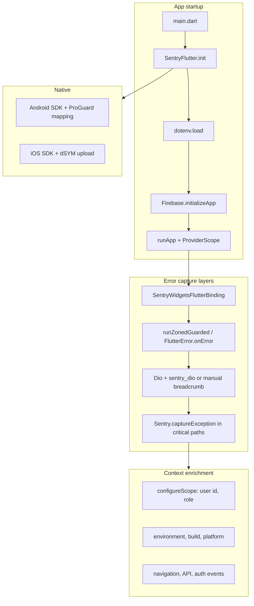

# Sentry Integration Plan — Match Vibe Flutter App

> **App:** `zztherapy` (Match Vibe) · **Path:** `D:\zztherapy\frontend`  
> **Package:** `com.matchvibe.app` (release) / `com.matchvibe.app` + `-dev` suffix (debug)  
> **Status:** Planning document — **implemented** in app code (May 2026)  
> **Last updated:** May 2026

---

## Table of contents

1. [Goals and non-goals](#1-goals-and-non-goals)
2. [Current state](#2-current-state)
3. [Architecture overview](#3-architecture-overview)
4. [Prerequisites](#4-prerequisites)
5. [Phase 0 — Sentry project setup](#5-phase-0--sentry-project-setup)
6. [Phase 1 — Core SDK bootstrap](#6-phase-1--core-sdk-bootstrap)
7. [Phase 2 — Environment and secrets](#7-phase-2--environment-and-secrets)
8. [Phase 3 — User and session context](#8-phase-3--user-and-session-context)
9. [Phase 4 — Automatic error capture](#9-phase-4--automatic-error-capture)
10. [Phase 5 — HTTP (Dio) instrumentation](#10-phase-5--http-dio-instrumentation)
11. [Phase 6 — Navigation breadcrumbs](#11-phase-6--navigation-breadcrumbs)
12. [Phase 7 — Stream Chat and Stream Video](#12-phase-7--stream-chat-and-stream-video)
13. [Phase 8 — Socket.IO and billing events](#13-phase-8--socketio-and-billing-events)
14. [Phase 9 — Performance monitoring](#14-phase-9--performance-monitoring)
15. [Phase 10 — Native platform setup](#15-phase-10--native-platform-setup)
16. [Phase 11 — Release builds and symbol upload](#16-phase-11--release-builds-and-symbol-upload)
17. [Phase 12 — Privacy, PII, and sampling](#17-phase-12--privacy-pii-and-sampling)
18. [Phase 13 — Backend correlation (optional)](#18-phase-13--backend-correlation-optional)
19. [Phase 14 — Testing and verification](#19-phase-14--testing-and-verification)
20. [Phase 15 — Rollout checklist](#20-phase-15--rollout-checklist)
21. [File change summary](#21-file-change-summary)
22. [References](#22-references)

---

## 1. Goals and non-goals

### Goals

| Goal | Why it matters for Match Vibe |
|------|-------------------------------|
| Capture **uncaught Dart/Flutter crashes** in release builds | Today failures only appear in `debugPrint` / `developer.log` — invisible in production |
| Attach **user id, role, app version, environment** to every event | Debug billing, calls, onboarding, and wallet issues per user |
| Record **breadcrumbs** (navigation, API, auth) before a crash | `go_router`, Dio, Firebase, and Stream SDK interact in complex ways |
| Upload **Android/iOS debug symbols** so stack traces are readable | Release builds use R8 minification (`proguard-rules.pro` is nearly empty) |
| Optional **performance traces** for cold start and critical screens | Home feed, video call join, wallet checkout are latency-sensitive |
| Align with **backend Sentry** (future) via shared release name and trace IDs | `backend/src/utils/monitoring.ts` already has a Sentry TODO |

### Non-goals (initial rollout)

- Replacing Firebase Crashlytics (not in use today — Sentry is the first crash reporter)
- Sending every Dio 4xx/5xx as an error (noise; use breadcrumbs + selective `captureMessage`)
- Full session replay (not supported on mobile the same way as web)
- Reporting errors from **debug/profile** builds to production Sentry (use separate project or disable)

---

## 2. Current state

### What exists today

| Area | Current behavior | Gap |
|------|------------------|-----|
| **Entry point** | `lib/main.dart` — `WidgetsFlutterBinding`, dotenv, Firebase, `runApp` | No global error zone, no crash reporter |
| **Env** | `.env.development` / `.env.production` via `flutter_dotenv`; `kReleaseMode` selects file | No `SENTRY_DSN` key |
| **HTTP** | `ApiClient` (Dio singleton) — verbose `debugPrint` on errors | Errors not reported externally |
| **Navigation** | `go_router` + `RouteLogObserver` (debugPrint only) | No Sentry navigation integration |
| **Auth** | Firebase Auth + `auth_provider.dart`; `UserModel.id` (Mongo), Firebase `uid` | No `Sentry.configureScope` on login/logout |
| **Stream** | `stream_chat_flutter`, `stream_video_flutter` | Stream Chat Sentry pattern documented in `streamChatDocs.md` but not implemented |
| **Backend** | `monitoring.ts` logs to Redis/logger; Sentry commented out | Cross-stack traces not wired |

### Relevant dependencies (from `pubspec.yaml`)

- Flutter SDK ^3.10.7
- `dio`, `firebase_*`, `go_router`, `flutter_riverpod`, `socket_io_client`, Stream SDKs
- **No** `sentry` or `sentry_flutter` yet

---

## 3. Architecture overview



**Recommended init order** (critical):

1. `WidgetsFlutterBinding.ensureInitialized()` (or use `SentryWidgetsFlutterBinding.ensureInitialized()`)
2. Load dotenv (need DSN from env **or** `--dart-define`)
3. `await SentryFlutter.init(...)` — wraps the rest of startup
4. Firebase, notifications, security, then `runApp`

Sentry’s Flutter SDK hooks `FlutterError.onError` and `PlatformDispatcher.onError` when initialized via `SentryFlutter.init`; do **not** register duplicate handlers unless you forward to Sentry.

---

## 4. Prerequisites

### Sentry.io account

1. Create organization (or use existing).
2. Create **Flutter** projects (recommended: separate projects for clarity):
   - `matchvibe-flutter-production`
   - `matchvibe-flutter-staging` (optional)
   - `matchvibe-flutter-development` (optional — or disable reporting in debug)

3. Copy **DSN** from Project Settings → Client Keys (DSN).

4. Create **auth token** for CI symbol upload:
   - Settings → Auth Tokens
   - Scopes: `project:releases`, `org:read` (and `project:write` if uploading via API)

5. Note **Organization slug** and **Project slug** for `sentry-cli` / Gradle plugin.

### Team decisions (decide before coding)

| Decision | Recommendation for Match Vibe |
|----------|--------------------------------|
| One vs multiple Sentry projects | **Two**: production + non-prod (dev/staging share one) |
| Report from debug builds? | **No** — `enabled: kReleaseMode` or empty DSN in `.env.development` |
| Sample rate (errors) | **1.0** in production initially (low volume early); tune later |
| Sample rate (performance) | **0.1–0.2** for transactions |
| User PII in Sentry | **Id + role only**; never email/phone in tags unless explicitly approved |
| Backend same org? | Yes — enables issue correlation and release health across stack |

---

## 5. Phase 0 — Sentry project setup

### 5.1 Create release naming convention

Use a single scheme across Flutter and (future) backend:

```
matchvibe@{version}+{build}
```

Examples from `pubspec.yaml`:

- `matchvibe@1.0.0+37` (version `1.0.0`, build `37`)

Set in Sentry options:

```dart
options.release = 'matchvibe@${packageInfo.version}+${packageInfo.buildNumber}';
options.dist = packageInfo.buildNumber;
```

Use `package_info_plus` (already in `pubspec.yaml`).

### 5.2 Environments in Sentry UI

| Sentry `environment` | When |
|----------------------|------|
| `production` | `kReleaseMode` + `.env.production` |
| `development` | Non-release builds (if you enable a dev project) |

### 5.3 Alert rules (Sentry UI)

Configure after first events arrive:

- New issue in `production` → Slack/email
- Regression (resolved issue reappears)
- Spike in `DioException` / `FlutterError` with tag `feature:video_call`

---

## 6. Phase 1 — Core SDK bootstrap

### 6.1 Add dependency

In `pubspec.yaml`:

```yaml
dependencies:
  sentry_flutter: ^8.14.0  # pin latest stable at implementation time
```

Run:

```bash
cd D:\zztherapy\frontend
flutter pub get
```

> Use the latest compatible version from [pub.dev/packages/sentry_flutter](https://pub.dev/packages/sentry_flutter) when implementing.

### 6.2 Create `lib/core/services/sentry_service.dart`

Centralize all Sentry configuration so `main.dart` stays readable:

```dart
import 'package:flutter/foundation.dart';
import 'package:flutter_dotenv/flutter_dotenv.dart';
import 'package:package_info_plus/package_info_plus.dart';
import 'package:sentry_flutter/sentry_flutter.dart';

class SentryService {
  SentryService._();

  static String? get dsn {
    final fromEnv = (dotenv.env['SENTRY_DSN'] ?? '').trim();
    if (fromEnv.isNotEmpty) return fromEnv;
    // Optional: const String.fromEnvironment('SENTRY_DSN') for CI
    return null;
  }

  static Future<void> init(Future<void> Function() appRunner) async {
    final dsn = dsn;
    final packageInfo = await PackageInfo.fromPlatform();

    await SentryFlutter.init(
      (options) {
        options.dsn = dsn;
        options.environment = kReleaseMode ? 'production' : 'development';
        options.enabled = kReleaseMode && (dsn != null && dsn.isNotEmpty);

        options.release = 'matchvibe@${packageInfo.version}+${packageInfo.buildNumber}';
        options.dist = packageInfo.buildNumber;

        options.tracesSampleRate = kReleaseMode ? 0.15 : 0.0;
        options.profilesSampleRate = 0.0; // enable later if needed

        options.attachStacktrace = true;
        options.attachThreads = true;
        options.sendDefaultPii = false;

        options.beforeSend = (event, hint) {
          // Strip sensitive headers if any slip through
          return _scrubEvent(event);
        };
      },
      appRunner: appRunner,
    );
  }

  static SentryEvent? _scrubEvent(SentryEvent event) {
    // Implement: remove Authorization headers, tokens, email from breadcrumbs
    return event;
  }
}
```

### 6.3 Refactor `lib/main.dart`

**Before** (simplified):

```dart
void main() async {
  WidgetsFlutterBinding.ensureInitialized();
  // ... dotenv, firebase, init ...
  runApp(const ProviderScope(child: MyApp()));
}
```

**After** (pattern):

```dart
Future<void> main() async {
  // Prefer Sentry binding so frame tracking works
  await SentryFlutter.init(
    (options) { /* moved to SentryService — see 6.2 */ },
    appRunner: () async {
      WidgetsFlutterBinding.ensureInitialized();
      // image cache, MemoryPressureObserver, dotenv, firebase, etc.
      runApp(
        SentryWidget(
          child: const ProviderScope(child: MyApp()),
        ),
      );
    },
  );
}
```

**Or** call `SentryService.init(() async { ... runApp ... })` which wraps `SentryFlutter.init`.

Important:

- Move **all** async startup currently in `main()` into the `appRunner` callback passed to `SentryFlutter.init`.
- Wrap root widget with `SentryWidget` for better widget error attribution (optional but recommended).

### 6.4 Verify automatic capture

After integration, these should appear in Sentry without extra code:

- Uncaught async errors in the root zone
- `FlutterError` framework errors
- Native crashes (after symbol upload)

---

## 7. Phase 2 — Environment and secrets

### 7.1 Add to `.env.example`

```env
# Sentry (optional in development; required for production crash reporting)
# Get DSN from: Sentry → Project Settings → Client Keys
SENTRY_DSN=

# Optional: override traces sample rate (0.0–1.0). Default set in code.
# SENTRY_TRACES_SAMPLE_RATE=0.15
```

### 7.2 Add to `.env.production` (not committed)

```env
SENTRY_DSN=https://<key>@o<org>.ingest.sentry.io/<project>
```

### 7.3 `.env.development`

Leave `SENTRY_DSN` **empty** or point to a **separate** dev project if you want local crash testing.

### 7.4 CI / release builds (`--dart-define`)

For CI where `.env.production` is injected at build time, also support:

```bash
flutter build apk --release \
  --dart-define=SENTRY_DSN=https://...
```

Read in code:

```dart
const dsnFromDefine = String.fromEnvironment('SENTRY_DSN', defaultValue: '');
```

**Precedence:** `--dart-define` > `.env` > disabled.

### 7.5 Do not commit DSN to public repos

DSN is not a secret equivalent to an API key (it is client-side), but still restrict repo access. Use CI secrets for production DSN in pipelines.

### 7.6 Update `pubspec.yaml` assets

No change needed if DSN is only in `.env.*` (already listed). Do **not** add DSN as a static asset file.

---

## 8. Phase 3 — User and session context

### 8.1 Identifiers to use

| Identifier | Source | Sentry field |
|------------|--------|--------------|
| Mongo user id | `UserModel.id` | `user.id` (primary) |
| Firebase UID | `FirebaseAuth.instance.currentUser?.uid` | `user` data / tag `firebase_uid` |
| Role | `UserModel.role` | tag `role` |
| Creator flag | `role == 'creator'` | tag `is_creator` |

**Do not** set `user.email` or `user.username` unless legal/compliance approves.

### 8.2 Hook into `auth_provider.dart`

On successful login / `_syncUserToBackend`:

```dart
await Sentry.configureScope((scope) {
  scope.setUser(SentryUser(id: user.id));
  scope.setTag('role', user.role ?? 'unknown');
  scope.setTag('firebase_uid', firebaseUser.uid);
});
```

On `signOut()`:

```dart
await Sentry.configureScope((scope) {
  scope.setUser(null);
  scope.removeTag('role');
  scope.removeTag('firebase_uid');
});
```

### 8.3 Global tags at startup

```dart
scope.setTag('platform', Platform.operatingSystem);
scope.setTag('api_base_host', Uri.parse(AppConstants.baseUrl).host);
```

Avoid full API URLs in tags (can leak staging hosts in screenshots).

---

## 9. Phase 4 — Automatic error capture

### 9.1 What Sentry captures automatically

With `SentryFlutter.init` + `SentryWidget`:

- Dart zone errors
- Flutter framework errors
- Jank / slow frames (if performance enabled)
- Native crashes (with symbols)

### 9.2 Manual capture — when to use

Use `Sentry.captureException` for **handled** errors that represent real product failures:

| Location | Condition |
|----------|-----------|
| Firebase init failure in release | Only if auth is required and app is unusable |
| Stream Video call join failure | After user-visible failure, not user-cancelled |
| Wallet payment flow terminal failure | Checkout returned error state |
| Onboarding crash recovery exhaustion | `retryCount` exceeded (see `home_screen.dart` comments) |

Use `Sentry.captureMessage` for **non-exception** anomalies:

- Production env sanity check failed (localhost API in release) — already warned in `main.dart`
- Billing socket desync detected

### 9.3 What NOT to report

| Case | Reason |
|------|--------|
| Expected 401 → token refresh | Normal auth flow in `ApiClient` |
| User denied camera/mic permission | User action |
| Network timeout on poor connectivity | High volume; use breadcrumb |
| `DioExceptionType.cancel` | User navigated away |

### 9.4 `FlutterError.onError` custom handler

If you add a custom handler (e.g. for local logging), **chain** to Sentry:

```dart
final originalOnError = FlutterError.onError;
FlutterError.onError = (details) {
  originalOnError?.call(details);
  // SentryFlutter.init already registers — avoid duplicate capture
};
```

Prefer relying on the SDK default unless you have a specific need.

---

## 10. Phase 5 — HTTP (Dio) instrumentation

### 10.1 Option A — `sentry_dio` package (recommended)

Add:

```yaml
dependencies:
  sentry_dio: ^8.14.0
```

In `ApiClient._internal()` after creating `Dio`:

```dart
_dio.addSentry(
  captureFailedRequests: false, // avoid flooding Sentry with 4xx/5xx
);
```

This adds **breadcrumbs** for requests without creating issues for every failed call.

### 10.2 Option B — Manual breadcrumb in existing interceptor

In `onError` of `InterceptorsWrapper` (end of handler, before `handler.next`):

```dart
Sentry.addBreadcrumb(Breadcrumb(
  category: 'http',
  type: 'http',
  level: SentryLevel.warning,
  data: {
    'method': error.requestOptions.method,
    'path': error.requestOptions.path,
    'status': error.response?.statusCode,
    'type': error.type.name,
  },
));
```

### 10.3 Selective error reporting for API

Report to Sentry only when:

- `statusCode >= 500` on critical paths: `/billing`, `/calls`, `/wallet`
- Repeated failures after token refresh (refresh failed in `ApiClient` catch block)

```dart
if (kReleaseMode && _shouldReportApiError(error)) {
  Sentry.captureException(error, stackTrace: error.stackTrace);
}
```

### 10.4 Scrub sensitive data

In `beforeSend` or Dio transformer:

- Remove `Authorization` header
- Truncate response bodies
- Never log full request `data` if it contains PII

---

## 11. Phase 6 — Navigation breadcrumbs

### 11.1 Extend `RouteLogObserver`

File: `lib/core/utils/route_log_observer.dart`

Add Sentry breadcrumbs alongside existing `debugPrint`:

```dart
@override
void didPush(Route<dynamic> route, Route<dynamic>? previousRoute) {
  Sentry.addBreadcrumb(Breadcrumb(
    category: 'navigation',
    message: 'push ${_routeLabel(route)}',
    level: SentryLevel.info,
  ));
  // existing debugPrint...
  super.didPush(route, previousRoute);
}
```

### 11.2 go_router integration

`app_router.dart` uses `GoRouter` with `RouteLogObserver` in `observers`. For go_router-specific integration, also log **route paths**:

```dart
// In redirect or a dedicated observer if you add GoRouterObserver
Sentry.configureScope((scope) {
  scope.setTag('route', state.uri.path);
});
```

Consider `sentry_go_router` if available for your `go_router` version; otherwise manual breadcrumbs are sufficient.

### 11.3 Critical routes to tag on enter

| Route | Tag |
|-------|-----|
| `/home` | `screen:home` |
| `/call` | `screen:video_call` |
| `/wallet` | `screen:wallet` |
| `/chat/:id` | `screen:chat` |

Set via `GoRoute` builder or screen `initState`.

---

## 12. Phase 7 — Stream Chat and Stream Video

### 12.1 Stream Chat log handler

Reference: `frontend/streamChatDocs.md` (Error Reporting With Sentry section).

After `StreamChat` client is created in `stream_chat_provider.dart` / wrapper:

```dart
import 'package:stream_chat/stream_chat.dart' as stream;

// Override Stream Chat log handler
stream.StreamChatClient.defaultLogHandler = (record) async {
  if (record.error != null && kReleaseMode) {
    await Sentry.captureException(
      record.error!,
      stackTrace: record.stackTrace,
      hint: Hint.withMap({'stream': 'chat', 'level': record.level.name}),
    );
  }
};
```

**Caution:** Stream SDK can be verbose — filter by `LogLevel.warning` and above, or specific error types.

### 12.2 Stream Video

In video call connection controller / `IncomingCallListener`:

- Breadcrumb on: incoming call, accept, reject, join channel, leave
- `captureException` on: join failure with non-user-cancel reason

Tags:

```dart
scope.setTag('call_id', callId);
scope.setTag('call_state', state.name);
```

### 12.3 Do not attach Stream tokens

Never put Stream JWT, Firebase ID token, or API keys in Sentry extras.

---

## 13. Phase 8 — Socket.IO and billing events

### 13.1 Availability socket

File: `lib/core/services/` (availability socket service)

Add breadcrumbs for:

- `connect` / `disconnect` / `reconnect`
- `creator:online` / `creator:offline` (creator app only)

### 13.2 Billing / coin socket events

When socket events drive coin balance or call billing:

```dart
Sentry.addBreadcrumb(Breadcrumb(
  category: 'socket',
  message: 'billing_tick',
  data: {'callId': callId, 'event': eventName},
));
```

Report exceptions only for **unexpected** protocol errors (parse failures, unknown state transitions).

---

## 14. Phase 9 — Performance monitoring

### 14.1 Enable transactions

Already configured via `tracesSampleRate` in Phase 1.

### 14.2 Custom transactions (high value)

| Transaction name | Span | File area |
|------------------|------|-----------|
| `app.startup` | dotenv → first frame | `main.dart` |
| `home.feed_load` | API + render | `home_screen.dart` |
| `video.call_join` | Stream connect | video feature |
| `wallet.checkout` | deep link return | `payment_service.dart` |

Example:

```dart
final transaction = Sentry.startTransaction('home.feed_load', 'ui.load');
try {
  await loadCreators();
} finally {
  await transaction.finish();
}
```

### 14.3 Cold start

`SentryFlutter.init` automatically tracks app start. Ensure heavy work (Firebase, dotenv) stays inside `appRunner` **after** init so startup timing is accurate.

### 14.4 Profile sampling

Keep `profilesSampleRate = 0` until error volume is stable and you need CPU profiles.

---

## 15. Phase 10 — Native platform setup

### 15.1 Android

**Application ID:**

- Release: `com.matchvibe.app`
- Debug: same with `versionNameSuffix = "-dev"` (see `android/app/build.gradle.kts`)

**ProGuard / R8** (release minification enabled):

1. Add Sentry Android Gradle plugin (symbol upload) — see Phase 11.
2. Add keep rules if stack traces show obfuscated Flutter/plugin classes:

```proguard
# android/app/proguard-rules.pro
-keepattributes SourceFile,LineNumberTable
-keep class io.sentry.** { *; }
```

**NDK:** `ndkVersion = "28.0.13004108"` — compatible with current Sentry Android SDK.

**Internet permission:** Already present for API calls; Sentry uses HTTPS to ingest.

### 15.2 iOS

1. Ensure **dSYM** generation: Build Settings → Debug Information Format = `DWARF with dSYM File` for Release.
2. Upload dSYMs via `sentry-cli` or Xcode build phase (Phase 11).
3. If using Firebase, no conflict — both can coexist.

**Pod install:** `sentry_flutter` pulls native SDK via CocoaPods automatically on `pod install`.

### 15.3 Permissions / privacy manifests

Sentry does not require extra iOS privacy keys beyond standard network usage. No changes to `Info.plist` for basic crash reporting.

---

## 16. Phase 11 — Release builds and symbol upload

### 16.1 Why this matters

Without symbols, production stack traces show obfuscated Java/Kotlin and incomplete Dart line numbers for native frames.

### 16.2 Android — Sentry Gradle plugin

In `android/settings.gradle.kts` / project `build.gradle.kts`, add Sentry Gradle plugin per [Sentry Flutter docs](https://docs.sentry.io/platforms/flutter/upload-debug/):

```kotlin
plugins {
    id("io.sentry.android.gradle") version "4.x.x"
}
```

Configure `sentry {
    autoUploadProguardMapping.set(true)
    org.set("your-org")
    projectName.set("matchvibe-flutter-production")
    authToken.set(System.getenv("SENTRY_AUTH_TOKEN"))
}
```

### 16.3 iOS — upload dSYMs

Post-build script or CI step:

```bash
sentry-cli debug-files upload \
  --auth-token "$SENTRY_AUTH_TOKEN" \
  --org your-org \
  --project matchvibe-flutter-production \
  build/ios/iphoneos/Runner.app.dSYM
```

### 16.4 Dart symbolication

For Flutter 3+, use Sentry’s `dart_symbol_map_path` / build hooks as documented for your SDK version when building with `--split-debug-info`:

```bash
flutter build apk --release \
  --split-debug-info=build/app/outputs/symbols \
  --obfuscate
```

Upload symbols folder in CI:

```bash
sentry-cli dart-symbol-files upload build/app/outputs/symbols
```

**Note:** `--obfuscate` changes stack traces — only enable when symbol upload is automated.

### 16.5 CI pipeline checklist

| Step | Command / action |
|------|------------------|
| Inject DSN | Secret `SENTRY_DSN` → `.env.production` or `--dart-define` |
| Inject auth token | Secret `SENTRY_AUTH_TOKEN` |
| Build | `flutter build appbundle --release` |
| Upload Android mapping | Sentry Gradle plugin (automatic) |
| Upload Dart symbols | `sentry-cli dart-symbol-files upload` |
| Upload iOS dSYM | `sentry-cli debug-files upload` |
| Create release | `sentry-cli releases new matchvibe@1.0.0+37` |
| Finalize release | `sentry-cli releases finalize ...` |

### 16.6 Associate commits (optional)

```bash
sentry-cli releases set-commits matchvibe@1.0.0+37 --auto
```

---

## 17. Phase 12 — Privacy, PII, and sampling

### 17.1 `beforeSend` scrubbing (required)

Strip or redact:

- `Authorization` / `Bearer` tokens in request breadcrumbs
- Email, phone, username from error messages
- Chat message body content
- Payment IDs (Razorpay order id) — use hashed or last-4 only

### 17.2 `sendDefaultPii`

Keep **`false`** unless legal approves IP collection for your jurisdictions.

### 17.3 GDPR / deletion

When user deletes account (`delete_account_screen.dart` flow):

- Call Sentry API to delete user data **or** rely on Sentry’s data scrubbing + short retention
- Document retention policy in privacy policy

### 17.4 Sampling tuning (after 2 weeks of data)

| Signal | Starting | Tune down if |
|--------|----------|--------------|
| Errors | 100% | >10k events/day |
| Performance | 15% | Quota exceeded |
| Profiling | 0% | N/A initially |

---

## 18. Phase 13 — Backend correlation (optional)

### 18.1 Backend today

`backend/src/utils/monitoring.ts` has:

```typescript
// TODO: Send to external service (Sentry, DataDog, etc.)
```

### 18.2 Unified release

Use same release string `matchvibe@1.0.0+37` in Node Sentry SDK when backend is integrated.

### 18.3 Distributed tracing

For API calls from Flutter:

1. Backend returns `sentry-trace` / `baggage` headers (Sentry Node SDK).
2. Dio interceptor reads headers and continues trace (advanced; Phase 2+).

Minimum viable: share **`X-Request-Id`** (if backend adds one) as Sentry tag on both sides.

### 18.4 Flutter → backend breadcrumb

When API returns error with `requestId` in JSON body, attach to Sentry event:

```dart
Sentry.configureScope((s) => s.setTag('backend_request_id', requestId));
```

---

## 19. Phase 14 — Testing and verification

### 19.1 Local dev test (dev Sentry project)

Temporary DSN in `.env.development`, force enable:

```dart
options.enabled = true; // TEMP — revert before merge
```

Trigger test exception:

```dart
ElevatedButton(
  onPressed: () => throw StateError('Sentry test exception'),
  child: const Text('Test Sentry'),
)
```

Or:

```dart
await Sentry.captureException(StateError('Manual Sentry test'));
```

Confirm event in Sentry Issues within ~30 seconds.

### 19.2 Release build test

```bash
flutter build apk --release
adb install build/app/outputs/flutter-apk/app-release.apk
# Trigger crash, restart app, verify native crash report
```

### 19.3 Verification matrix

| Test | Expected in Sentry |
|------|-------------------|
| Uncaught `throw` in widget build | Issue with Dart stack, release/env tags |
| Async error in `Future` | Issue with stack trace |
| Dio 503 on `/billing` (staging) | Breadcrumb; issue only if manual capture enabled |
| Login → crash | User id + `role` tag present |
| Logout → crash | No user id on scope |
| Navigation to `/call` then crash | Breadcrumb trail includes push events |
| Stream Chat error | Issue with `stream: chat` hint |
| ProGuard release build | Deobfuscated Java stack (after mapping upload) |

### 19.4 Regression guard

Add a **widget test** or **integration test** that mocks Sentry and verifies `SentryService.init` is called (optional, low priority).

---

## 20. Phase 15 — Rollout checklist

### Week 1 — Foundation

- [ ] Create Sentry projects and DSNs
- [ ] Add `sentry_flutter` + `SentryService`
- [ ] Refactor `main.dart` with `SentryFlutter.init` + `SentryWidget`
- [ ] Add `SENTRY_DSN` to `.env.example` and production env
- [ ] `enabled: kReleaseMode` only
- [ ] Auth scope: set/clear user on login/logout
- [ ] Ship internal release build to QA
- [ ] Verify test exception in Sentry UI

### Week 2 — Instrumentation

- [ ] Dio breadcrumbs (`sentry_dio` or manual)
- [ ] `RouteLogObserver` → Sentry breadcrumbs
- [ ] Stream Chat log handler (filtered)
- [ ] Video call failure capture
- [ ] `beforeSend` scrubbing
- [ ] Android ProGuard mapping upload in CI
- [ ] iOS dSYM upload in CI

### Week 3 — Production

- [ ] Production DSN in release pipeline only
- [ ] Alert rules in Sentry
- [ ] Document runbook: “How to find user’s crashes” (search by `user.id`)
- [ ] Tune sample rates from first week volume
- [ ] (Optional) Start backend `monitoring.ts` Sentry integration with same org

### Week 4 — Hardening

- [ ] Performance transactions for `app.startup`, `video.call_join`
- [ ] Review top 10 issues, fix noise (adjust `beforeSend` / `captureFailedRequests`)
- [ ] Privacy review with `sendDefaultPii = false`
- [ ] Remove any temporary test crash buttons

---

## 21. File change summary

| File | Action |
|------|--------|
| `pubspec.yaml` | Add `sentry_flutter`, optionally `sentry_dio` |
| `lib/core/services/sentry_service.dart` | **Create** — init, scrubbing, helpers |
| `lib/main.dart` | Wrap startup in `SentryFlutter.init`, add `SentryWidget` |
| `lib/features/auth/providers/auth_provider.dart` | `configureScope` on login/logout |
| `lib/core/api/api_client.dart` | Sentry Dio integration + selective capture |
| `lib/core/utils/route_log_observer.dart` | Sentry breadcrumbs |
| `lib/app/router/app_router.dart` | Optional route tags |
| `lib/features/chat/providers/stream_chat_provider.dart` | Stream log handler |
| Video feature files | Call breadcrumbs + failure capture |
| `.env.example` | Document `SENTRY_DSN` |
| `android/app/build.gradle.kts` | Sentry Gradle plugin (Phase 11) |
| `android/app/proguard-rules.pro` | Sentry keep rules if needed |
| CI workflow (repo root) | Symbol upload + secrets |
| `docs/FLUTTER_FRONTEND_COMPREHENSIVE.md` | Add Sentry section after implementation |

---

## 22. References

| Resource | URL |
|----------|-----|
| Sentry Flutter SDK | https://docs.sentry.io/platforms/flutter/ |
| Manual setup | https://docs.sentry.io/platforms/flutter/manual-setup/ |
| Upload debug symbols | https://docs.sentry.io/platforms/flutter/upload-debug/ |
| `sentry_flutter` on pub.dev | https://pub.dev/packages/sentry_flutter |
| `sentry_dio` | https://pub.dev/packages/sentry_dio |
| Stream Chat + Sentry (in-repo) | `frontend/streamChatDocs.md` |
| Backend monitoring TODO | `backend/src/utils/monitoring.ts` |
| Current app bootstrap | `lib/main.dart` |
| Env pattern | `lib/core/constants/app_constants.dart`, `.env.example` |

---

## Appendix A — Minimal `main.dart` shape (reference)

```dart
import 'package:sentry_flutter/sentry_flutter.dart';
import 'core/services/sentry_service.dart';

Future<void> main() async {
  await SentryService.init(() async {
    WidgetsFlutterBinding.ensureInitialized();
    // MemoryPressureObserver, dotenv, firebase, notifications...
    runApp(
      SentryWidget(
        child: const ProviderScope(child: MyApp()),
      ),
    );
  });
}
```

## Appendix B — Estimated effort

| Phase | Effort |
|-------|--------|
| 0–2 Core bootstrap + env | 0.5–1 day |
| 3–6 Context + Dio + navigation | 1 day |
| 7–8 Stream + socket | 0.5–1 day |
| 9 Performance (basic) | 0.5 day |
| 10–11 Native + CI symbols | 1–2 days |
| 12–14 Privacy + testing | 0.5–1 day |
| **Total** | **~4–7 days** including CI and QA |

---

*This document is a plan only. Implementation should follow phases in order; do not enable production reporting until symbol upload and `beforeSend` scrubbing are in place.*
