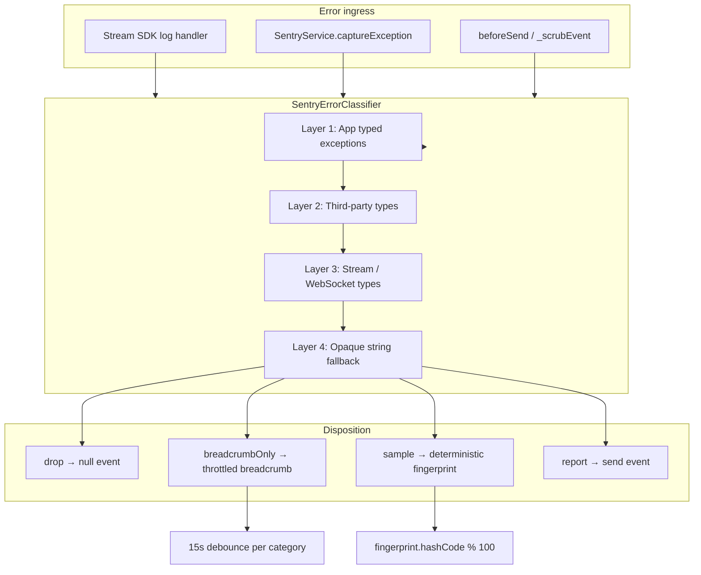

# Sentry Stability and Noise Reduction — Implementation Report

**Date:** 2026-05-25  
**Related analysis:** [`SENTRY_FLUTTER_ERRORS_ANALYSIS.md`](./SENTRY_FLUTTER_ERRORS_ANALYSIS.md)  
**Scope:** Phases 0–5 implemented; Phase 6 documented as future follow-up

---

## Executive summary

This implementation addresses 14 Sentry Flutter issues (FLUTTER-1 through FLUTTER-E) with two parallel tracks:

1. **Real bug fixes** — overlay crashes, ref-after-dispose races, and false-fatals from expected chat validation.
2. **Noise reduction infrastructure** — a type-first error classifier, deterministic sampling, throttled breadcrumbs, Stream SDK log tiering, bundled Google Fonts, and ringtone interrupt handling.

The goal is to cut Sentry noise by roughly 50–70% without hiding genuine outages, auth failures, join timeouts, or native crashes.

---

## Goals and outcomes

| Goal | Outcome |
|------|---------|
| Fix real P1 bugs | FLUTTER-6/9 (ref-after-dispose), FLUTTER-E (overlay crash) hardened |
| Stop false Fatals | FLUTTER-C/D (restricted chat) no longer pollute Sentry |
| Cut noise 50–70% | Connectivity, DNS, ICE abort, font fetch, and ringtone interrupts filtered or sampled |
| Offline-safe typography | Montserrat, Inter, Poppins, Archivo Black bundled locally |
| Keep real bugs reportable | Ref-after-dispose, null assertions, join/auth failures, native crashes still report until verified fixed |

---

## Architecture overview



**Design principles:**

- **Type-first classification** — `is` checks on exported SDK and app types; string matching only for opaque blobs.
- **Explicit DNS allowlist** — only known noisy third-party hosts are sampled; unknown hosts always report (fail-open on parse failure).
- **Deterministic sampling** — `fingerprint.hashCode.abs() % 100`; never `Random()`.
- **Breadcrumb throttling** — max one breadcrumb per category per 15 seconds.
- **Lifecycle cancellation** — generation counters and pre-read notifiers beyond bare `mounted` checks.

---

## Phase 0 — Sentry classification

### New file: `lib/core/services/sentry_error_classifier.dart`

Central classification logic shared by `SentryService.beforeSend`, `SentryService.captureException`, and the Stream Chat log handler.

#### Disposition enum

```dart
enum SentryErrorDisposition {
  report,           // send event as-is
  drop,             // suppress entirely
  breadcrumbOnly,   // throttled breadcrumb only
  sample,           // report only if fingerprint passes rate
}
```

#### Classification layers

| Layer | Mechanism | Examples |
|-------|-----------|----------|
| 1 | App typed exceptions | `RestrictedContentException`, `MediaAttachmentBlockedException` → **drop** |
| 2 | Known third-party types | `PlayerInterruptedException` → **drop**; `SocketException` → DNS sub-classifier |
| 3 | Stream / WebSocket types | `StreamWebSocketError` → **breadcrumbOnly**; `StreamChatNetworkError` timeout → **breadcrumbOnly**; `WebSocketChannelException` on allowlisted host → **sample** |
| 4 | Opaque string fallback | Twirp IceTrickle abort → **sample**; font fetch failures → **drop**; legacy restricted-content strings → **drop** |

#### DNS allowlist (explicit only)

Only these host fragments suppress/sample; all other hosts **report**:

| Host fragment | Rationale |
|---------------|-----------|
| `chat.stream-io-api.com` | Stream Chat API — noisy during offline/reconnect |
| `stream-io-video.com` | Stream Video SFU — ICE/WebSocket churn |
| `fonts.gstatic.com` | Google Fonts CDN — eliminated by bundling |

**Fail-open parsing:** If host cannot be extracted from a `failed host lookup` message, disposition is **report** (never silently drop unknown outages).

#### Sampling rates

| Error class | Rate | Fingerprint |
|-------------|------|-------------|
| Allowlisted DNS / WebSocket | 2% (`sampleRateDnsAllowlist`) | `{runtimeType}\|{host}` |
| ICE / Twirp abort | 8% (`sampleRateIceTrickle`) | `{runtimeType}\|{host}` |

Deterministic check:

```dart
final bucket = fingerprint.hashCode.abs() % 100;
return bucket < (rate * 100).round();
```

Same fingerprint always produces the same keep/drop decision across app restarts and devices.

#### Public API

| Method | Purpose |
|--------|---------|
| `classifyError(Object error)` | Returns disposition for any error |
| `shouldSuppressEvent(Object error)` | True when event should not reach Sentry |
| `shouldReportCapture(Object error)` | Inverse of suppress — used by `captureException` |
| `buildSampleFingerprint(...)` | Builds stable fingerprint for sampling |
| `shouldSample(fingerprint, rate)` | Deterministic rate gate |
| `sampleRateFor(Object error)` | Resolves 2% vs 8% based on error content |
| `breadcrumbCategoryFor(Object error)` | Routes breadcrumbs to `connectivity.dns`, `stream.chat.connectivity`, or `call.network` |

---

### Modified: `lib/core/services/sentry_service.dart`

#### `beforeSend` integration (`_scrubEvent`)

1. Extract throwable from `event.throwable` (fallback: parse from exception value).
2. Check `_shouldAlwaysReport` — bypasses classifier for real bugs:
   - `StateError` / message containing `Cannot use "ref" after the widget was disposed`
   - `TypeError`
   - Null check operator messages
   - Native crash signatures (`syscall: abort`, `flutterjni is not attached`)
   - Events tagged `failure_reason=joinTimeout`
3. Otherwise run `SentryErrorClassifier.classifyError` and apply disposition:
   - **drop** → return `null`
   - **breadcrumbOnly** → record throttled breadcrumb, return `null`
   - **sample** → keep only if fingerprint passes rate; otherwise breadcrumb with `sampled_out: true`
   - **report** → continue to scrub/dedup pipeline

#### `captureException` integration

Before calling `Sentry.captureException`, checks `SentryErrorClassifier.shouldReportCapture`. Suppressed errors get a throttled classifier breadcrumb instead of a full event.

#### Throttled breadcrumbs

```dart
static void addThrottledBreadcrumb({
  required String category,
  required String message,
  ...
});
```

- Debounce window: **15 seconds per category**
- Test helpers: `isBreadcrumbThrottled`, `recordBreadcrumbTimestampForTests`

During a 60-second airplane-mode session, expect ~4 breadcrumbs (one per category) instead of hundreds of events.

---

## Phase 1 — P1 stability fixes

### 1.1 Chat typed exceptions (FLUTTER-C / FLUTTER-D)

**New file:** `lib/features/chat/exceptions/chat_send_exceptions.dart`

```dart
class RestrictedContentException implements Exception { ... }
class MediaAttachmentBlockedException implements Exception { ... }
```

**Modified:** `lib/features/chat/screens/chat_screen.dart`

`_onPreSend` now throws typed exceptions instead of generic `Exception` strings. Layer 1 classification catches these by `is` check — no string dependency.

**Sentry effect:** Restricted content and media attachment blocks show user-facing dialogs but produce **zero** Sentry events.

---

### 1.2 Overlay null crash (FLUTTER-E)

**Modified:** `lib/core/services/push_notification_service.dart`

| Change | Detail |
|--------|--------|
| `_previewDismissTimer` | Replaces fire-and-forget `Future.delayed` for auto-dismiss |
| `_activePreviewEntry` | Tracks current overlay for cleanup before showing next preview |
| `_safeRemoveOverlayEntry` | Checks `entry.mounted`, wraps `remove()` in try/catch |
| `dispose()` | Cancels timer, removes active overlay on logout/teardown |
| Tap handlers | Cancel timer and remove overlay before navigation |

**Root cause addressed:** Overlay entry removed after widget/navigator teardown or double-remove on fast navigation.

---

### 1.3 Lifecycle hardening (FLUTTER-6 / FLUTTER-9)

#### Pattern A: Pre-read notifiers before async

Anti-pattern:

```dart
await someFuture();
ref.read(someProvider.notifier).load(); // BAD — ref may be disposed
```

Preferred:

```dart
final notifier = ref.read(someProvider.notifier);
await someFuture();
if (!mounted) return;
notifier.load();
```

#### Pattern B: Generation guards

Increment a counter on dispose/logout/end-call; async continuations check `generation == _generation` before post-await work.

#### File-specific changes

**`lib/app/widgets/stream_chat_wrapper.dart`**

- `_connectGeneration` incremented on logout before disconnect
- `_isConnectGenerationCurrent(generation)` checks `mounted && generation == _connectGeneration`
- `_connectToStreamChat`: pre-reads `streamChatNotifier`, `streamVideoNotifier`, `pushService` before any `await`
- Generation checked after token fetch, connect, and push init

**`lib/features/home/screens/home_screen.dart`**

- `_setupReactiveListeners`: pre-read `creatorsProvider.notifier` before `unawaited(refreshFeed())`
- Onboarding completion: pre-read creators notifier before feed refresh
- `_showPermissionsIntroThenRequest` / `_requestBundledPermissions`: capture `authNotifier`, `modalCoordinator`, `authStateSnapshot` synchronously; no `ref.read` after `await completer.future`
- Welcome dialog callbacks: use outer `firebaseUid` instead of `ref.read(authProvider)` inside async `onPresented` / `onAgree` / `onNotNow`
- `_markWelcomeAsSeenWithRetry`: capture `firebaseUid` once at method start
- `dispose()`: already cancels `_onboardingPopupWatchdog` (unchanged, verified)

**`lib/features/video/controllers/call_connection_controller.dart`**

- `_postCallGeneration` incremented on dispose and at start of post-call async block
- `_feedbackNavigateCoinAfterCall`: pre-reads `authNotifier`; after each delay checks `!mounted || postCallGeneration != _postCallGeneration`
- Coin popup: pre-reads `coinPopupNotifier` before delayed future
- `dispose()`: increments generation, stops ringtone, cancels subscriptions/watchdog

**Important:** Ref-after-dispose events are **still reported** to Sentry via `_shouldAlwaysReport` until production confirms the fixes eliminated them.

---

## Phase 2 — Stream SDK log tiering

**Modified:** `lib/features/chat/providers/stream_chat_provider.dart`

Replaced blunt "WARNING+ → captureException" with shared classifier:

```dart
void _streamChatLogHandler(LogRecord record) {
  if (kDebugMode) StreamChatClient.defaultLogHandler(record);
  if (record.error == null) return;

  final disposition = SentryErrorClassifier.classifyError(record.error!);

  // drop / breadcrumbOnly → throttled breadcrumb, return
  // sample → breadcrumb if sampled out, else fall through
  // WARNING+ → captureException (which also runs classifier)
}
```

Connectivity timeouts and WebSocket reconnect noise become throttled breadcrumbs. Genuine WARNING+ errors that pass classification still reach Sentry.

---

## Phase 3 — Google Fonts bundling (FLUTTER-2)

### Problem

`GoogleFonts` runtime fetching from `fonts.gstatic.com` fails offline and generated Sentry noise (now also **drop**ped in classifier as belt-and-suspenders).

### Solution

**New assets:** `frontend/assets/fonts/`

| File | Family | Notes |
|------|--------|-------|
| `Montserrat-wght.ttf` | Montserrat | Variable font — app theme |
| `Inter-opsz-wght.ttf` | Inter | Variable font — wallet modals, promo labels |
| `Poppins-Medium.ttf` | Poppins | weight 500 |
| `Poppins-SemiBold.ttf` | Poppins | weight 600 |
| `Poppins-Bold.ttf` | Poppins | weight 700 |
| `Poppins-ExtraBold.ttf` | Poppins | weight 800 |
| `ArchivoBlack-Regular.ttf` | Archivo Black | welcome free-call popup |

**Modified:** `pubspec.yaml` — `fonts:` section declares all families and weights.

**Modified:** `lib/main.dart`

```dart
GoogleFonts.config.allowRuntimeFetching = false;
```

Set before `runApp` so all `GoogleFonts.montserrat()` / `.inter()` / `.poppins()` / `.archivoBlack()` calls resolve from bundled assets.

---

## Phase 4 — Ringtone interrupt (FLUTTER-B)

**Modified:** `lib/features/video/services/call_ringtone_service.dart`

`PlayerInterruptedException` from `just_audio` is caught at source in:

- `stop()` — when stopping player during call end or mode switch
- `_startIncomingRingtoneInternal()` — asset play, URL upgrade, and fallback paths

Classifier layer 2 also drops `PlayerInterruptedExceptionSafe` by type if any escape the service layer.

**Expected behavior:** Stopping or switching ringtone during an active play no longer produces Sentry noise.

---

## Phase 5 — Stream Video SFU / ICE (FLUTTER-A)

**Modified:** `lib/features/video/controllers/call_connection_controller.dart` — `_sentryReportCallFailure`

When the error classifies as **sample** (opaque Twirp + IceTrickle + connection abort on `stream-io-video.com`):

- Records throttled breadcrumb with `disposition: sampled_ice`
- Does **not** call `captureException`

Still reports via(e.g.):

- `joinTimeout`
- Auth failures
- User-visible SFU failures
- Non-sample failure reasons (except permission denied, rejected, creator not picked up — unchanged)

Sampling rate: **8%** via `sampleRateIceTrickle`.

---

## Phase 6 — Future work (documented only)

Added to [`SENTRY_FLUTTER_ERRORS_ANALYSIS.md`](./SENTRY_FLUTTER_ERRORS_ANALYSIS.md):

Proactive offline gating via `connectivity_plus` (already a dependency) wrapped in a Riverpod provider to pause Stream Chat reconnect, Stream Video ICE retries, image prefetch, and token refresh while offline — reducing noise at the source rather than only filtering it.

**Not implemented in this PR** — classification and throttling handle symptoms; connectivity gating addresses root cause of reconnect storms.

---

## Sentry issue mapping

| Issue | Description | Fix |
|-------|-------------|-----|
| FLUTTER-C | Restricted content false fatal | Typed `RestrictedContentException` + drop |
| FLUTTER-D | Media attachment false fatal | Typed `MediaAttachmentBlockedException` + drop |
| FLUTTER-E | Overlay null crash | Timer + safe overlay remove + dispose |
| FLUTTER-6/9 | Ref after dispose | Generation guards, pre-read notifiers |
| FLUTTER-2 | Font fetch offline | Bundled fonts + runtime fetch disabled |
| FLUTTER-B | Ringtone interrupt | Catch `PlayerInterruptedException` |
| FLUTTER-A | SFU ICE abort noise | Sample 8% + breadcrumb for rest |
| FLUTTER-1/3/4/5/7/8 | Connectivity/DNS noise | Allowlist sample 2% + breadcrumbs |

---

## Files changed

| File | Change type | Summary |
|------|-------------|---------|
| `lib/core/services/sentry_error_classifier.dart` | **New** | Layered classification, DNS allowlist, sampling |
| `lib/core/services/sentry_service.dart` | Modified | beforeSend, captureException, throttled breadcrumbs, always-report guard |
| `lib/features/chat/exceptions/chat_send_exceptions.dart` | **New** | Typed chat validation exceptions |
| `lib/features/chat/screens/chat_screen.dart` | Modified | Throws typed exceptions in `_onPreSend` |
| `lib/core/services/push_notification_service.dart` | Modified | Overlay timer, safe remove, dispose cleanup |
| `lib/app/widgets/stream_chat_wrapper.dart` | Modified | `_connectGeneration`, pre-read notifiers |
| `lib/features/home/screens/home_screen.dart` | Modified | Pre-read notifiers, captured `firebaseUid` in modals |
| `lib/features/video/controllers/call_connection_controller.dart` | Modified | `_postCallGeneration`, ICE sampling in `_sentryReportCallFailure`, dispose |
| `lib/features/chat/providers/stream_chat_provider.dart` | Modified | Tiered `_streamChatLogHandler` |
| `lib/features/video/services/call_ringtone_service.dart` | Modified | `PlayerInterruptedException` handling |
| `lib/main.dart` | Modified | `GoogleFonts.config.allowRuntimeFetching = false` |
| `pubspec.yaml` | Modified | Font declarations; direct `stream_chat`, `web_socket_channel` deps |
| `assets/fonts/*.ttf` | **New** | 7 bundled font files |
| `test/sentry_error_classifier_test.dart` | **New** | 11 classifier unit tests |
| `test/sentry_service_test.dart` | Modified | Throttle + integration tests |
| `docs/SENTRY_FLUTTER_ERRORS_ANALYSIS.md` | Modified | Phase 6 future-work section |

---

## Automated testing

### Run command

```bash
cd frontend
flutter test test/sentry_error_classifier_test.dart test/sentry_service_test.dart
```

### Results: 15/15 passed

#### `sentry_error_classifier_test.dart` (11 tests)

| Test | Asserts |
|------|---------|
| `RestrictedContentException drops` | Layer 1 drop |
| `PlayerInterruptedException drops` | Layer 2 drop |
| `allowlisted DNS host samples` | `chat.stream-io-api.com` → sample |
| `unknown DNS host reports` | `prestigeinteriordesign.com` → report |
| `unparseable DNS host reports (fail open)` | Malformed message → report |
| `ref after dispose reports` | Real bug stays report |
| `opaque IceTrickle abort samples` | Twirp ICE string → sample |
| `shouldSample is deterministic` | Same fingerprint → same result |
| `shouldSample respects rate bounds` | 0% and 100% edge cases |
| `extractHostFromSocketMessage parses quoted host` | Regex extraction |
| `extractHostFromSocketMessage returns null for malformed` | Fail-open input |

#### `sentry_service_test.dart` (4 tests)

| Test | Asserts |
|------|---------|
| `SentryService is disabled in debug/profile builds` | Baseline guard |
| `second breadcrumb within 15s is throttled` | Debounce logic |
| `shouldSuppressEvent drops restricted content` | End-to-end suppress |
| `shouldReportCapture keeps backend DNS failures visible` | Unknown host not suppressed |

### Static analysis

```bash
dart analyze lib/core/services/sentry_service.dart lib/core/services/sentry_error_classifier.dart
```

No errors on touched files (pre-existing info-level lints only).

---

## Manual QA checklist

Perform on a physical device or emulator before release:

| # | Scenario | Steps | Expected |
|---|----------|-------|----------|
| 1 | Restricted chat | Send blocked content as user | Dialog shows; **zero** new Sentry events |
| 2 | Media attachment block | Non-creator sends attachment | Dialog shows; **zero** Sentry events |
| 3 | Unknown DNS failure | Break a non-allowlisted URL (e.g. bad avatar CDN) | Event **still reports** to Sentry |
| 4 | Stream DNS allowlist | Airplane mode 60s with chat open | Throttled breadcrumbs only; ~2% sampled events if any |
| 5 | ICE abort | Drop network mid-call | Breadcrumbs; occasional sampled SFU event (~8%) |
| 6 | Host parse failure | N/A (unit tested) | Malformed lookup messages **report** |
| 7 | Breadcrumb storm | Airplane mode 60s | Max ~4 breadcrumbs (15s/category), not hundreds of events |
| 8 | Logout during connect | Log out while Stream Chat connecting | No crash; connect work stops |
| 9 | Overlay preview | Receive push preview, tap quickly / navigate away | No overlay crash |
| 10 | Fonts offline | Airplane mode; open home, wallet, free-call popup | Typography renders from bundled fonts |
| 11 | Ref after dispose | Exercise onboarding + post-call flows heavily | Should decrease; any remaining events still **report** |

---

## Operational notes

### What still reports to Sentry

- Ref-after-dispose (`StateError` / matching message)
- Null check operator failures (`TypeError` / message)
- Native abort / JNI detach
- Join timeout (`failure_reason=joinTimeout`)
- DNS failures on **non-allowlisted** hosts
- Unparseable host in lookup messages (fail-open)
- Non-sample call failures (auth, SFU user-visible errors)

### What is intentionally suppressed or reduced

- Expected chat validation (restricted content, media blocks)
- Ringtone stop/interrupt during call flow
- Stream Chat connectivity timeouts (breadcrumb)
- Allowlisted third-party DNS (2% sample)
- SFU ICE abort during reconnect (8% sample)
- Font CDN fetch errors (drop + bundling)
- Duplicate events within 30s fingerprint window (existing dedup)

### Tuning sampling rates

Edit constants in `sentry_error_classifier.dart`:

```dart
static const sampleRateDnsAllowlist = 0.02;  // 2%
static const sampleRateIceTrickle = 0.08;    // 8%
```

Changes take effect on next app build; fingerprints remain deterministic.

---

## Document history

| Date | Change |
|------|--------|
| 2026-05-25 | Initial implementation report for Sentry stability and noise reduction work |
